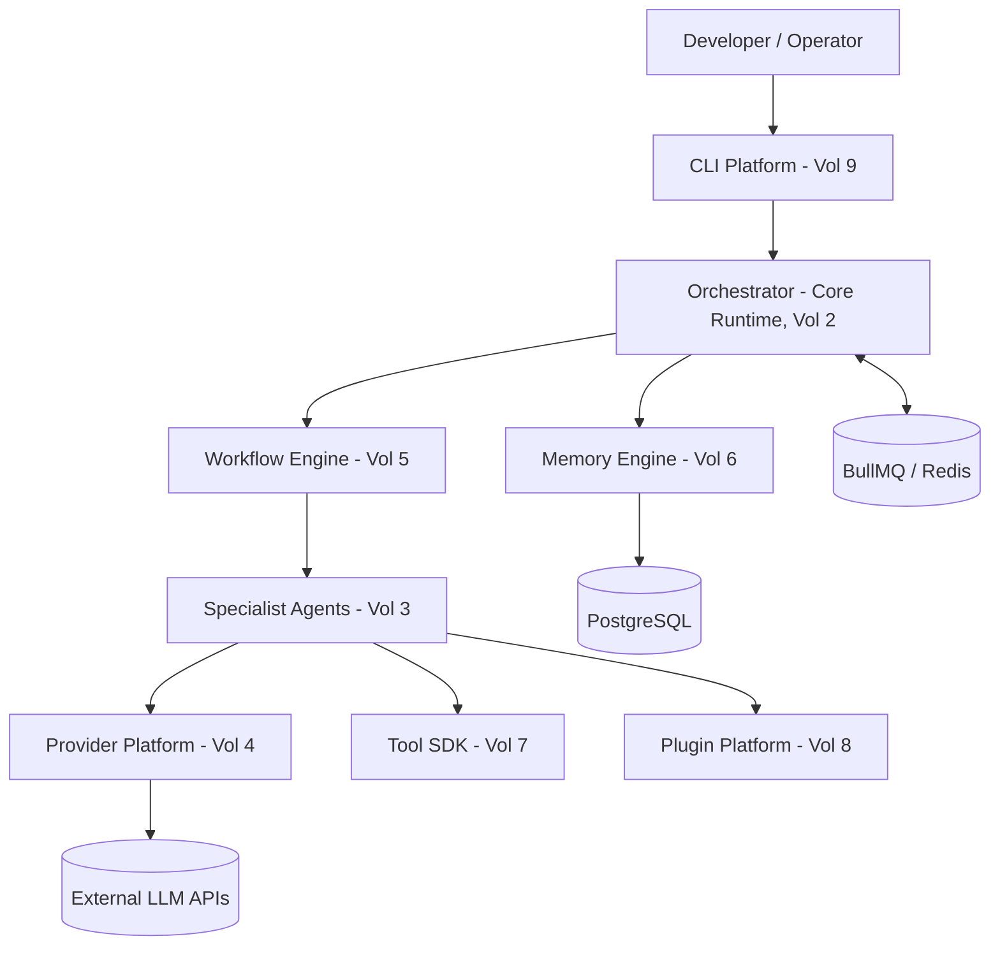
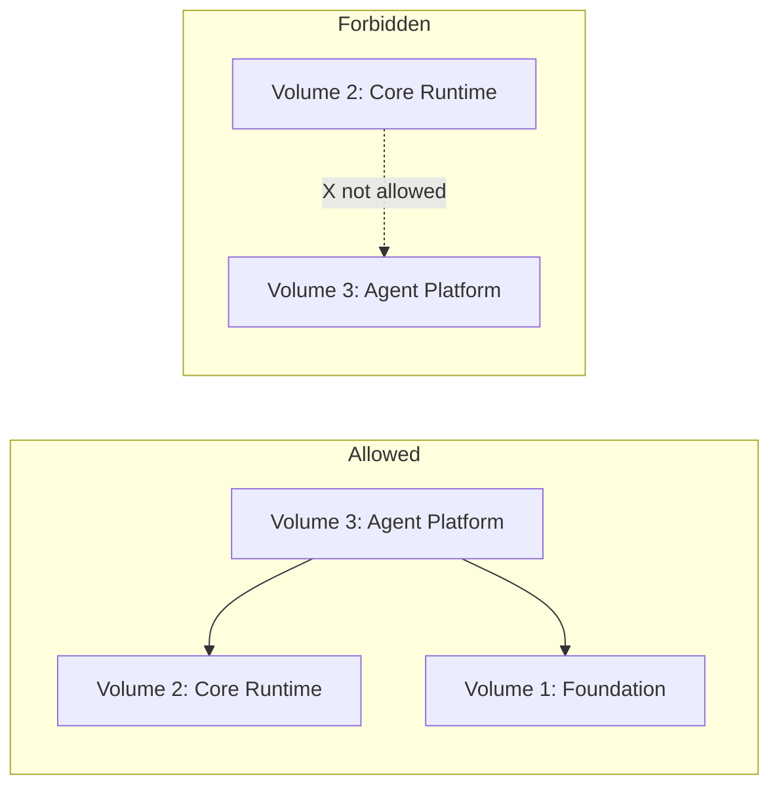

# Volume 1: Foundation

**Status:** Approved — Architecture (Project Owner, 2026-07-12)
**Contract Test:** Template authored at `08-Examples/volume-01-foundation/contract.test.ts` — pending Project Owner review before this Volume can advance to Approved — Implementation-Gated per ADR-0009.
**Schema:** `04-Schemas/volume-01.schema.json` added.
**Governs:** Overall system definition, terminology, module map, and cross-Volume conventions
**Depends on:** `00-Governance/PROJECT_CONSTITUTION.md`
**Depended on by:** All other Volumes (2–12)

---

## 1. Objectives

1. Define, once and unambiguously, what "the AI Company Platform" is and is not, so every
   later Volume inherits the same mental model instead of re-deriving it.
2. Establish the system-wide module map and naming conventions used by every subsequent
   Volume, RFC, and ADR.
3. Define the conventions this handbook itself follows (document status lifecycle,
   diagram notation, interface notation) so Volumes 2–12 are internally consistent.
4. Provide the single source of truth for cross-cutting concerns that do not belong to any
   one module: versioning strategy, monorepo layout, environment strategy.

## 2. Scope

**In scope for this Volume:**
- System definition and product boundaries (what problem this platform solves).
- The 12-module map and how modules relate (ownership boundaries, allowed dependencies).
- Monorepo layout convention (packages/, apps/, shared tooling).
- Document conventions used across the whole handbook (this governs how Volumes 2–12,
  RFCs, and ADRs are written).
- Versioning and release strategy at the platform level.

**Out of scope for this Volume (deferred to later Volumes):**
- Runtime execution semantics of the orchestrator → Volume 2 (Core Runtime)
- Agent lifecycle and specialist agent contracts → Volume 3 (Agent Platform)
- Provider abstraction details → Volume 4 (Provider Platform)
- Any concrete database schema → Volume 6 (Memory Engine) / `04-Schemas/`

## 3. Chapters

1. What This Platform Is
2. System Context Diagram
3. The 12-Module Map
4. Monorepo & Repository Layout
5. Document Conventions for This Handbook
6. Versioning & Release Strategy
7. Glossary

### Chapter 1 — What This Platform Is

The platform (working name: **agentx**, umbrella name in this handbook: **AI Company
Platform**) is a provider-agnostic, multi-agent AI software-engineering system. A human
operator issues a high-level engineering goal; an **Orchestrator** decomposes it into
tasks; **specialist agents** (coding, review, test, security, etc.) execute those tasks
using **tools** (filesystem, shell, git, HTTP) under **approval gates**; results are
composed back for the human to accept.

It is explicitly **not**:
- A single-agent coding autocomplete tool (that's a different, simpler product).
- A hosted SaaS with only one supported LLM vendor (violates Provider Agnostic).
- A no-code platform for non-developers — the primary user is a developer operating a CLI
  or, later, a thin UI over the same CLI core.

### Chapter 2 — System Context Diagram



### Chapter 3 — The 12-Module Map

| # | Volume | One-line responsibility | Depends on |
|---|---|---|---|
| 1 | Foundation | System definition, conventions | — |
| 2 | Core Runtime | Orchestration kernel, event bus, task scheduler | 1 |
| 3 | Agent Platform | Agent contracts, lifecycle, specialist agents | 1, 2 |
| 4 | Provider Platform | LLM provider abstraction, routing, cost tracking | 1, 2 |
| 5 | Workflow Engine | Multi-step task graphs, approval gates | 1, 2, 3 |
| 6 | Memory Engine | Conversation/state persistence, retrieval | 1, 2 |
| 7 | Tool SDK | Tool contract, sandboxing, permission model | 1, 2, 3 |
| 8 | Plugin Platform | Third-party extension points | 1–7 |
| 9 | CLI Platform | Developer-facing command-line interface | 1–7 |
| 10 | Enterprise Platform | Multi-tenant, RBAC, audit, compliance | 1–9 |
| 11 | Cloud Platform | Deployment, scaling, managed-vs-self-hosted | 1–10 |
| 12 | AI Company OS | Cross-module orchestration for org-level workflows (multi-project, multi-team) | 1–11 |

**Dependency rule (enforced by Constitution Principle 10 — Small Stable Core):** a lower-
numbered Volume must never depend on a higher-numbered one. Violations must be resolved by
renumbering or splitting the Volume, recorded in an ADR.

### Chapter 4 — Monorepo & Repository Layout

```
agentx/
├── apps/
│   ├── cli/                 # Volume 9
│   └── enterprise-console/  # Volume 10 (future, web UI)
├── packages/
│   ├── core-runtime/        # Volume 2
│   ├── agent-platform/      # Volume 3
│   ├── provider-sdk/        # Volume 4
│   ├── workflow-engine/     # Volume 5
│   ├── memory-engine/       # Volume 6
│   ├── tool-sdk/            # Volume 7
│   ├── plugin-sdk/          # Volume 8
│   └── shared/              # cross-cutting types, config, logger
├── prisma/                  # schema.prisma, migrations (Volume 6 owns schema content)
├── docs/                    # this handbook, mirrored from the authored copy
└── tooling/                 # eslint, tsconfig base, CI config
```

Stack (already established in prior project work and carried forward here): **Node.js /
TypeScript, NestJS (service layer), Next.js (any web surface), Prisma, PostgreSQL,
BullMQ**, managed as an npm/pnpm workspace monorepo.

### Chapter 5 — Document Conventions for This Handbook

- **Volumes** (`01-Volumes/`) specify *what a module is and must do*. They do not contain
  implementation code, only interfaces, diagrams, and prose.
- **RFCs** (`02-RFC/`) propose *a specific design decision* within a Volume's scope, before
  it is locked in. A Volume may spawn many RFCs over time.
- **ADRs** (`03-ADR/`) record *a decision that was made and why*, after an RFC is accepted.
  ADRs are immutable once Final; a reversal is a new ADR that supersedes the old one.
- **Status lifecycle** (all three document types): `Draft → In Review → Approved/Accepted/
  Final → Superseded` (terminal states: Approved/Accepted/Final unless superseded).
- **Diagrams** use Mermaid, embedded directly in the Markdown file (no external image
  files), so diagrams stay diffable in version control.
- **Interfaces** are written as TypeScript `interface`/`type` blocks — illustrative of the
  contract shape, not full implementations.
- **Numbering:** RFCs and ADRs are numbered sequentially and never renumbered or reused,
  even if withdrawn (a withdrawn RFC keeps its number with `Status: Withdrawn`).

### Chapter 6 — Versioning & Release Strategy

- The platform follows **SemVer** at the package level (`packages/*`) and a coarser
  **v0.x milestone** label at the platform level (current target: **v0.1**, per the
  project's own scoping: 3–4 agents, single-provider default).
- **v0.1 exit criteria** (draft, to be finalized once Volumes 2–9 are approved):
  1. Core Runtime + Agent Platform support exactly the 3–4 agents already scoped
     (coding, review, test, security).
  2. Single default LLM provider fully working end-to-end through Provider Platform's
     abstraction (not hardcoded — abstraction exists even if only one provider is
     configured).
  3. CLI Platform supports the full task lifecycle: submit → plan → execute → approve →
     result.
  4. Approval gates are enforced for any tool call classified as destructive (file
     writes, shell exec, git push) — see Volume 7's Security & Isolation section.
- Breaking changes to any package before v1.0 are allowed but must be recorded in an ADR
  and reflected in that package's CHANGELOG.

### Chapter 7 — Glossary

| Term | Definition |
|---|---|
| Orchestrator | The Core Runtime component that decomposes a goal into tasks and schedules agents to execute them. |
| Agent | A specialist LLM-driven worker bound to a role (coding, review, test, security) with a restricted tool set. |
| Tool | A discrete capability an agent can invoke (read file, run shell command, call git) — see Tool SDK. |
| Approval Gate | A synchronous human-confirmation checkpoint required before a classified-risky action executes. |
| Provider | An external LLM vendor (Claude, Gemini, GPT-family, local model) accessed via the Provider Platform's normalized interface. |
| Task Graph | A directed graph of tasks and their dependencies, produced by the Workflow Engine for a given goal. |
| Plugin | A third-party extension registered through the Plugin Platform's defined extension points, without modifying core. |
| Tenant | An isolated customer/organization boundary enforced at the data and authorization layer (Enterprise Platform). |

## 4. Architecture

At the Foundation level, "architecture" means the **module boundary contract**, not
internal design (that is each Volume's own job). The binding rule is:



Every Volume 2–12 must open its own Architecture section by declaring, explicitly, which
lower-numbered Volumes it depends on — mirroring the table in Chapter 3.

## 5. Requirements

### Functional Requirements
- FR-1: This handbook MUST provide a single glossary (Chapter 7) that all other Volumes
  reference rather than redefine terms locally.
- FR-2: This handbook MUST provide a dependency table (Chapter 3) that CI tooling can
  later validate against actual package imports (see Recommended Additions, `04-Schemas`).
- FR-3: The repository layout in Chapter 4 MUST be the layout Google AI Studio prompts
  (`06-Prompts/`) generate code into — prompts that deviate from it are non-compliant.

### Non-Functional Requirements
- NFR-1 (Consistency): Any term defined in Chapter 7 must be used identically across all
  Volumes — no synonyms introduced silently.
- NFR-2 (Auditability): Every status change to a Volume/RFC/ADR must be attributable to a
  date and a decision-maker (Project Owner per the Constitution's role table).

### Security & Isolation
Foundation itself has no runtime, so no direct attack surface. However, it is the source
of the **security-relevant conventions** every other Volume must follow:
- Any Volume introducing a new data store MUST declare tenant-isolation strategy in its
  own Security & Isolation subsection (Constitution Principle 7).
- Any Volume introducing a new external network call MUST declare it in that Volume's
  Interfaces section so Cloud Platform (Volume 11) can enumerate egress requirements.

## 6. Mermaid Diagrams

See Chapter 2 (System Context) and Chapter 4/5 (Module dependency diagrams) above. No
additional diagrams are needed at Foundation level; sequence and state diagrams belong to
Volume 2 (Core Runtime) where actual execution flow is defined.

## 7. Interfaces

Foundation defines one cross-cutting type used by every other Volume: the document
metadata header, which is not code but a structural convention — expressed here as a
schema for tooling that may later lint the handbook itself:

```typescript
type DocStatus = "Draft" | "In Review" | "Approved" | "Accepted" | "Final" | "Superseded" | "Withdrawn";

interface HandbookDocument {
  id: string;               // e.g. "Volume-02", "RFC-0007", "ADR-0003"
  title: string;
  status: DocStatus;
  dependsOn: string[];      // other document ids, e.g. ["Volume-01"]
  supersededBy?: string;    // set only when status is "Superseded"
}
```

## 8. Examples

**Example: how a future Volume should declare its dependency block (per Chapter 5
convention), using Volume 2 as a forward-looking example of the pattern this Volume
mandates:**

```markdown
# Volume 2: Core Runtime
**Status:** Draft
**Depends on:** Volume 1 (Foundation)
**Depended on by:** Volume 3, 4, 5, 6, 7
```

This is illustrative only — Volume 2's actual content is out of scope here and will be
authored as its own deliverable.

## 9. Risks

| Risk | Likelihood | Impact | Mitigation |
|---|---|---|---|
| Handbook drifts from actual code as implementation proceeds | High (common failure mode for spec-first projects) | High — defeats the project's entire premise | Constitution Principle 8 (Documentation Required) makes doc updates part of the definition of "done" for any RFC/ADR |
| 12-Volume scope is too large for one operator to maintain solo | Medium | Medium — stalls momentum | Sequential, one-Volume-at-a-time approval (per `06-Prompts/SYSTEM_PROMPT.md`) bounds effort per session |
| Module boundary table (Chapter 3) becomes stale as real dependencies emerge during implementation | Medium | Medium | Recommend adding a CI check (see Recommended Additions) that fails the build if `packages/*` imports violate the table |
| Glossary terms get redefined inconsistently in later Volumes | Low–Medium | Low | NFR-1 + a lightweight terminology review step before marking any Volume Approved |

## 10. Trade-offs

- **Sequential Volume approval (chosen) vs. parallel drafting of all 12 Volumes (rejected
  for this pass):** Parallel drafting is faster but risks 12 shallow, mutually
  inconsistent documents — directly against Constitution Principle 1 (Architecture First)
  and the Project Owner's explicit instruction not to start implementation before the
  full spec is done *and approved*, which implies each piece must be genuinely reviewable,
  not rubber-stamped in bulk.
- **Mermaid-in-Markdown (chosen) vs. external diagram files (rejected):** External diagram
  tools (draw.io, Figma) produce better visuals but break "diffable in version control"
  and require a second tool in the workflow — against Provider Agnostic / No Vendor
  Lock-in in spirit (tooling lock-in, not just LLM lock-in).
- **12 fixed Volumes (kept, with recommended additions below) vs. open-ended Volume count:**
  A fixed map keeps the dependency table in Chapter 3 meaningful; genuinely new concerns
  (Observability, Testing Strategy — see below) are proposed as explicit additions with
  their own numbering rather than silently expanding scope.

## 11. Acceptance Criteria

This Volume is **Approved** when:
- [ ] Project Owner confirms the system definition in Chapter 1 matches actual intent for
      agentx / AI Company Platform.
- [ ] Project Owner confirms the 12-module map (Chapter 3) and dependency rule are correct,
      or requests specific changes.
- [ ] Project Owner confirms or amends the Recommended Additions below (glossary is
      considered part of this Volume, not a separate one).
- [ ] Project Owner confirms the monorepo layout (Chapter 4) matches the actual repo, or
      flags divergence to reconcile.
- [ ] No outstanding Draft-blocking risk from Section 9 is left unaddressed.

## 12. Roadmap

1. **This session:** Approve Volume 1 (Foundation) + Constitution.
2. **Next:** Volume 2 (Core Runtime) — orchestration kernel, event bus, task scheduler.
   This is the highest-priority next Volume because Volumes 3, 4, 5, 6, 7 all depend on it.
3. **Then:** Volume 3 (Agent Platform) and Volume 4 (Provider Platform) — can proceed in
   either order once Volume 2 is Approved, since neither depends on the other.
4. **Then:** Volume 7 (Tool SDK) — needed before Volume 5 (Workflow Engine) can meaningfully
   define approval gates over tool calls.
5. **Then:** Volume 5 (Workflow Engine), Volume 6 (Memory Engine).
6. **Then:** Volume 8 (Plugin Platform), Volume 9 (CLI Platform) — CLI is the v0.1
   user-facing deliverable per Chapter 6 exit criteria.
7. **Deferred beyond v0.1:** Volume 10 (Enterprise Platform), Volume 11 (Cloud Platform),
   Volume 12 (AI Company OS) — these govern multi-tenant/enterprise/org-level concerns that
   are explicitly post-v0.1 per the project's own scoping notes.

---

## Recommended Additions to the Handbook Structure

The following gaps were identified while authoring this Volume. Each is proposed with
reasoning, not yet created — awaiting approval before being added to the roadmap:

1. **`00-Governance/GLOSSARY.md`** — split out of this Volume's Chapter 7 into its own
   file once term count grows past ~20, so it can be updated without bumping Volume 1's
   version. *Reason:* Chapter 7 will otherwise become the single most frequently edited
   part of an otherwise-stable Foundation Volume.
2. **`00-Governance/CONTRIBUTING.md`** — even solo, this should define the PR checklist
   referenced in Constitution Principle 8 ("Volumes updated" checklist). *Reason:*
   Currently that checklist is only described in prose inside the Constitution; it needs
   to be an actual enforceable template.
3. **New Volume 13: Observability & SRE** — logging, tracing, and metrics for agent runs
   (cost per task, latency per provider, failure rate per tool) are cross-cutting but
   substantial enough to deserve their own Volume rather than being a subsection of Core
   Runtime. *Reason:* Multi-agent systems fail silently without this; bolting it onto
   Volume 2 would bloat that Volume past a reviewable size.
4. **New Volume 14: Testing & QA Strategy** — Constitution Principle 6 (Testable by
   Default) needs a home describing contract-test conventions, agent evaluation
   methodology (how do you "test" an LLM-driven agent's output quality?), and CI gating.
   *Reason:* This is currently implied by Principle 6 but has no Volume that operationalizes it.
5. **`04-Schemas/` population** — this folder exists but is empty. Recommend it hold
   machine-readable JSON Schema / Zod exports of every `interface` defined across Volumes,
   so the dependency table (Chapter 3) and interface contracts (Constitution Principle 6)
   can eventually be CI-validated instead of only human-reviewed.
6. **`05-Templates/` population** — currently empty; should hold the actual `.md`
   templates (blank Volume template, blank RFC template, blank ADR template) that were
   used to generate the skeletons in this ZIP, so future Volumes/RFCs/ADRs are created
   consistently rather than copy-pasted from a prior filled-in one.
7. **`07-Diagrams/`** — given Chapter 5's decision to keep diagrams inline as Mermaid, this
   folder's purpose should be narrowed to *exported PNG/SVG snapshots* for use outside the
   repo (slides, README badges) — not a second source of truth. Worth an explicit ADR to
   avoid ambiguity later.
8. **`08-Examples/`** — currently empty; per Constitution Principle 6, this is where
   contract-test templates for each Volume's Interfaces section should live. Recommend
   populating it starting with Volume 2, once approved.
