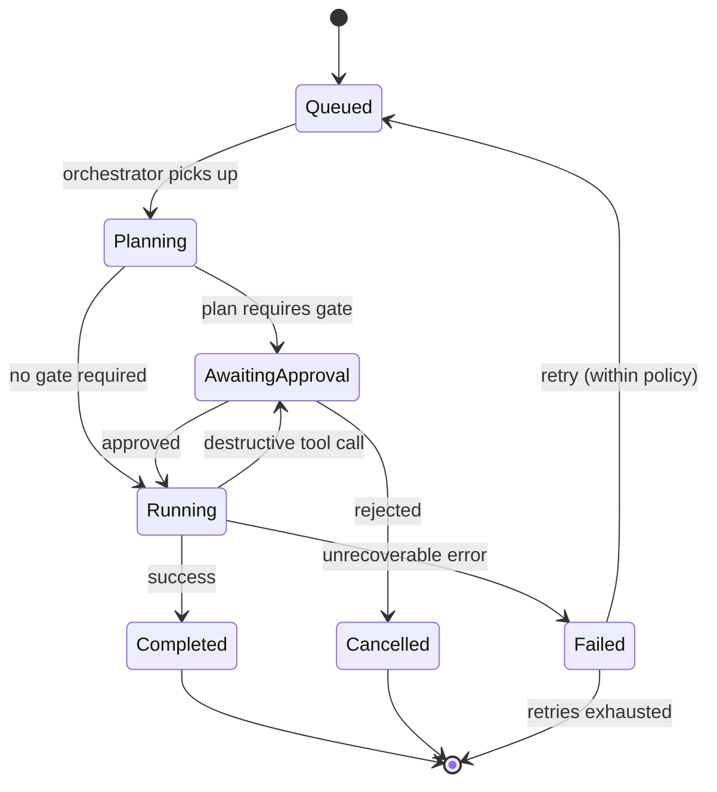
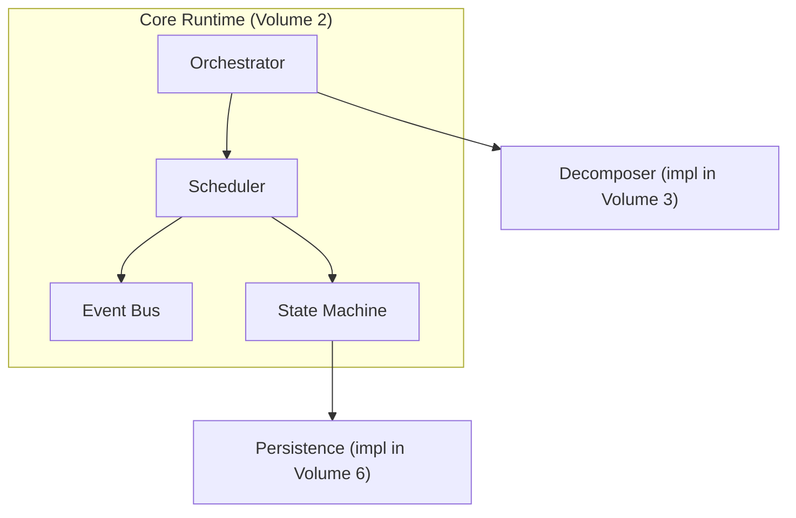

# Volume 2: Core Runtime

**Status:** Approved — Architecture (Project Owner, 2026-07-12)
**Contract Test:** Template authored at `08-Examples/volume-02-core-runtime/contract.test.ts` — pending Project Owner review before this Volume can advance to Approved — Implementation-Gated per ADR-0009.
**Governs:** The orchestration kernel — event bus, task scheduler, task lifecycle state machine
**Depends on:** Volume 1 (Foundation)
**Depended on by:** Volume 3, 4, 5, 6, 7, 8, 9

---

## 1. Objectives

1. Provide the single, stable execution kernel every other module builds on, satisfying
   Constitution Principle 10 (Small Stable Core).
2. Define the Task lifecycle state machine that all agents, workflows, and tools
   participate in, so state is never module-local and always inspectable centrally.
3. Define the Event Bus contract (topics, payload shape, delivery guarantees) that
   satisfies Constitution Principle 5 (Event Driven).
4. Keep the kernel provider-agnostic and agent-agnostic — Core Runtime must not import
   from Agent Platform or Provider Platform (dependency rule from Volume 1, Ch. 3).

## 2. Scope

**In scope:**
- Task entity, its state machine, and persistence contract (not schema — that's Volume 6).
- Event Bus: topics, publish/subscribe contract, retry/backoff policy.
- Scheduler: how tasks are picked up, concurrency limits, priority.
- Orchestrator's decomposition contract (interface only — decomposition *logic* is an
  Agent Platform concern in Volume 3, since it requires an LLM call).

**Out of scope:**
- What an agent actually does with a task → Volume 3
- How tasks are persisted to Postgres → Volume 6
- How approval gates pause/resume a task → Volume 5 (Core Runtime exposes the pause/resume
  primitive; Workflow Engine decides *when* to use it)

## 3. Chapters

1. Task Lifecycle State Machine
2. Event Bus Contract
3. Scheduler & Concurrency
4. Orchestrator Decomposition Contract
5. Failure Handling & Retries

### Chapter 1 — Task Lifecycle State Machine



Every state transition MUST be published as an event (Chapter 2) — the state machine has
no "silent" transitions. This is what makes the system auditable (Constitution Principle 7).

### Chapter 2 — Event Bus Contract

Backed by BullMQ/Redis in v0.1 (per Volume 1 stack decision), abstracted behind an
internal interface so the backend can be swapped without touching publishers/subscribers.

**Core topics (v0.1):**

| Topic | Published by | Consumed by | Payload |
|---|---|---|---|
| `task.created` | Orchestrator | Scheduler, Memory Engine | `TaskCreatedEvent` |
| `task.state_changed` | Scheduler | Memory Engine, CLI (for live status) | `TaskStateChangedEvent` |
| `task.approval_required` | Scheduler | Workflow Engine, CLI | `ApprovalRequiredEvent` |
| `task.approval_resolved` | Workflow Engine | Scheduler | `ApprovalResolvedEvent` |
| `tool.invoked` | Agent Platform | Memory Engine (audit log) | `ToolInvokedEvent` |
| `provider.call_completed` | Provider Platform | Memory Engine (cost tracking) | `ProviderCallEvent` |

**Delivery guarantee:** at-least-once, consumers MUST be idempotent (dedupe on
`event.id`). Chosen over exactly-once because exactly-once delivery over Redis/BullMQ adds
significant complexity for a v0.1 single-operator system; revisit in Volume 13
(Observability) once failure telemetry exists to justify the cost. This trade-off is
recorded formally in RFC-0002 / ADR-0002.

### Chapter 3 — Scheduler & Concurrency

- Default concurrency: 1 task graph active at a time in v0.1 (single-operator CLI use
  case does not need parallel task graphs yet); concurrency is a config value, not a
  hardcoded constant, so it can be raised without a breaking change later.
- Within a task graph, independent sub-tasks (no shared dependency edge) MAY run
  concurrently up to `maxParallelAgents` (default 2 in v0.1, matching the 3–4 agent scope).
- Priority is FIFO within a task graph; cross-task-graph priority is out of scope for v0.1
  (single active graph makes it moot).

### Chapter 4 — Orchestrator Decomposition Contract

Core Runtime defines *the shape* of decomposition, not the intelligence behind it:

```typescript
interface DecompositionRequest {
  goal: string;
  context: TaskContext;      // see Volume 6 for what TaskContext persists
}

interface DecomposedTask {
  id: string;
  description: string;
  assignedAgentRole: string;      // opaque role identifier — the AgentRole enum that
                                  // constrains valid values is defined in Volume 3 and
                                  // validated there. Core Runtime must NOT import a
                                  // Volume 3 type (dependency rule, Volume 1 Ch. 3),
                                  // so it treats the role as an opaque string.
  dependsOn: string[];            // other DecomposedTask ids
  requiresApproval: boolean;
}

interface DecompositionResult {
  tasks: DecomposedTask[];
}

// Implemented by Agent Platform (Volume 3), called by Core Runtime.
interface Decomposer {
  decompose(req: DecompositionRequest): Promise<DecompositionResult>;
}
```

Core Runtime depends only on the `Decomposer` interface, never on a concrete
implementation — this is what keeps Volume 2 free of a Volume 3 import, preserving the
dependency rule.

### Chapter 5 — Failure Handling & Retries

- Retry policy is exponential backoff, max 3 attempts by default, configurable per task
  type via `RetryPolicy`.
- A task that exhausts retries transitions to `Failed` (terminal) and publishes
  `task.state_changed`; it is never silently dropped.
- Distinguish **recoverable** failures (provider timeout, rate limit — retryable) from
  **unrecoverable** failures (invalid tool arguments, permission denied — not retried,
  surfaced immediately to the operator).

## 4. Architecture



Core Runtime depends only on Volume 1. `Decomposer` and `Persistence` are interfaces
defined here but implemented in Volumes 3 and 6 respectively — dependency inversion keeps
the arrow pointing inward, satisfying Volume 1 Chapter 3's dependency rule.

## 5. Requirements

### Functional Requirements
- FR-1: Every Task MUST have exactly one current state from the state machine (Ch. 1) at
  all times; concurrent writers MUST NOT be able to produce an invalid transition.
- FR-2: Every state transition MUST publish a corresponding event within the same logical
  operation (no transition without an event — see Ch. 1).
- FR-3: The Scheduler MUST expose a `pause(taskId)` / `resume(taskId)` primitive used by
  Workflow Engine to implement approval gates.

### Non-Functional Requirements
- NFR-1 (Determinism): Given the same `DecompositionResult`, the Scheduler's execution
  order for independent tasks must be deterministic (stable topological sort) to make
  debugging reproducible.
- NFR-2 (Observability): Every event on the bus must carry a `traceId` correlating it to
  the originating Task, forward-compatible with Volume 13 (Observability & SRE).

### Security & Isolation
- The Event Bus carries no secrets in payloads (provider API keys, tokens) — only
  references/IDs; secret resolution happens inside Provider Platform (Volume 4), not on
  the bus. This limits blast radius if the queue backend is ever compromised or logged.
- State transitions to `Running` for any task whose plan contains a destructive tool call
  MUST route through `AwaitingApproval` first (Ch. 1) — this is enforced in the state
  machine itself, not left to agent discipline, per Constitution Principle 7.

## 6. Mermaid Diagrams

See Chapter 1 (state diagram) and Section 4 (architecture flowchart) above.

## 7. Interfaces

```typescript
type TaskState =
  | "Queued" | "Planning" | "AwaitingApproval"
  | "Running" | "Completed" | "Failed" | "Cancelled";

interface Task {
  id: string;
  goal: string;
  state: TaskState;
  parentTaskId?: string;
  createdAt: Date;
  updatedAt: Date;
}

interface EventEnvelope<T> {
  id: string;          // for idempotency dedupe
  topic: string;
  traceId: string;
  occurredAt: Date;
  payload: T;
}

interface EventBus {
  publish<T>(topic: string, payload: T, traceId: string): Promise<void>;
  subscribe<T>(topic: string, handler: (e: EventEnvelope<T>) => Promise<void>): void;
}

interface Scheduler {
  enqueue(task: Task): Promise<void>;
  pause(taskId: string): Promise<void>;
  resume(taskId: string): Promise<void>;
}
```

## 8. Examples

**Example: minimal task lifecycle for a single-agent, no-approval-needed goal**

```typescript
const task = await orchestrator.submit({ goal: "Add a health-check endpoint" });
// -> task.created published
// -> Planning: Decomposer returns 1 DecomposedTask, requiresApproval=false
// -> Running: Scheduler enqueues, Agent Platform executes
// -> Completed: task.state_changed published with state="Completed"
```

Contract test template for this flow to be added to `08-Examples/core-runtime/` once this
Volume is Approved (Constitution Principle 6).

## 9. Risks

| Risk | Likelihood | Impact | Mitigation |
|---|---|---|---|
| At-least-once delivery causes duplicate side effects if consumers aren't idempotent | Medium | High | FR/NFR require idempotency; add contract test asserting duplicate-event safety before Approved |
| Single active task graph (v0.1 concurrency default) becomes a bottleneck sooner than expected | Low | Low | Concurrency is config, not hardcoded — raising it is a config change, not an architecture change |
| Dependency-inversion pattern (Decomposer/Persistence as interfaces) is skipped by AI Studio codegen in a rush | Medium | High — reintroduces the exact coupling Volume 1 forbids | Codegen prompts (06-Prompts) must explicitly instruct "Core Runtime imports no other package" as a lint-checkable rule |

## 10. Trade-offs

- **At-least-once + idempotent consumers (chosen) vs. exactly-once delivery (rejected for
  v0.1):** Exactly-once over Redis/BullMQ requires transactional outbox patterns that add
  real implementation cost for a solo-operator v0.1 scope; revisit once Volume 13 exists
  to measure actual duplicate-event rate.
- **Single active task graph by default (chosen) vs. always-parallel (rejected):** Matches
  actual v0.1 usage pattern (one developer, one CLI session) and avoids building
  cross-task-graph scheduling logic that has no user yet — YAGNI, but the config knob keeps
  the door open without an architecture change later.
- **Interfaces defined in Core Runtime, implemented elsewhere (chosen) vs. Core Runtime
  importing Agent Platform directly (rejected):** More boilerplate up front, but is the
  only way to satisfy Volume 1's dependency rule and Constitution Principle 10.

## 11. Acceptance Criteria

- [ ] Project Owner confirms the Task state machine (Ch. 1) covers all needed states, or
      specifies additions.
- [ ] Project Owner confirms v0.1 concurrency defaults (1 active task graph, 2 parallel
      agents) match intended usage.
- [ ] Project Owner confirms at-least-once delivery trade-off (Ch. 2 / Section 10) is
      acceptable for v0.1.
- [ ] `Decomposer` and `Persistence` interfaces are confirmed as the correct seams for
      Volume 3 / Volume 6 to implement against.

## 12. Roadmap

Next Volumes unblocked by this one: Volume 3 (Agent Platform, implements `Decomposer`),
Volume 4 (Provider Platform), Volume 6 (Memory Engine, implements `Persistence`). Proceeding
to Volume 3 next per Volume 1's roadmap ordering.

## Observability Requirements

### Metrics
- Task throughput (tasks/sec) — measures the orchestration kernel's processing capacity
- Event bus latency (p50, p99) — time from event emission to all subscribers receiving it
- Scheduler queue depth — number of tasks waiting in the scheduling queue at any point
- Task lifecycle transition rate — frequency of state changes (PENDING → RUNNING → COMPLETED/FAILED)
- Event bus subscriber count per topic — detects dead subscriptions or missing handlers

### Logging
- Log every task lifecycle state transition with taskId, from-state, to-state, and duration in state
- Log event bus emissions with topic, payload size, and subscriber count
- Log scheduler decisions (which task was assigned to which worker and why)

### Alerting
- Alert if scheduler queue depth exceeds 1000 tasks for more than 30 seconds (backpressure indicator)
- Alert if event bus p99 latency exceeds 500ms (subscribers may be blocking the event loop)
