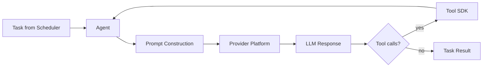
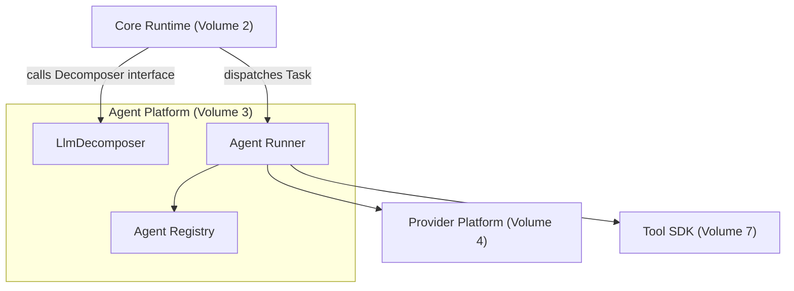

# Volume 3: Agent Platform

**Status:** Approved — Architecture (Project Owner, 2026-07-12)
**Contract Test:** Template authored at `08-Examples/volume-03-agent-platform/contract.test.ts` — pending Project Owner review before this Volume can advance to Approved — Implementation-Gated per ADR-0009.
**Schema:** `04-Schemas/volume-03.schema.json` added.
**Governs:** Agent contracts, lifecycle, the specialist agent roster, and the Decomposer implementation
**Depends on:** Volume 1 (Foundation), Volume 2 (Core Runtime)
**Depended on by:** Volume 5, 8, 9

---

## 1. Objectives

1. Define the `Agent` contract every specialist agent (coding, review, test, security)
   implements, so new agents can be added without touching Core Runtime.
2. Implement Core Runtime's `Decomposer` interface (Volume 2, Ch. 4) with actual
   LLM-driven decomposition logic.
3. Scope the v0.1 agent roster tightly: exactly the 3–4 agents already committed to
   (coding, review, test, security) — no speculative agents.
4. Define how an agent's tool access is restricted per role (least privilege), feeding
   into Volume 7's permission model.

## 2. Scope

**In scope:** Agent contract/interface, agent registry, the 4 v0.1 specialist agents'
responsibilities and restricted tool sets, prompt-construction contract (not prompt
content — that's per-agent config), Decomposer implementation.

**Out of scope:** Actual tool execution (Volume 7), LLM call mechanics (Volume 4), plugin
agents from third parties (Volume 8).

## 3. Chapters

1. The Agent Contract
2. v0.1 Specialist Agent Roster
3. Agent Registry & Discovery
4. Decomposer Implementation
5. Prompt Construction Contract

### Chapter 1 — The Agent Contract



Every agent is a stateless function of `(Task, TaskContext) -> AgentResult` — agents do
not hold their own persistent state between invocations; all state lives in Memory Engine
(Volume 6), reinforcing Constitution Principle 10 by keeping agents replaceable/regenerable.

### Chapter 2 — v0.1 Specialist Agent Roster

| Agent | Role | Allowed tools (Volume 7 categories) | Can request approval gate |
|---|---|---|---|
| Coding Agent | Implements features/fixes per an approved spec | file read/write, shell (build/lint) | Yes — on shell exec of unknown commands |
| Review Agent | Reviews diffs against the spec and Constitution | file read, git diff/log (read-only) | No — read-only by design |
| Test Agent | Writes/runs tests, reports coverage | file read/write (test files only), shell (test runner) | Yes — on shell exec |
| Security Agent | Static checks: secrets, tenant-isolation patterns, permission gaps | file read, git diff/log (read-only) | No — read-only by design |

This roster is deliberately fixed for v0.1 per Constitution Principle 10 and Volume 1's
exit criteria. A 5th agent requires an RFC before being added — it is not a config-only
change, because it affects the trust boundary (which tools which agent may touch).

### Chapter 3 — Agent Registry & Discovery

```typescript
interface AgentDefinition {
  role: AgentRole;
  allowedToolCategories: ToolCategory[];   // Volume 7 taxonomy
  systemPromptTemplateId: string;          // resolved via Volume 6 or static config
}

interface AgentRegistry {
  register(def: AgentDefinition): void;
  resolve(role: AgentRole): AgentDefinition;
  list(): AgentDefinition[];
}
```

The registry is populated at boot from static config in v0.1 (no dynamic registration UI
yet — that is an Enterprise Platform / Plugin Platform concern, Volumes 8 and 10).

### Chapter 4 — Decomposer Implementation

Implements `Decomposer` from Volume 2, Ch. 4. In v0.1, decomposition is a single LLM call
against the default provider (Volume 4) with a fixed system prompt instructing the model
to output a `DecompositionResult` matching the Core Runtime schema, validated before being
handed back (invalid JSON / schema mismatch is a retryable failure per Volume 2, Ch. 5).

```typescript
class LlmDecomposer implements Decomposer {
  async decompose(req: DecompositionRequest): Promise<DecompositionResult> {
    const raw = await this.provider.complete({
      systemPrompt: DECOMPOSITION_SYSTEM_PROMPT,
      userPrompt: req.goal,
      context: req.context,
    });
    return validateDecomposition(raw); // throws on schema violation -> Failed, not silently accepted
  }
}
```

### Chapter 5 — Prompt Construction Contract

Each agent's prompt is assembled from three layers, always in this order, so behavior is
predictable across regenerated sessions:

1. **Role prompt** (static, per `AgentDefinition.systemPromptTemplateId`) — who this agent
   is and its boundaries.
2. **Constitution excerpt** — the subset of `00-Governance/PROJECT_CONSTITUTION.md`
   principles relevant to that role (e.g., Security Agent always receives Principle 7 in
   full).
3. **Task context** — from Memory Engine (Volume 6): relevant history, the specific Task,
   and any prior agent outputs it depends on.

## 4. Architecture



Agent Platform depends on Volumes 1 and 2 only (plus interfaces it consumes from Provider
Platform and Tool SDK, which are peers, not dependents, per Volume 1's table — Volume 3 is
listed before 4 and 7, but in practice consumes their interfaces at runtime; the
compile-time dependency direction is still inward via interfaces defined in this Volume,
matching the Decomposer pattern from Volume 2).

## 5. Requirements

### Functional Requirements
- FR-1: Every agent invocation MUST be restricted to its `allowedToolCategories`; a tool
  call outside that set MUST be rejected by Tool SDK (Volume 7), not merely discouraged by
  prompt wording.
- FR-2: `LlmDecomposer` output MUST be schema-validated before being returned to Core
  Runtime; invalid output is a retryable failure, never passed through.
- FR-3: Review Agent and Security Agent MUST NOT have write-capable tools in their
  `allowedToolCategories` — enforced at registry level, not just by convention.

### Non-Functional Requirements
- NFR-1 (Predictability): Prompt construction order (Ch. 5) must be identical across all
  agents so debugging a bad output is tractable.
- NFR-2 (Regenerability): No agent implementation may hold state that would be lost/
  inconsistent if regenerated fresh by Google AI Studio in a new session — all state is
  externalized to Memory Engine.

### Security & Isolation
- Least-privilege tool assignment (Ch. 2 table) is the primary control here; this
  directly operationalizes Constitution Principle 7 for the agent layer.
- Security Agent's findings are advisory in v0.1 (surfaced to operator) — it does not
  auto-block a task graph; auto-block is deferred to Volume 10 (Enterprise Platform) where
  organizational policy enforcement belongs.

## 6. Mermaid Diagrams

See Chapter 1 and Section 4 above.

## 7. Interfaces

```typescript
type AgentRole = "coding" | "review" | "test" | "security";

interface AgentResult {
  taskId: string;
  role: AgentRole;
  output: string;
  toolCallsMade: ToolCallRecord[];   // Volume 7 type
  requiresApproval: boolean;
}

interface Agent {
  role: AgentRole;
  run(task: Task, context: TaskContext): Promise<AgentResult>;
}
```

## 8. Examples

**Example: Coding Agent restricted tool set in registry config**

```json
{
  "role": "coding",
  "allowedToolCategories": ["fs.read", "fs.write", "shell.build", "shell.lint"],
  "systemPromptTemplateId": "coding-agent-v1"
}
```

Contract test to be added at `08-Examples/agent-platform/` asserting a Coding Agent
attempting `shell.exec.arbitrary` is rejected by Tool SDK.

## 9. Risks

| Risk | Likelihood | Impact | Mitigation |
|---|---|---|---|
| Decomposition LLM call produces plausible-but-wrong task graphs (hallucinated dependencies) | Medium | Medium | Schema validation (FR-2) catches malformed output; semantic correctness is a Volume 14 (Testing/QA) evaluation concern |
| Prompt layering (Ch. 5) drifts per-agent if not enforced in code | Medium | Medium | Centralize prompt assembly in one `buildPrompt()` function all agents call, not per-agent duplication |
| 4-agent roster feels limiting once real usage starts | Low (by design for v0.1) | Low | Explicit roadmap note: 5th+ agent requires an RFC, not silent scope creep |

## 10. Trade-offs

- **Fixed 4-agent roster (chosen) vs. dynamic/open agent set from day one (rejected):**
  Matches the project's own v0.1 scoping decision; dynamic agent sets are a Plugin
  Platform (Volume 8) concern deferred past v0.1.
- **Stateless agents with externalized state (chosen) vs. stateful agent processes
  (rejected):** Costs more round-trips to Memory Engine, but makes agents trivially
  regenerable by AI Studio without losing conversation continuity — directly serves the
  project's AI-assisted-codegen workflow.
- **Security/Review agents advisory-only in v0.1 (chosen) vs. auto-blocking (rejected):**
  Auto-blocking without a policy engine (Volume 10) risks false-positive lockout for a
  solo operator; advisory-only keeps a human in the loop until policy enforcement exists.

## 11. Acceptance Criteria

- [ ] Project Owner confirms the 4-agent roster and their tool restrictions (Ch. 2 table).
- [ ] Project Owner confirms Security/Review agents being advisory-only (not blocking) is
      correct for v0.1.
- [ ] Project Owner confirms the prompt-layering order (Ch. 5) is the intended behavior.

## 12. Roadmap

Unblocks Volume 5 (Workflow Engine — needs agent roles to route tasks) and Volume 9 (CLI
Platform — surfaces agent status to the user). Proceeding to Volume 4 (Provider Platform)
next per Volume 1's roadmap ordering.

## Observability Requirements

### Metrics
- Agent spawn rate (agents/min) — frequency of new agent instances being created
- Task completion rate per agent type — success/failure ratio for coding, review, test, and security agents
- Agent lifecycle duration (p50, p95) — time from agent spawn to completion or termination
- Decomposer throughput — number of goals decomposed into task graphs per minute
- Agent resource consumption — memory and CPU usage per active agent instance

### Logging
- Log agent lifecycle events (spawned, assigned task, completed, failed, terminated) with agentId and type
- Log Decomposer decisions — which decomposition strategy was selected and the resulting task count
- Log agent specialist routing decisions (why a task was assigned to a specific agent type)

### Alerting
- Alert if agent task failure rate exceeds 20% for any agent type over a 5-minute window
- Alert if no agents have been spawned in 10 minutes during active workflow execution (stall detection)
