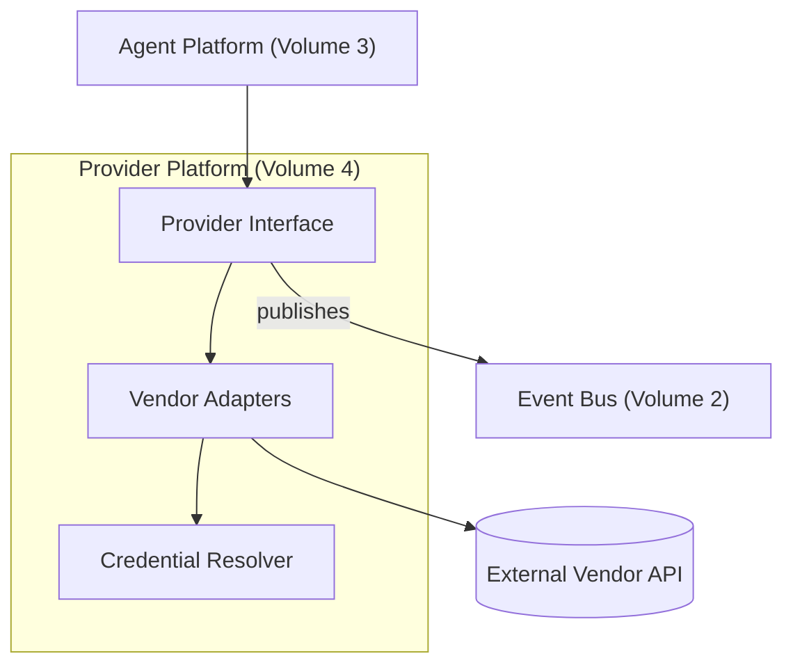

# Volume 4: Provider Platform

**Status:** Approved — Architecture (Project Owner, 2026-07-12)
**Contract Test:** Template authored at `08-Examples/volume-04-provider-platform/contract.test.ts`, covering FR-1 through FR-3 across all registered providers — pending Project Owner review before this Volume can advance to Approved — Implementation-Gated per ADR-0009.
**Governs:** LLM provider abstraction, routing, cost tracking, credential handling
**Depends on:** Volume 1 (Foundation), Volume 2 (Core Runtime)
**Depended on by:** Volume 3, 5, 8

---

## 1. Objectives

1. Provide the single normalized interface all providers implement, satisfying
   Constitution Principle 3 (Provider Agnostic) so no other module ever imports a vendor
   SDK directly.
2. Support a single default provider fully in v0.1 while proving the abstraction is real
   (not hardcoded) — per Volume 1's exit criteria.
3. Track cost and latency per call, feeding Volume 13 (Observability) later and giving
   the operator visibility now.
4. Own credential/secret resolution so no other module ever sees a raw API key.

## 2. Scope

**In scope:** `Provider` interface, request/response normalization (including tool-calling
format normalization across vendors), credential resolution, cost/token accounting,
retry/timeout policy specific to provider calls.

**Out of scope:** Which agent decides to call the provider (Volume 3), how results are
persisted (Volume 6), multi-provider routing/fallback strategy beyond v0.1's single-
default (deferred, see Roadmap).

## 3. Chapters

1. The Provider Interface
2. Tool-Calling Format Normalization
3. Credential Resolution
4. Cost & Token Accounting
5. v0.1 Default Provider Configuration

### Chapter 1 — The Provider Interface

```typescript
interface CompletionRequest {
  systemPrompt: string;
  userPrompt: string;
  context?: TaskContext;
  tools?: NormalizedToolSpec[];   // see Ch. 2
  maxTokens?: number;
}

interface CompletionResponse {
  text: string;
  toolCalls: NormalizedToolCall[];
  usage: { inputTokens: number; outputTokens: number; costUsd: number };
  providerId: string;
  latencyMs: number;
}

interface Provider {
  id: string;              // e.g. "anthropic", "google", "openai", "local"
  complete(req: CompletionRequest): Promise<CompletionResponse>;
}
```

Every provider implementation (one per vendor) lives in `packages/provider/provider-sdk/src/providers/*`
and is the *only* place a vendor SDK import is permitted (Constitution Principle 3
enforcement point).

### Chapter 2 — Tool-Calling Format Normalization

Vendors expose tool/function calling differently (shape of tool schema, streaming vs.
non-streaming tool call events, parallel vs. sequential tool calls). This Volume defines
one normalized shape; each provider adapter is responsible for translating to/from it.

```typescript
interface NormalizedToolSpec {
  name: string;
  description: string;
  parameters: JsonSchema;   // subset of JSON Schema, provider-agnostic
}

interface NormalizedToolCall {
  toolName: string;
  arguments: Record<string, unknown>;
  callId: string;
}
```

**Rule:** Agent Platform (Volume 3) and Tool SDK (Volume 7) only ever see
`NormalizedToolSpec`/`NormalizedToolCall` — never a vendor-specific tool-call payload.

### Chapter 3 — Credential Resolution

```typescript
interface CredentialResolver {
  resolve(providerId: string): Promise<string>;  // returns API key/token, never logged
}
```

- v0.1: resolves from environment variables (`PROVIDER_<ID>_API_KEY`), consistent with a
  solo-developer / self-hosted deployment (Volume 1 Principle 9, No Vendor Lock-in).
- Enterprise Platform (Volume 10) later swaps this for a secrets-manager-backed resolver
  without changing the `Provider` interface — this is exactly the seam Provider Agnostic
  is meant to protect.
- Credentials are never included in Event Bus payloads (Volume 2, Ch. 2) or in
  `CompletionRequest`/`CompletionResponse` logs.

### Chapter 4 — Cost & Token Accounting

Every `CompletionResponse.usage` is published as a `provider.call_completed` event
(Volume 2 topic table) consumed by Memory Engine for persistence and, later, Volume 13 for
dashboards. v0.1 ships a simple running-total-per-task cost, surfaced in the CLI
(Volume 9) — no budget-enforcement/cutoff logic yet (that is an Enterprise Platform policy
concern).

### Chapter 5 — v0.1 Default Provider Configuration

- v0.1 ships with exactly one provider adapter enabled by default, selected via config
  (`DEFAULT_PROVIDER_ID`), fulfilling Volume 1's exit criterion #2 ("single default
  provider... abstraction exists even if only one is configured").
- A second adapter must exist in code (even if untested end-to-end) before this Volume can
  be marked Approved, as the concrete proof the abstraction is not accidentally
  provider-coupled. Recommend: implement both an Anthropic adapter and a Google adapter,
  given both are already part of the project's existing toolchain (Claude Code +
  Google AI Studio).

## 4. Architecture



## 5. Requirements

### Functional Requirements
- FR-1: Every provider adapter MUST implement the full `Provider` interface (Ch. 1) —
  partial implementations fail a contract test, not silently degrade.
- FR-2: Tool specs/calls crossing the Provider Platform boundary MUST be normalized
  (Ch. 2) in both directions.
- FR-3: `CompletionResponse.usage.costUsd` MUST be computed from a per-provider,
  per-model pricing table kept in this Volume's config, not hardcoded per call site.

### Non-Functional Requirements
- NFR-1 (Swappability): Changing `DEFAULT_PROVIDER_ID` must require zero code changes in
  Volume 3 or Volume 7 — config only.
- NFR-2 (Latency visibility): Every call records `latencyMs`; this Volume does not itself
  enforce a timeout SLA (deferred to Volume 13) but must expose the data needed to set one.

### Security & Isolation
- Credential Resolver (Ch. 3) is the sole path to secrets; no other module may read
  `process.env.PROVIDER_*` directly — enforced by code review / lint rule restricting env
  access to this package.
- Provider responses are not trusted as executable instructions beyond their normalized
  tool-call shape — Tool SDK (Volume 7) still applies its own permission checks
  independent of what the model "asked" for.

## 6. Mermaid Diagrams

See Section 4 above.

## 7. Interfaces

See Chapters 1–3 for `Provider`, `NormalizedToolSpec`/`NormalizedToolCall`, and
`CredentialResolver`.

## 8. Examples

**Example: swapping default provider via config only**

```bash
# .env
DEFAULT_PROVIDER_ID=anthropic
# switching to:
DEFAULT_PROVIDER_ID=google
```

No code in `packages/agent/agent-platform` or `packages/shared/tool-sdk` changes. Contract test to be
added at `08-Examples/provider-platform/` asserting both adapters pass an identical test
suite against the `Provider` interface.

## 9. Risks

| Risk | Likelihood | Impact | Mitigation |
|---|---|---|---|
| Tool-calling normalization (Ch. 2) doesn't cover an edge case a specific vendor needs (e.g. parallel tool calls) | Medium | Medium | Treat first two adapters (Anthropic, Google) as the proving ground; extend `NormalizedToolCall` via RFC if a 3rd adapter reveals a gap |
| Cost table (FR-3) goes stale as vendors change pricing | High (vendors change pricing often) | Low–Medium (wrong cost display, not a functional break) | Keep pricing table as versioned config, not code constants; flag for periodic manual review |
| Only implementing one adapter "for real" and stubbing the second just to pass the letter of FR requirement in Ch. 5 | Medium | High — silently reintroduces provider coupling | Contract test in 08-Examples must run against both adapters with live or recorded fixtures, not skip the second |

## 10. Trade-offs

- **Two working adapters at v0.1 (chosen) vs. one adapter + interface-only proof
  (rejected):** Costs more implementation time up front, but a single implemented adapter
  provides no real evidence the abstraction holds — this is the classic "abstraction of
  one" trap; Constitution Principle 3 is worth the extra adapter.
- **Env-var credential resolution for v0.1 (chosen) vs. building a secrets manager now
  (rejected):** Matches actual deployment context (solo developer, self-hosted); secrets
  manager integration is real but premature complexity before Volume 10 exists.

## 11. Acceptance Criteria

- [ ] Project Owner confirms Anthropic + Google as the two v0.1 adapters (or specifies
      different pair).
- [ ] Project Owner confirms env-var credential resolution is acceptable for v0.1.
- [ ] Project Owner confirms cost-tracking is informational-only in v0.1 (no enforcement).

## 12. Roadmap

Unblocks Volume 5 (Workflow Engine) and Volume 8 (Plugin Platform, for provider plugins
later). Multi-provider *routing/fallback* (e.g., auto-failover) is explicitly deferred
beyond v0.1 — proposed as a future RFC once two adapters are proven stable. Proceeding to
Volume 7 (Tool SDK) next, per Volume 1's roadmap ordering (needed before Volume 5 can
define approval gates meaningfully).

## Observability Requirements

### Metrics
- LLM call latency per provider (p50, p95) — response time for each provider adapter
- Token cost per provider per day — cumulative spend tracked per adapter
- Provider error rate — percentage of failed LLM calls per provider (4xx, 5xx, timeout)
- Request queue depth — number of pending LLM requests waiting for provider response
- Token usage breakdown (input vs output) — per-call token consumption split

### Logging
- Log every LLM call with provider name, model, token count, latency, and cost estimate
- Log provider failover events (when one adapter fails and another is attempted)
- Log credential resolution events (which credential source was used for each provider call)

### Alerting
- Alert if any provider's error rate exceeds 10% over a 5-minute window
- Alert if daily token cost for any provider exceeds the configured budget threshold
