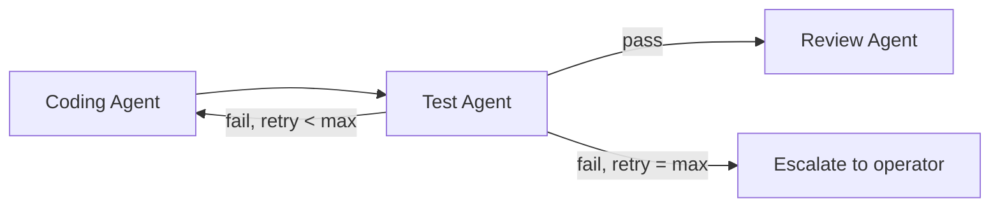
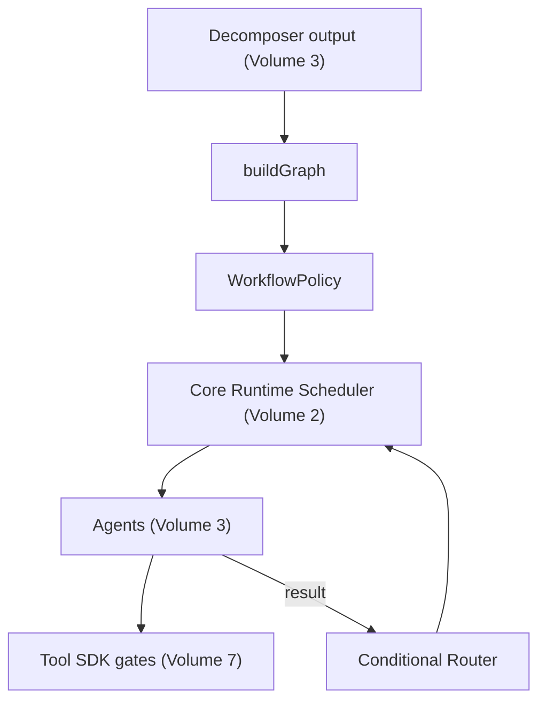

# Volume 5: Workflow Engine

**Status:** Approved — Architecture (Project Owner, 2026-07-12)
**Contract Test:** Template authored at `08-Examples/volume-05-workflow-engine/contract.test.ts` — pending Project Owner review before this Volume can advance to Approved — Implementation-Gated per ADR-0009.
**Schema:** `04-Schemas/volume-05.schema.json` added.
**Governs:** Multi-step task graphs, approval-gate orchestration, human-in-the-loop flow
**Depends on:** Volume 1, 2 (Core Runtime), 3 (Agent Platform), 7 (Tool SDK)
**Depended on by:** Volume 8, 9, 12

---

## 1. Objectives

1. Turn a `DecompositionResult` (Volume 2) into an executable task graph with explicit
   dependency ordering.
2. Own the operator-facing semantics of approval gates: what triggers one (Volume 7
   destructive calls, plus workflow-level policy), how it is presented, how resolution
   flows back to `Scheduler.resume()`.
3. Support conditional/branching flows where a later task depends on an earlier task's
   result (e.g., Test Agent's failure re-routes to Coding Agent).

## 2. Scope

**In scope:** Task graph construction and execution ordering, approval-gate policy layer
(beyond the tool-level gates Volume 7 already enforces), conditional branching/retry
routing between agents.

**Out of scope:** The actual pause/resume primitive (Volume 2 owns it), tool-level
destructive classification (Volume 7 owns it — this Volume consumes those events, does not
redefine them).

## 3. Chapters

1. Task Graph Construction
2. Approval Gate Policy Layer
3. Conditional Branching & Re-routing
4. Graph Execution Semantics

### Chapter 1 — Task Graph Construction

```typescript
interface TaskGraph {
  id: string;
  nodes: DecomposedTask[];     // Volume 2 type
  edges: Array<{ from: string; to: string }>;
}

function buildGraph(decomposition: DecompositionResult): TaskGraph {
  // topological validation: reject cycles, reject dangling dependsOn references
}
```

A `TaskGraph` is built once per goal, immediately after `Decomposer.decompose()`
(Volume 3, Ch. 4) returns, and validated before any node is scheduled — this is where an
invalid decomposition (cycle, dangling reference) is caught, on top of Volume 3's schema
validation.

### Chapter 2 — Approval Gate Policy Layer

Volume 7 already gates individual destructive tool calls. This Volume adds a second,
coarser gate: **graph-level checkpoints**, configurable per workflow type, independent of
any single tool call. Example v0.1 default policy: require approval before the first
`git.write` call in a graph, even if Volume 7 would have gated it anyway — the two layers
are complementary, not redundant, because policy layer gates can also apply to
*non-destructive but consequential* transitions (e.g., "approve before Review Agent's
findings are auto-applied by Coding Agent").

```typescript
interface WorkflowPolicy {
  requiresApprovalBefore(node: DecomposedTask, graph: TaskGraph): boolean;
}
```

### Chapter 3 — Conditional Branching & Re-routing

- Test Agent failure MUST be able to route back to Coding Agent as a new dependent task,
  not merely fail the whole graph — this is a defined edge type: `retry-with-feedback`.
- Maximum re-routing loop count per node: 2 by default (config), to prevent infinite
  fix-attempt loops burning provider cost — ties into Volume 4's cost accounting.



### Chapter 4 — Graph Execution Semantics

- Nodes with no unresolved `dependsOn` are eligible for scheduling; the Workflow Engine
  hands eligible nodes to Core Runtime's Scheduler (Volume 2, Ch. 3) respecting
  `maxParallelAgents`.
- A graph is `Completed` only when all nodes are `Completed`; `Failed` if any node
  exhausts retries per Chapter 3's loop limit without an operator override.

## 4. Architecture



## 5. Requirements

### Functional Requirements
- FR-1: `buildGraph` MUST reject cyclic dependency graphs before scheduling begins.
- FR-2: Retry-with-feedback loops MUST be capped (Ch. 3) and MUST escalate to the operator
  rather than silently fail when the cap is reached.
- FR-3: Graph-level policy gates (Ch. 2) MUST be evaluated independently of tool-level
  gates — a node can be policy-gated even if it makes no destructive tool call.

### Non-Functional Requirements
- NFR-1 (Cost bound): The retry cap (Ch. 3) is the primary control keeping a single goal's
  provider cost bounded; default value must be conservative (2), not unlimited.

### Security & Isolation
- Policy-layer gates (Ch. 2) are additive to, never a replacement for, Tool SDK's
  enforcement (Volume 7) — this Volume must not expose a way to bypass a Volume 7 gate.

## 6. Mermaid Diagrams

See Chapter 3 and Section 4 above.

## 7. Interfaces

See Chapters 1–2 for `TaskGraph`, `WorkflowPolicy`.

## 8. Examples

**Example: default v0.1 policy — gate before any `git.write`**

```typescript
const defaultPolicy: WorkflowPolicy = {
  requiresApprovalBefore: (node) => node.assignedAgentRole === "coding" && node.description.includes("commit"),
};
```

Contract test to be added at `08-Examples/workflow-engine/` covering cycle rejection and
retry-cap escalation.

## 9. Risks

| Risk | Likelihood | Impact | Mitigation |
|---|---|---|---|
| Two gate layers (Volume 7 + this Volume) confuse the operator with duplicate prompts | Medium | Low | CLI (Volume 9) should present a single unified approval prompt even if two layers triggered it |
| Retry cap too low, blocking legitimate multi-attempt fixes | Low | Low | Config value, adjustable without architecture change |

## 10. Trade-offs

- **Two-layer gating (chosen) vs. single unified gate in Tool SDK only (rejected):** More
  moving parts, but lets policy evolve (e.g., per-project custom policies later) without
  touching Tool SDK's security-critical enforcement code — separation of concerns between
  "is this action inherently dangerous" (Volume 7) and "does our process require sign-off
  here" (this Volume).

## 11. Acceptance Criteria

- [ ] Project Owner confirms default retry cap of 2.
- [ ] Project Owner confirms the default v0.1 policy (gate before `git.write`).
- [ ] Project Owner confirms two-layer gating approach vs. preferring a single layer.

## 12. Roadmap

Unblocks Volume 9 (CLI needs to render graph state) and Volume 8/12 (org-level workflows
build on this). Proceeding to Volume 6 (Memory Engine) next.

## Observability Requirements

### Metrics
- Workflow execution time (p50, p95) — total time from workflow start to completion
- Approval gate wait time — time tasks spend waiting for human approval at each gate
- Task graph depth and width — complexity metrics for each workflow's DAG structure
- Workflow completion rate — percentage of workflows completing successfully vs failing
- Blocked task count — number of tasks currently waiting on upstream dependencies

### Logging
- Log workflow lifecycle events (created, started, paused at gate, resumed, completed, failed)
- Log approval gate events (gate reached, approval requested, approved/rejected, approver identity)
- Log task graph traversal — which tasks became eligible and were dispatched at each step

### Alerting
- Alert if any task has been waiting at an approval gate for more than 1 hour (stale approval)
- Alert if workflow execution time exceeds 3× the historical p95 for the same workflow type
