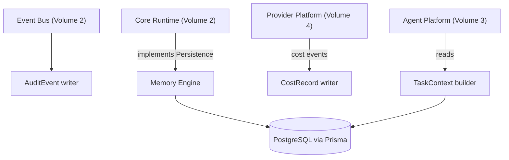

# Volume 6: Memory Engine

**Status:** Approved — Architecture (Project Owner, 2026-07-12)
**Contract Test:** Template authored at `08-Examples/volume-06-memory-engine/contract.test.ts` — pending Project Owner review before this Volume can advance to Approved — Implementation-Gated per ADR-0009.
**Schema:** `04-Schemas/volume-06.schema.json` added.
**Governs:** Conversation/state persistence, retrieval, audit log, cost log
**Depends on:** Volume 1, Volume 2 (Core Runtime — implements its `Persistence` interface)
**Depended on by:** Volume 3, 4, 5, 9, 10

---

## 1. Objectives

1. Implement Core Runtime's `Persistence` interface (Volume 2) on PostgreSQL/Prisma per
   the project's established stack.
2. Provide `TaskContext` retrieval so agents get relevant history without re-sending an
   entire conversation on every call (cost control, ties to Volume 4).
3. Own the audit log (every event from Volume 2's Event Bus) and cost log
   (Volume 4's `provider.call_completed`) as durable, queryable records.

## 2. Scope

**In scope:** Prisma schema for Task, TaskGraph, AgentResult, ToolCallRecord, AuditEvent,
CostRecord; `TaskContext` construction/retrieval strategy; retention policy.

**Out of scope:** Multi-tenant row-level isolation (Volume 10 owns tenant scoping on top
of this schema), vector/semantic search (explicitly deferred, see Roadmap).

## 3. Chapters

1. Core Schema
2. TaskContext Retrieval Strategy
3. Audit Log
4. Cost Log
5. Retention Policy

### Chapter 1 — Core Schema

```prisma
model Task {
  id            String   @id @default(cuid())
  goal          String
  state         String
  parentTaskId  String?
  taskGraphId   String?
  createdAt     DateTime @default(now())
  updatedAt     DateTime @updatedAt
}

model TaskGraph {
  id        String   @id @default(cuid())
  status    String
  createdAt DateTime @default(now())
}

model AgentResult {
  id        String   @id @default(cuid())
  taskId    String
  role      String
  output    String
  createdAt DateTime @default(now())
}

model AuditEvent {
  id        String   @id @default(cuid())
  topic     String
  traceId   String
  payload   Json
  occurredAt DateTime @default(now())
}

model CostRecord {
  id          String   @id @default(cuid())
  taskId      String
  providerId  String
  inputTokens Int
  outputTokens Int
  costUsd     Decimal
  createdAt   DateTime @default(now())
}
```

This is a v0.1, single-tenant schema. Volume 10 adds a `tenantId` column (and RLS
policies) to every model above — a deliberate, explicit extension, not a retrofit
surprise, called out here so Volume 10's design doesn't have to re-derive this schema.

### Chapter 2 — TaskContext Retrieval Strategy

```typescript
interface TaskContext {
  recentResults: AgentResult[];   // last N results in this TaskGraph, N configurable
  relevantHistory: string;        // summarized, not raw — see below
}
```

v0.1 strategy: last-N-results plus a rolling summary (built by a lightweight
summarization call) rather than full conversation replay — controls provider cost
(Volume 4) as graphs grow long. Semantic/vector retrieval is deferred (Roadmap) since it
adds infra (embedding store) not justified until context windows are observed to be a
real bottleneck.

### Chapter 3 — Audit Log

Every event published on Core Runtime's Event Bus (Volume 2, Ch. 2) is persisted verbatim
to `AuditEvent`, keyed by `traceId`, satisfying Constitution Principle 7's auditability
requirement and NFR-2 from Volume 2. This is append-only — no update/delete API is
exposed for `AuditEvent` rows in v0.1.

### Chapter 4 — Cost Log

Every `provider.call_completed` event (Volume 4) is persisted to `CostRecord`. Aggregation
queries (cost per task, per graph, per day) power the CLI's cost display (Volume 9) and,
later, Volume 13's dashboards.

### Chapter 5 — Retention Policy

- v0.1 default: indefinite retention (single operator, low volume) — explicit choice, not
  an oversight, but flagged for revisit once Volume 10 (multi-tenant, higher volume)
  exists, where unranked retention becomes a real storage-cost concern.

## 4. Architecture



## 5. Requirements

### Functional Requirements
- FR-1: Memory Engine MUST implement Core Runtime's `Persistence` interface (Volume 2)
  fully — Core Runtime has no fallback in-memory store in production config.
- FR-2: `TaskContext` construction MUST bound its size (last-N + summary, Ch. 2) — it must
  never grow unbounded with graph length.
- FR-3: `AuditEvent` writes MUST be append-only; no code path may update or delete a row.

### Non-Functional Requirements
- NFR-1 (Durability): All writes are within a Postgres transaction consistent with the
  triggering state transition — no "event published but not persisted" gap.

### Security & Isolation
- v0.1 schema is single-tenant (Ch. 1 note). Any query helper written now should already
  accept an implicit `tenantId: "default"` parameter internally, even though enforcement
  isn't active yet — this makes Volume 10's later RLS retrofit additive rather than a
  rewrite, directly following the lesson embedded in Constitution Principle 7.
- `CostRecord` and `AuditEvent` contain no raw credentials (Volume 4, Ch. 3 keeps those out
  of event payloads already).

## 6. Mermaid Diagrams

See Section 4 above.

## 7. Interfaces

See Chapter 2 for `TaskContext`. `Persistence` (implemented here) is defined in Volume 2
and re-stated for reference:

```typescript
interface Persistence {
  saveTask(task: Task): Promise<void>;
  loadTaskContext(taskId: string): Promise<TaskContext>;
  appendAuditEvent(event: EventEnvelope<unknown>): Promise<void>;
}
```

## 8. Examples

**Example: TaskContext for a mid-graph node**

```typescript
const context = await memory.loadTaskContext(taskId);
// { recentResults: [last 5 AgentResults in this graph], relevantHistory: "Coding Agent added /health endpoint; Test Agent found 1 failing assertion on 404 case." }
```

## 9. Risks

| Risk | Likelihood | Impact | Mitigation |
|---|---|---|---|
| Summarization step (Ch. 2) itself costs provider calls, adding latency/cost | Medium | Low–Medium | Use a cheap/fast model tier for summarization, tracked separately in CostRecord |
| Unbounded retention (Ch. 5) becomes a real cost at higher volume | Low for v0.1, High later | Medium | Explicit revisit flagged for Volume 10 |
| Implicit `tenantId: "default"` convention (Security section) not actually followed by generated code | Medium | High later (harder Volume 10 retrofit) | Add to codegen prompt checklist (06-Prompts) explicitly |

## 10. Trade-offs

- **Last-N + summary (chosen) vs. full replay (rejected) vs. vector search (deferred):**
  Full replay is simplest but cost-unbounded; vector search is more scalable but is
  infrastructure not yet justified at v0.1 volume — last-N + summary is the pragmatic
  middle ground.
- **Indefinite retention for v0.1 (chosen) vs. building retention/archival now
  (rejected):** Avoids premature infrastructure; explicitly flagged as a Volume 10
  dependency so it isn't forgotten.

## 11. Acceptance Criteria

- [ ] Project Owner confirms the core schema (Ch. 1) fields are sufficient for v0.1.
- [ ] Project Owner confirms last-N + summary context strategy over full replay.
- [ ] Project Owner confirms indefinite retention is acceptable for v0.1.

## 12. Roadmap

Unblocks Volume 9 (CLI reads cost/audit data), Volume 10 (extends this schema with tenant
scoping — do not redesign, extend). Vector/semantic retrieval proposed as a future RFC
once real context-window pressure is observed. Proceeding to Volume 8 (Plugin Platform)
next, then Volume 9 (CLI Platform), per Volume 1's roadmap ordering.

## Observability Requirements

### Metrics
- Query latency (p50, p95) — time for conversation state retrieval and persistence operations
- Database connection pool utilization — percentage of active connections vs pool maximum
- Audit log write throughput — entries written per second to the audit and cost logs
- Storage growth rate — daily increase in database size (conversation state, audit entries)
- Cache hit rate — percentage of state reads served from in-memory cache vs database

### Logging
- Log all conversation state mutations (create, update, delete) with sessionId and agentId
- Log audit log entries with actor, action, target resource, and timestamp
- Log cost log entries with provider, model, token count, and computed cost per interaction
- Log database connection pool events (checkout, checkin, timeout, eviction)

### Alerting
- Alert if database connection pool utilization exceeds 80% for more than 2 minutes
- Alert if query p95 latency exceeds 200ms (indicates potential missing index or table bloat)
