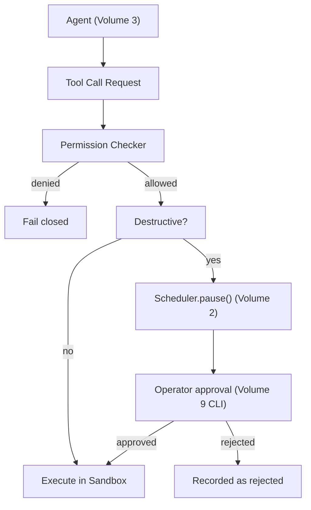

# Volume 7: Tool SDK

**Status:** Approved — Architecture (Project Owner, 2026-07-12)
**Contract Test:** Template authored at `08-Examples/volume-07-tool-sdk/contract.test.ts`, covering FR-1 through FR-3 — pending Project Owner review before this Volume can advance to Approved — Implementation-Gated per ADR-0009. **Note:** Ch. 2's table and Ch. 4's text were corrected in this same patch to resolve a conflict with ADR-0005 (see PATCH_SUMMARY_v5.md) discovered while authoring this test.
**Governs:** Tool contract, permission model, sandboxing, destructive-action classification
**Depends on:** Volume 1 (Foundation), Volume 2 (Core Runtime), Volume 3 (Agent Platform)
**Depended on by:** Volume 5 (Workflow Engine), Volume 8 (Plugin Platform)

---

## 1. Objectives

1. Define the `Tool` contract every capability (filesystem, shell, git, HTTP) implements.
2. Define the permission model that enforces Volume 3's per-agent `allowedToolCategories`
   at the point of execution, not just at prompt-construction time.
3. Classify every tool call as safe or destructive, and route destructive calls through
   the approval-gate primitive Core Runtime exposes (Volume 2, Ch. 5 / FR-3).
4. Define sandboxing boundaries so a tool call cannot escape its declared scope (e.g., a
   file-write tool cannot write outside the project directory).

## 2. Scope

**In scope:** Tool interface, tool registry, permission checks, destructive-action
taxonomy, sandbox boundary enforcement (filesystem jail, shell allowlist/denylist).

**Out of scope:** Which agent may use which tool category (Volume 3 owns the assignment;
this Volume owns the enforcement), the UI for approving a gate (Volume 9, CLI Platform).

## 3. Chapters

1. The Tool Contract
2. Tool Registry & Categories
3. Permission Enforcement
4. Destructive-Action Classification & Approval Gates
5. Sandboxing

### Chapter 1 — The Tool Contract

```typescript
interface ToolCallContext {
  agentRole: AgentRole;      // Volume 3
  taskId: string;
  workingDirectory: string;  // sandbox root, see Ch. 5
}

interface ToolResult {
  success: boolean;
  output: string;
  error?: string;
}

interface Tool {
  name: string;
  category: ToolCategory;
  isDestructive: boolean;
  execute(args: Record<string, unknown>, ctx: ToolCallContext): Promise<ToolResult>;
}
```

### Chapter 2 — Tool Registry & Categories

| Category | Examples (v0.1) | Destructive? |
|---|---|---|
| `fs.read` | read file, list directory | No |
| `fs.write` | write file, delete file | Yes — v0.1 classifies ALL `fs.write` calls as destructive per ADR-0005, including new-file writes (see Ch. 4) |
| `shell.build` | run build/lint command from an allowlist | No (allowlisted commands only) |
| `shell.exec` | arbitrary shell command | Yes |
| `git.read` | diff, log, status | No |
| `git.write` | commit, push | Yes |

The registry is the enforcement point for Volume 3's `allowedToolCategories`: a tool
lookup for a category not in the calling agent's allowed set fails closed (throws, does
not silently no-op), satisfying Constitution Principle 7.

### Chapter 3 — Permission Enforcement

```typescript
interface PermissionChecker {
  isAllowed(agentRole: AgentRole, category: ToolCategory): boolean;
}

// Called before every tool execution, not just at agent-construction time —
// closes the gap where a compromised or buggy prompt tries to invoke an
// out-of-scope tool despite the system prompt's instructions.
```

This mirrors the Sidfree-project lesson captured in the Constitution (Principle 7): never
rely on the model/prompt alone to enforce a boundary that can be enforced in code.

### Chapter 4 — Destructive-Action Classification & Approval Gates

- A tool call is **destructive** if it can (a) delete or overwrite existing data, (b)
  execute arbitrary code, or (c) have an externally-visible side effect (git push, network
  write).
- **`fs.write` is a deliberate exception to per-call precision, per ADR-0005:** rather
  than distinguishing "new file" from "overwrite" per call — which is more complex to
  implement correctly and risks a false-negative silent overwrite if misclassified — v0.1
  classifies **every** `fs.write` call as destructive, unconditionally. This trades more
  approval prompts early on for zero risk of silent data loss. ADR-0005 records this as a
  documented future relaxation, not a permanent limitation: a future version MAY introduce
  per-call new-vs-overwrite classification once the detection logic has been verified
  safe, but that is out of scope for v0.1 and requires its own ADR superseding ADR-0005
  before Volume 7's `fs.write` handling may change.
- All other categories (`shell.exec`, `git.write`, etc.) ARE evaluated per-call against
  the (a)/(b)/(c) criteria above, where feasible — the blanket-conservative exception in
  this chapter applies to `fs.write` only.
- Destructive calls call `Scheduler.pause(taskId)` (Volume 2, Ch. 5) and publish
  `task.approval_required` (Volume 2, Ch. 2) instead of executing immediately.
- On `task.approval_resolved` with `approved: true`, the tool executes; with
  `approved: false`, the tool call is recorded as rejected and the agent is informed to
  proceed differently or fail the task.

### Chapter 5 — Sandboxing

- **Filesystem jail:** all `fs.*` tools resolve paths relative to `ToolCallContext.
  workingDirectory` and reject any resolved path that escapes it (`../` traversal, symlink
  escape) — checked with real path resolution, not string matching alone.
- **Shell allowlist:** `shell.build` only executes commands matching a configured
  allowlist (e.g., `npm run build`, `npm run lint`, `npm test`); anything else is
  `shell.exec` and therefore always destructive/gated.
- **No network tools in v0.1** beyond what Provider Platform itself needs — an explicit
  scope decision, not an oversight; a generic `http.request` tool is deferred (see
  Roadmap) because it is a meaningful new attack surface deserving its own RFC.

## 4. Architecture



## 5. Requirements

### Functional Requirements
- FR-1: Every tool execution MUST pass through `PermissionChecker.isAllowed` before
  running — no tool implementation may skip this by calling execution logic directly.
- FR-2: Every destructive call MUST pause the task and require explicit approval; there is
  no config flag to disable this in v0.1 (it is not optional per Constitution Principle 7).
- FR-3: Filesystem sandbox violations MUST throw before any I/O occurs, not after a
  partial write.

### Non-Functional Requirements
- NFR-1 (Fail-closed default): Any ambiguity in classification (Ch. 4) defaults to
  destructive, never to safe — false positives (extra approval prompts) are acceptable;
  false negatives are not.
- NFR-2 (Auditability): Every `ToolResult`, approved or rejected, is published as
  `tool.invoked` (Volume 2 topic) for Memory Engine's audit log.

### Security & Isolation
This entire Volume *is* the security enforcement layer for agent actions — it is the
direct implementation of Constitution Principle 7 for the tool-execution boundary. Key
points already covered above: fail-closed permission checks (FR-1), mandatory approval
gates (FR-2), sandbox jail (Ch. 5), fail-closed classification default (NFR-1).

## 6. Mermaid Diagrams

See Section 4 above.

## 7. Interfaces

See Chapters 1 and 3 for `Tool`, `ToolResult`, `ToolCallContext`, `PermissionChecker`.

```typescript
type ToolCategory = "fs.read" | "fs.write" | "shell.build" | "shell.exec" | "git.read" | "git.write";

interface ToolRegistry {
  register(tool: Tool): void;
  resolve(name: string, category: ToolCategory): Tool | undefined;
}
```

## 8. Examples

**Example: Coding Agent attempts an out-of-scope tool**

```typescript
// Coding Agent's allowedToolCategories does NOT include "git.write" (Volume 3, Ch. 2)
const tool = registry.resolve("git.commit", "git.write");
// PermissionChecker.isAllowed("coding", "git.write") -> false
// -> throws PermissionDeniedError, tool never executes
```

Contract test to be added at `08-Examples/tool-sdk/` covering: (a) denied category throws
before execution, (b) filesystem jail rejects `../` traversal, (c) destructive call pauses
task and waits for approval event.

## 9. Risks

| Risk | Likelihood | Impact | Mitigation |
|---|---|---|---|
| Per-call destructive classification (Ch. 4) is more complex to implement correctly than per-tool-name | Medium | High if wrong (silent data loss) | Start conservative: v0.1 may classify all `fs.write` as destructive regardless of new-vs-overwrite, relax later via RFC once classification logic is tested |
| Shell allowlist (Ch. 5) too restrictive, blocking legitimate build commands | Medium | Low (annoying, not unsafe) | Allowlist is config, extensible without code change; operator can add entries |
| Symlink-based sandbox escape missed by naive path-prefix checks | Low–Medium | High | NFR/FR require real path resolution (`fs.realpath`) before jail check, not string prefix matching |

## 10. Trade-offs

- **Conservative destructive classification (recommended default: all `fs.write` gated in
  v0.1) vs. precise new-vs-overwrite detection (deferred):** Fewer silent-loss risks at
  the cost of more approval prompts early on; can be relaxed once real usage data exists.
- **No generic `http.request` tool in v0.1 (chosen) vs. including it (rejected):** Keeps
  v0.1's attack surface minimal; agents needing external data can be extended later via a
  dedicated RFC that treats network access as a first-class permission category, not an
  afterthought bolted onto `fs`.

## 11. Acceptance Criteria

- [ ] Project Owner confirms the v0.1 tool category taxonomy (Ch. 2 table).
- [ ] Project Owner confirms conservative (all-`fs.write`-gated) classification default
      for v0.1.
- [ ] Project Owner confirms shell allowlist approach (vs. a denylist) for `shell.build`.
- [ ] Project Owner confirms deferring a generic HTTP tool past v0.1.

## 12. Roadmap

Unblocks Volume 5 (Workflow Engine) which builds the operator-facing approval-gate
experience on top of this Volume's `task.approval_required` events. Proceeding to
Volume 5 next, then Volume 6, per Volume 1's roadmap ordering.

## Observability Requirements

### Metrics
- Tool invocation count per tool — tracks which tools are used most frequently
- Tool execution latency (p50, p95) — time per tool execution including sandbox overhead
- Permission denial rate — percentage of tool invocations blocked by the permission model
- Sandbox resource consumption — CPU and memory usage within tool execution sandboxes
- Destructive action approval rate — percentage of destructive actions approved vs rejected

### Logging
- Log every tool invocation with tool name, agentId, parameters (sanitized), and execution result
- Log permission decisions (allowed/denied) with the reason and applicable policy rule
- Log sandbox lifecycle events (created, executed, destroyed) with resource limits applied
- Log destructive action approvals with approver identity and timestamp

### Alerting
- Alert if permission denial rate exceeds 30% for any single tool (may indicate misconfigured permissions)
- Alert if sandbox memory usage exceeds 90% of the configured limit (impending OOM)
