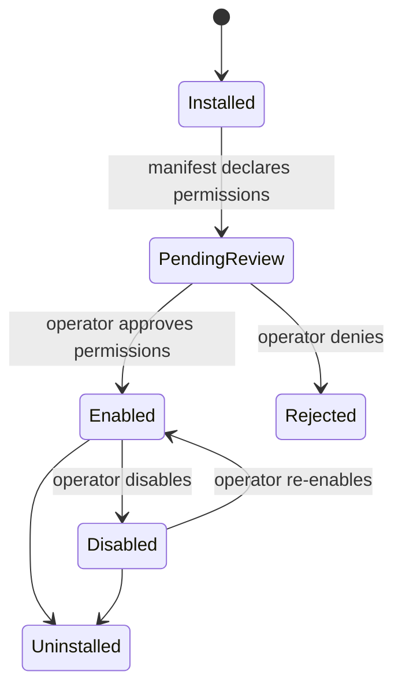
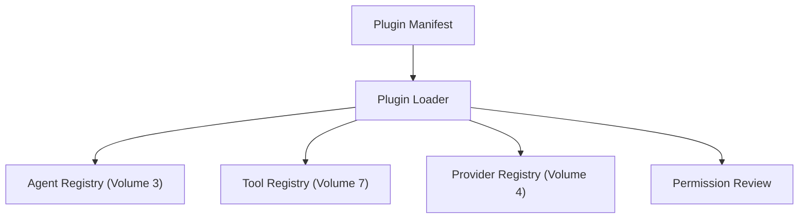

# Volume 8: Plugin Platform

**Status:** Approved — Architecture (Project Owner, 2026-07-12)
**Contract Test:** Template authored at `08-Examples/volume-08-plugin-system/contract.test.ts` — pending Project Owner review before this Volume can advance to Approved — Implementation-Gated per ADR-0009.
**Schema:** `04-Schemas/volume-08.schema.json` added.
**Governs:** Third-party extension points for agents, tools, and providers
**Depends on:** Volume 1, 2, 3 (Agent Platform), 4 (Provider Platform), 7 (Tool SDK)
**Depended on by:** Volume 9, 10, 12

---

## 1. Objectives

1. Define the extension points that let new agents, tools, or providers be added without
   modifying core packages, operationalizing Constitution Principle 4 (Plugin First).
2. Define a plugin manifest format so a plugin declares its capabilities and required
   permissions upfront, reviewable before install.
3. Keep plugin execution subject to the same permission/sandbox rules as built-in agents
   and tools (Volume 7) — a plugin is not a trust escalation path.

## 2. Scope

**In scope:** Plugin manifest schema, extension point interfaces (agent plugin, tool
plugin, provider plugin), plugin lifecycle (install/enable/disable/uninstall), permission
declaration and review.

**Out of scope:** A plugin marketplace/registry UI (deferred, likely Volume 11/Cloud
concern if ever built), remote/hosted plugin execution (v0.1 plugins run in-process,
locally).

## 3. Chapters

1. Plugin Manifest
2. Extension Points
3. Plugin Lifecycle
4. Permission Review

### Chapter 1 — Plugin Manifest

```typescript
interface PluginManifest {
  id: string;
  version: string;
  kind: "agent" | "tool" | "provider";
  declaredToolCategories?: ToolCategory[];   // required if kind === "tool"
  declaredAgentRole?: string;                // required if kind === "agent", must be new, not override a v0.1 role
  entryPoint: string;                        // module path
}
```

### Chapter 2 — Extension Points

- **Agent plugin:** implements the `Agent` interface (Volume 3, Ch. 7) and registers a
  *new* `AgentRole` — plugins cannot override the fixed v0.1 roster (coding, review, test,
  security), consistent with Volume 3's decision that new agents require deliberate review.
- **Tool plugin:** implements the `Tool` interface (Volume 7, Ch. 1) and registers under a
  declared `ToolCategory` — new categories require the same destructive-classification
  discipline as built-in tools (Volume 7, Ch. 4).
- **Provider plugin:** implements the `Provider` interface (Volume 4, Ch. 1) — this is how
  a third vendor or local model gets added without touching `packages/provider-sdk` core.

### Chapter 3 — Plugin Lifecycle



### Chapter 4 — Permission Review

Every tool-kind plugin's `declaredToolCategories` is shown to the operator before
`Enabled` — same trust model as Volume 7's approval gates, applied once at install time
rather than per-call, since the categories (not individual calls) are what's being
trusted. Enabling a plugin does not bypass Volume 7's per-call classification — a plugin
tool declaring `fs.write` is still subject to Volume 7's destructive-call gating at
runtime.

## 4. Architecture



## 5. Requirements

### Functional Requirements
- FR-1: A plugin MUST declare its manifest before any code loads; the loader MUST refuse
  to import a plugin's entry point until the manifest is validated.
- FR-2: An agent-kind plugin MUST NOT be allowed to register an `AgentRole` value that
  collides with the fixed v0.1 roster.
- FR-3: A tool-kind plugin's declared categories MUST go through the same permission
  review UI/flow as reviewing a new built-in tool would.

### Non-Functional Requirements
- NFR-1 (No silent trust escalation): Enabling a plugin never grants it access beyond what
  its manifest declared and the operator approved.

### Security & Isolation
This Volume exists specifically to make sure Plugin First (Constitution Principle 4) does
not create a security hole: extension must never mean "runs with fewer checks than core."
All checks from Volume 7 (permission, sandbox, destructive gating) apply identically to
plugin-provided tools and agents.

## 6. Mermaid Diagrams

See Chapter 3 and Section 4 above.

## 7. Interfaces

See Chapter 1 for `PluginManifest`.

## 8. Examples

**Example: a hypothetical "docs" agent plugin**

```json
{
  "id": "docs-agent-plugin",
  "version": "0.1.0",
  "kind": "agent",
  "declaredAgentRole": "docs",
  "entryPoint": "./plugins/docs-agent/index.js"
}
```

## 9. Risks

| Risk | Likelihood | Impact | Mitigation |
|---|---|---|---|
| In-process plugin execution (v0.1) means a buggy plugin can crash the host process | Medium | Medium | Wrap plugin invocation in try/catch with isolation at the call boundary; process-level sandboxing (e.g., worker threads) is a candidate future RFC |
| Manifest permission review becomes a rubber-stamp if the UI doesn't surface it clearly | Medium | Medium | Volume 9 (CLI) must design an explicit, unskippable review step, not a buried flag |

## 10. Trade-offs

- **In-process plugins for v0.1 (chosen) vs. sandboxed subprocess/worker execution
  (deferred):** Simpler to build first; revisit via RFC once a plugin ecosystem beyond
  the operator's own code is realistic.
- **Manifest-declared, install-time permission review (chosen) vs. per-call review for
  plugins too (rejected):** Per-call review for every plugin tool call would be excessive
  friction; Volume 7's per-call destructive gating already covers the sharpest risk.

## 11. Acceptance Criteria

- [ ] Project Owner confirms the three extension point kinds (agent/tool/provider) cover
      intended plugin use cases.
- [ ] Project Owner confirms in-process execution is acceptable for v0.1.

## 12. Roadmap

Unblocks Volume 9 (CLI needs plugin install/enable commands), Volume 10 (enterprise
policy may restrict which plugins a tenant can enable), Volume 12 (org-level workflows may
compose plugin agents). Proceeding to Volume 9 (CLI Platform) next.
