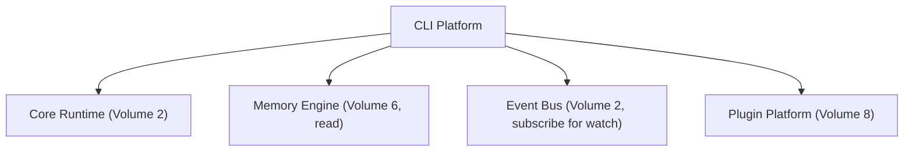

# Volume 9: CLI Platform

**Status:** Approved — Architecture (Project Owner, 2026-07-12)
**Contract Test:** Template authored at `08-Examples/volume-09-cli-platform/contract.test.ts` — pending Project Owner review before this Volume can advance to Approved — Implementation-Gated per ADR-0009.
**Schema:** `04-Schemas/volume-09.schema.json` added.
**Governs:** The developer-facing command-line interface — the v0.1 primary product surface
**Depends on:** Volume 1, 2, 3, 4, 5, 6, 7, 8
**Depended on by:** Volume 10 (enterprise console reuses these command semantics), Volume 12

---

## 1. Objectives

1. Deliver the full task lifecycle (submit → plan → execute → approve → result) as CLI
   commands — this is Volume 1's v0.1 exit criterion #3.
2. Surface approval gates (Volume 5, Volume 7) as clear, unskippable interactive prompts.
3. Surface cost (Volume 4/6) and audit trail per task/graph.
4. Provide plugin management commands (Volume 8).

## 2. Scope

**In scope:** Command surface, interactive approval UX, status/watch commands, plugin
management commands, config file format.

**Out of scope:** Any web/GUI surface (Enterprise Platform, Volume 10, future), remote
multi-user access (Volume 10/11 concerns).

## 3. Chapters

1. Command Surface
2. Approval Gate UX
3. Status, Watch & Cost Reporting
4. Plugin Management Commands
5. Configuration

### Chapter 1 — Command Surface

| Command | Purpose |
|---|---|
| `agentx submit "<goal>"` | Create a Task, trigger decomposition, build graph (Volume 5) |
| `agentx status [taskId\|graphId]` | Show current state machine position (Volume 2, Ch. 1) |
| `agentx watch [graphId]` | Live-stream state transitions as they occur (subscribes to Event Bus) |
| `agentx approve <taskId>` / `agentx reject <taskId>` | Resolve a pending approval gate |
| `agentx cost [graphId]` | Show CostRecord aggregation (Volume 6, Ch. 4) |
| `agentx audit [graphId]` | Show AuditEvent trail (Volume 6, Ch. 3) |
| `agentx plugin install/enable/disable/list` | Plugin lifecycle (Volume 8, Ch. 3) |
| `agentx config get/set` | Read/write local config (Ch. 5 below) |

### Chapter 2 — Approval Gate UX

When `task.approval_required` (Volume 2 topic) fires, the CLI (if actively watching) MUST
present:
1. Which node/tool call triggered the gate.
2. The exact action about to be taken (e.g., the shell command, the file diff).
3. A clear `[a]pprove / [r]eject` prompt — no default action, requires explicit input.

If the CLI is not actively attached (async submission), the graph pauses and
`agentx approve` must be run explicitly later — there is no timeout-based auto-approve or
auto-reject in v0.1 (silent auto-approval would violate Constitution Principle 7; silent
auto-reject would silently stall work) .

### Chapter 3 — Status, Watch & Cost Reporting

- `status` renders the state machine position (Volume 2, Ch. 1) plus which agent is
  currently assigned.
- `watch` subscribes to the Event Bus (Volume 2, Ch. 2) and renders transitions live —
  this is the only command that holds an open subscription; all others are one-shot
  queries against Memory Engine.
- `cost` and `audit` are read-only queries against Volume 6's schema, with no write path.

### Chapter 4 — Plugin Management Commands

Directly surfaces Volume 8's lifecycle state machine; `install` triggers manifest
validation and, for tool/agent-kind plugins, the mandatory permission review screen
(Volume 8, Ch. 4) before the plugin can move to `Enabled`.

### Chapter 5 — Configuration

```yaml
# agentx.config.yaml
defaultProvider: anthropic
maxParallelAgents: 2
retryCapPerNode: 2
workingDirectory: .
```

Config is project-local (checked into the repo, not global user state) so behavior is
reproducible across machines/sessions — consistent with Volume 1's "regenerable by AI
Studio in a fresh session" principle.

## 4. Architecture



## 5. Requirements

### Functional Requirements
- FR-1: `submit` MUST support the full lifecycle end-to-end with no other command
  required for a no-approval-needed goal (Volume 1 exit criterion #3).
- FR-2: Approval prompts (Ch. 2) MUST show the concrete action, never just an abstract
  "approve this step?" with no detail.
- FR-3: `cost` and `audit` MUST be read-only against Memory Engine — no CLI command writes
  directly to the audit log (writes only happen via the Event Bus pipeline, Volume 6).

### Non-Functional Requirements
- NFR-1 (No silent defaults on approval): Ch. 2's "no default action" rule is a hard
  requirement, not a UX suggestion — directly enforces Constitution Principle 7 at the
  human-interaction layer.

### Security & Isolation
- CLI never prints raw credentials (Volume 4, Ch. 3) even in verbose/debug output modes.
- Config file (Ch. 5) contains no secrets — secrets remain in environment variables per
  Volume 4.

## 6. Mermaid Diagrams

See Section 4 above.

## 7. Interfaces

CLI Platform is primarily a consumer of interfaces defined in Volumes 2–8; it defines no
new cross-module interface of its own beyond the config schema (Ch. 5).

## 8. Examples

**Example: end-to-end no-approval-needed flow**

```bash
$ agentx submit "Add a health-check endpoint"
Task created: t_01... | Graph: g_01...
$ agentx watch g_01
[Planning] -> [Running: coding] -> [Running: test] -> [Completed]
$ agentx cost g_01
Total: $0.014 (2 provider calls)
```

**Example: approval-gated flow**

```bash
$ agentx submit "Refactor auth module and push to remote"
[Planning] -> [Running: coding] -> [AwaitingApproval]
  Action: git push origin refactor/auth (destructive: git.write)
  [a]pprove / [r]eject > a
[Running: coding] -> [Completed]
```

## 9. Risks

| Risk | Likelihood | Impact | Mitigation |
|---|---|---|---|
| Async submission + no timeout auto-resolve (Ch. 2) means graphs can sit paused indefinitely | Medium | Low (by design trade-off) | `status` command should surface "N tasks awaiting approval" prominently so it's not forgotten |
| Verbose/debug mode accidentally logs sensitive data | Low | High | Explicit test asserting no credential substrings appear in any CLI output path |

## 10. Trade-offs

- **No timeout-based auto-approve/reject (chosen) vs. configurable timeout (rejected for
  v0.1):** Safety over convenience, matching Constitution Principle 7; can be revisited via
  RFC if solo-operator workflow proves this too friction-heavy in practice.
- **Project-local config (chosen) vs. global user config (rejected):** Reproducibility
  across regenerated sessions outweighs the minor convenience of a global default.

## 11. Acceptance Criteria

- [ ] Project Owner confirms the command surface (Ch. 1) covers the intended v0.1 CLI
      experience.
- [ ] Project Owner confirms no-timeout approval behavior (Ch. 2) is acceptable.
- [ ] Project Owner confirms project-local config file approach.

## 12. Roadmap

This Volume completes the v0.1 critical path (Volumes 1–9). Volumes 10–12 below cover
explicitly post-v0.1 concerns per Volume 1's own roadmap notes.
