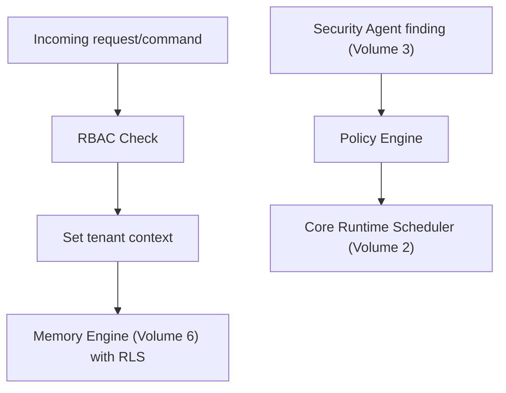

# Volume 10: Enterprise Platform

**Status:** Approved — Architecture (Project Owner, 2026-07-12)
**Contract Test:** Template authored at `08-Examples/volume-10-multi-tenant/contract.test.ts` — pending Project Owner review before this Volume can advance to Approved — Implementation-Gated per ADR-0009.
**Schema:** `04-Schemas/volume-10.schema.json` added.
**Governs:** Multi-tenancy, RBAC, audit/compliance surfacing, org policy enforcement
**Depends on:** Volume 1–9 (extends Memory Engine's schema and CLI's command surface)
**Depended on by:** Volume 11, 12
**Target:** Explicitly **post-v0.1** — this Volume specifies the design now so Volume 6's
schema is built extensibly, but implementation is not part of the v0.1 exit criteria.

---

## 1. Objectives

1. Add tenant isolation on top of Volume 6's schema without redesigning it — extension,
   not rewrite (per Volume 6, Ch. 1 note).
2. Define RBAC: roles beyond "the operator" (Volume 9 assumes a single operator; this
   Volume introduces org members with scoped permissions).
3. Turn Security Agent's advisory findings (Volume 3, Ch. 2) into enforceable org policy,
   closing the gap Volume 3 explicitly deferred here.
4. Define audit/compliance reporting suitable for external review (building on Volume 6's
   audit log).

## 2. Scope

**In scope:** `tenantId` schema extension + Postgres RLS policy design, RBAC role model,
policy engine (auto-block vs advisory), compliance export.

**Out of scope:** Actual cloud deployment topology (Volume 11), UI implementation (a
future console app, only referenced structurally here).

## 3. Chapters

1. Multi-Tenancy Schema Extension
2. RBAC Model
3. Policy Engine (Promoting Advisory to Enforced)
4. Compliance & Audit Export

### Chapter 1 — Multi-Tenancy Schema Extension

```prisma
model Task {
  // ...existing fields from Volume 6...
  tenantId String
}
```

Every model in Volume 6, Ch. 1 gains `tenantId`. Enforcement is **fail-closed Postgres
RLS**, not application-layer filtering alone — this is the direct, named lesson from prior
project experience (multi-tenancy bugs found in audits elsewhere): a missing `WHERE
tenantId = ?` in one query path must not leak data, because RLS blocks it at the database
layer regardless of application code correctness.

```sql
ALTER TABLE "Task" ENABLE ROW LEVEL SECURITY;
CREATE POLICY tenant_isolation ON "Task"
  USING (tenant_id = current_setting('app.current_tenant')::text);
```

All Prisma access goes through a tenant-scoped client extension that sets
`app.current_tenant` per request/session — mirroring the fail-closed Prisma extension
pattern already used in prior project work.

### Chapter 2 — RBAC Model

| Role | Permissions |
|---|---|
| Owner | Full control: config, billing, plugin approval, all tasks |
| Developer | Submit/approve tasks, view cost/audit, cannot manage plugins or billing |
| Viewer | Read-only: status, audit, cost |

RBAC checks wrap every CLI command (Volume 9) and, later, any console/API surface — a
single `PermissionChecker`-style gate (mirroring Volume 7's pattern) applied at the
request boundary, not scattered per-command.

### Chapter 3 — Policy Engine (Promoting Advisory to Enforced)

Volume 3 left Security/Review agent findings advisory-only for v0.1. This Volume defines
the policy engine that lets an Owner configure specific findings as **blocking**:

```typescript
interface OrgPolicy {
  blockOnSecurityFinding(severity: "low" | "medium" | "high" | "critical"): boolean;
}
```

Default recommendation: block on `critical` only, keep `low`/`medium`/`high` advisory —
avoids the false-positive lockout risk Volume 3 flagged, while giving orgs a real
enforcement lever for the most dangerous class of finding.

### Chapter 4 — Compliance & Audit Export

Exports Volume 6's `AuditEvent` log to standard formats (CSV/JSON) filtered by tenant and
date range, for external compliance review. No new data is collected here — this Volume
only adds export/reporting on top of what Volume 6 already durably records.

## 4. Architecture



## 5. Requirements

### Functional Requirements
- FR-1: Every table from Volume 6, Ch. 1 MUST have RLS enabled before this Volume can be
  marked Approved — no table may rely on application-layer filtering alone.
- FR-2: RBAC checks MUST fail closed — an unrecognized role has zero permissions, not
  default/implicit ones.
- FR-3: Policy Engine blocking decisions MUST be logged to `AuditEvent` with the specific
  finding that triggered the block.

### Non-Functional Requirements
- NFR-1 (Defense in depth): Both RLS (database layer) and a tenant-scoped Prisma client
  extension (application layer) must be present — neither alone is sufficient, directly
  reflecting the prior-project lesson this Volume is built to prevent recurring.

### Security & Isolation
This entire Volume *is* the Security & Isolation extension of Volume 6 — see Ch. 1 for the
core mechanism (fail-closed RLS + scoped Prisma extension) and Ch. 2 for RBAC's fail-closed
default (FR-2).

## 6. Mermaid Diagrams

See Section 4 above.

## 7. Interfaces

See Chapters 1–3 for schema extension and `OrgPolicy`.

## 8. Examples

**Example: tenant-scoped Prisma client extension pattern**

```typescript
const tenantScopedClient = prisma.$extends({
  query: {
    $allModels: {
      async $allOperations({ args, query }) {
        if (!currentTenantId) throw new Error("No tenant context set — fail closed");
        return query(args);
      },
    },
  },
});
```

## 9. Risks

| Risk | Likelihood | Impact | Mitigation |
|---|---|---|---|
| RLS policy misconfigured, silently allowing cross-tenant reads | Low if tested, High impact if missed | Critical | Mandatory contract test per model: attempt cross-tenant read, assert empty result, before Approved |
| Policy Engine default too permissive or too strict out of the box | Medium | Medium | Ship the `critical`-only default (Ch. 3) explicitly documented, adjustable per org |

## 10. Trade-offs

- **RLS + application-layer double enforcement (chosen) vs. application-layer only
  (rejected):** More implementation cost, but this is the exact gap named in the
  Constitution's Security by Design rationale — non-negotiable given the project's own
  prior experience with this failure mode.
- **`critical`-only blocking default (chosen) vs. blocking on all severities (rejected):**
  Avoids false-positive lockout of a legitimate multi-tenant org's daily workflow.

## 11. Acceptance Criteria

- [ ] Project Owner confirms the 3-role RBAC model (Ch. 2) is sufficient, or specifies
      additional roles.
- [ ] Project Owner confirms `critical`-only default blocking policy.
- [ ] Project Owner confirms this Volume remains explicitly post-v0.1 in priority.

## 12. Roadmap

Unblocks Volume 11 (Cloud Platform needs to know tenant model before deployment topology)
and Volume 12. Explicitly scheduled after v0.1 (Volumes 1–9) ships and is in real use.
