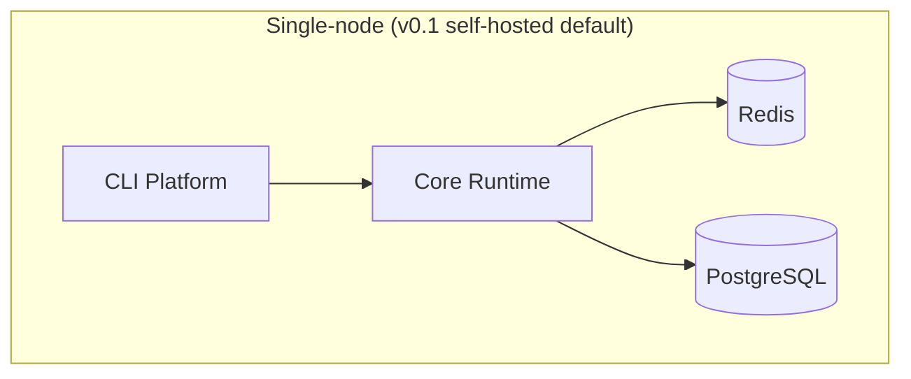

# Volume 11: Cloud Platform

**Status:** Approved — Architecture (Project Owner, 2026-07-12)
**Contract Test:** Template authored at `08-Examples/volume-11-deployment/contract.test.ts` — pending Project Owner review before this Volume can advance to Approved — Implementation-Gated per ADR-0009.
**Schema:** `04-Schemas/volume-11.schema.json` added.
**Governs:** Deployment topology, scaling, managed-vs-self-hosted decisions
**Depends on:** Volume 1–10
**Depended on by:** Volume 12
**Target:** Post-v0.1, after Volume 10 exists (multi-tenant deployment needs the tenant model first)

---

## 1. Objectives

1. Define a deployment topology that works both self-hosted (No Vendor Lock-in,
   Constitution Principle 9) and on managed infrastructure.
2. Define scaling levers for each stateful component (Postgres, Redis/BullMQ) as usage
   grows beyond the v0.1 single-operator scope.
3. For every managed service recommended, document a self-hosted fallback, per
   Constitution Principle 9's explicit enforcement rule.

## 2. Scope

**In scope:** Deployment topology (single-node vs. multi-service), scaling guidance per
component, managed-service-with-fallback table, environment strategy (dev/staging/prod).

**Out of scope:** CI/CD pipeline implementation details (belongs with actual code once
written), specific cloud vendor pricing (changes too often for a handbook — link out
instead).

## 3. Chapters

1. Deployment Topology
2. Managed Service / Self-Hosted Fallback Table
3. Scaling Levers
4. Environment Strategy

### Chapter 1 — Deployment Topology



- v0.1 default: everything runs on a single machine/container (developer laptop or a
  small VPS) — matches actual current usage (solo developer).
- Multi-service split (separate Scheduler workers, separate Postgres instance) is the
  Volume 10+ scaling path, not a v0.1 requirement.

### Chapter 2 — Managed Service / Self-Hosted Fallback Table

| Component | Managed option | Self-hosted fallback (mandatory per Constitution Principle 9) |
|---|---|---|
| Postgres | Managed Postgres (any vendor) | Self-hosted Postgres in a container, same schema |
| Redis/BullMQ | Managed Redis | Self-hosted Redis in a container |
| Secrets | Cloud secrets manager (post-Volume 10) | Environment variables (Volume 4, Ch. 3's v0.1 default) |
| Object storage (if needed later) | Cloud object storage | Local filesystem volume |

No component in this table is ever *managed-only* — this table is itself the
Constitution Principle 9 compliance check for this Volume.

### Chapter 3 — Scaling Levers

- **Postgres:** connection pooling first, read replicas for `AuditEvent`/`CostRecord`
  read-heavy queries (Volume 6) before considering sharding — sharding is out of scope
  until volume data justifies it.
- **Redis/BullMQ:** horizontal worker scaling (more Scheduler consumers) is the primary
  lever, bounded by `maxParallelAgents` config (Volume 2, Ch. 3) which becomes
  per-deployment rather than global once multiple workers exist.
- **Provider calls:** rate-limit-aware backoff already specified in Volume 2, Ch. 5;
  this Volume adds nothing new here, just confirms it's the relevant lever under load.

### Chapter 4 — Environment Strategy

Three environments: `dev` (local, single-node), `staging` (mirrors prod topology at
smaller scale), `prod`. Config (Volume 9, Ch. 5) is environment-specific via
`agentx.config.<env>.yaml` overlays.

## 4. Architecture

See Chapter 1 diagram above; multi-service topology is deferred to an RFC once Volume 10
tenant load data exists to size it correctly rather than guessing now.

## 5. Requirements

### Functional Requirements
- FR-1: Every managed service recommendation MUST have a documented self-hosted fallback
  in the same table (Ch. 2) — this Volume cannot be Approved with a gap in that table.
- FR-2: `maxParallelAgents`/scaling config MUST remain a config value, never a hardcoded
  constant, so scaling levers (Ch. 3) require no code change.

### Non-Functional Requirements
- NFR-1 (Portability): A full environment (Postgres + Redis + app) MUST be reproducible
  from a single `docker-compose.yml` for the self-hosted path, kept in sync with this
  Volume.

### Security & Isolation
- Secrets strategy (Ch. 2 table) follows Volume 4's credential resolution seam — no new
  secret-handling code path is introduced here, only deployment-time configuration of
  which resolver backend is active.

## 6. Mermaid Diagrams

See Chapter 1 above.

## 7. Interfaces

This Volume defines deployment configuration rather than runtime interfaces; no new
TypeScript contracts beyond referencing Volume 9's config schema (Ch. 5).

## 8. Examples

**Example: self-hosted `docker-compose.yml` skeleton**

```yaml
services:
  postgres:
    image: postgres:16
  redis:
    image: redis:7
  app:
    build: .
    depends_on: [postgres, redis]
```

## 9. Risks

| Risk | Likelihood | Impact | Mitigation |
|---|---|---|---|
| Managed-service convenience quietly becomes a hard dependency over time (config drift) | Medium | Medium | Periodic check: can `docker-compose up` still run the full stack self-hosted? Make this part of Volume 14's CI checklist |
| Multi-service topology designed too early, before real load data | Low (deferred by design) | Low | Explicitly deferred to an RFC gated on Volume 10 usage data |

## 10. Trade-offs

- **Single-node v0.1 default (chosen) vs. designing multi-service topology now
  (rejected):** No current usage data justifies the complexity; matches actual solo-
  developer deployment reality today.
- **Self-hosted fallback mandatory for every managed service (chosen) vs. allowing
  managed-only conveniences (rejected):** Directly enforces Constitution Principle 9;
  costs some managed-service convenience but preserves portability.

## 11. Acceptance Criteria

- [ ] Project Owner confirms single-node v0.1 topology matches actual deployment plans.
- [ ] Project Owner confirms the managed/self-hosted fallback table (Ch. 2) is complete.

## 12. Roadmap

Unblocks Volume 12 (org-level workflows need a deployment model to reason about). Explicitly
sequenced after Volume 10 in priority.
