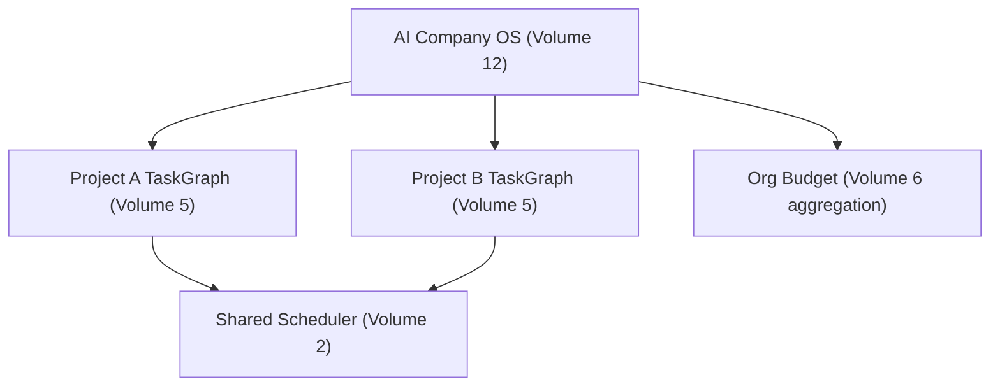

# Volume 12: AI Company OS

**Status:** Approved — Architecture (Project Owner, 2026-07-12)
**Contract Test:** Template authored at `08-Examples/volume-12-portfolio/contract.test.ts` — pending Project Owner review before this Volume can advance to Approved — Implementation-Gated per ADR-0009.
**Schema:** `04-Schemas/volume-12.schema.json` added.
**Governs:** Org-level orchestration across multiple projects/teams — the platform's
long-term "AI Company" vision layer
**Depends on:** Volume 1–11 (composes all prior Volumes; introduces no lower-level primitives of its own)
**Depended on by:** none (top of the dependency stack)
**Target:** Furthest-out, explicitly speculative relative to Volumes 1–11 — kept as a
Volume (not dropped) because it is named in the handbook's own scope, but its Acceptance
Criteria below intentionally include "confirm this is still wanted" as a live question.

---

## 1. Objectives

1. Define what it means to run multiple `TaskGraph`s (Volume 5) across multiple projects
   under one org, coordinated rather than run as isolated silos.
2. Define cross-project resource allocation (provider cost budgets, agent capacity) at the
   org level, building on Volume 10's tenant/RBAC model.
3. Keep this Volume a **composition layer only** — it must introduce no new primitive that
   belongs in a lower Volume (if it needs one, that's a sign the primitive belongs in
   Volume 2 or 5 instead, and this Volume should be revised via RFC).

## 2. Scope

**In scope:** Cross-project graph coordination, org-level budget allocation, portfolio-
level status/reporting composing Volume 9's per-project views.

**Out of scope:** Any new execution primitive (must reuse Volume 2's Scheduler / Volume 5's
TaskGraph unchanged), new agent roles (still governed by Volume 3's fixed-roster-plus-RFC
rule).

## 3. Chapters

1. Cross-Project Coordination
2. Org-Level Budget Allocation
3. Portfolio Reporting

### Chapter 1 — Cross-Project Coordination

```typescript
interface Portfolio {
  orgId: string;               // ties to Volume 10 tenant
  projectGraphs: Record<string, TaskGraph[]>;  // Volume 5 type, keyed by project
}
```

Coordination in v1 of this Volume means **visibility and prioritization**, not shared
execution state across projects — each project's `TaskGraph` still runs independently
through Volume 2's Scheduler; this Volume only adds an org-level view and the ability to
set relative priority when multiple projects compete for `maxParallelAgents` capacity
(Volume 2, Ch. 3) on shared infrastructure (Volume 11).

### Chapter 2 — Org-Level Budget Allocation

Extends Volume 4/6's per-task cost tracking with an org-level budget ceiling:

```typescript
interface OrgBudget {
  orgId: string;
  monthlyCeilingUsd: number;
  currentSpendUsd: number;   // aggregated from Volume 6 CostRecord across all projects
}
```

When `currentSpendUsd` approaches `monthlyCeilingUsd`, new graph submissions are queued
with a warning rather than silently blocked — consistent with the project's general
"advisory before enforcement" bias (mirroring Volume 3's Security Agent stance) until
real usage data justifies hard cutoffs.

### Chapter 3 — Portfolio Reporting

Composes Volume 9's `status`/`cost`/`audit` commands across all projects in an org into a
single dashboard view — no new data collection, purely an aggregation/presentation layer.

## 4. Architecture



## 5. Requirements

### Functional Requirements
- FR-1: This Volume MUST NOT modify Volume 2's Scheduler or Volume 5's TaskGraph
  semantics — it only composes/prioritizes across instances of them.
- FR-2: Budget ceiling enforcement (Ch. 2) defaults to advisory (queue + warn), matching
  the project's stated bias against premature hard blocking.

### Non-Functional Requirements
- NFR-1 (Compositional purity): Any feature request against this Volume that seems to
  need a new execution primitive must be redirected to an RFC against the relevant lower
  Volume (2 or 5), not implemented locally — this is the concrete enforcement of this
  Volume's Objective 3.

### Security & Isolation
- Portfolio views (Ch. 3) are RBAC-scoped per Volume 10 — a Developer role sees only their
  assigned projects' data, not the full org portfolio, unless granted Owner-level access.

## 6. Mermaid Diagrams

See Section 4 above.

## 7. Interfaces

See Chapters 1–2 for `Portfolio`, `OrgBudget`.

## 8. Examples

**Example: two projects sharing capacity under one org**

```
Org "acme" | Budget: $500/mo, spent $340
  Project A: Graph g_01 [Running] — 1 agent active
  Project B: Graph g_02 [Queued] — waiting for capacity (maxParallelAgents=2, both slots on Project A)
```

## 9. Risks

| Risk | Likelihood | Impact | Mitigation |
|---|---|---|---|
| This Volume's scope is the most speculative in the handbook — may not reflect real near-term need | Medium–High | Low (it's explicitly deferred/last) | Acceptance Criteria explicitly asks Project Owner to reconfirm demand before any implementation effort starts |
| Cross-project prioritization logic quietly grows into a new scheduling primitive, violating FR-1/NFR-1 | Medium | Medium | Any such growth must be caught in architecture review and redirected to a Volume 2/5 RFC |

## 10. Trade-offs

- **Composition-only design (chosen) vs. a richer org-level execution engine (rejected):**
  Keeps Constitution Principle 10 (Small Stable Core) intact even at the top of the
  Volume stack — the alternative risks duplicating Volume 2/5 logic at a second layer.
- **Advisory budget enforcement (chosen) vs. hard cutoffs (rejected):** Consistent with
  the rest of the handbook's bias toward human-in-the-loop over silent automation for
  anything with real-world (financial) consequence.

## 11. Acceptance Criteria

- [ ] **Project Owner reconfirms this Volume's scope is still wanted** at its current
      ambition level, given it is the furthest from the v0.1 critical path.
- [ ] Project Owner confirms advisory (not hard-cutoff) budget enforcement.
- [ ] Project Owner confirms the composition-only constraint (FR-1) is the right boundary.

## 12. Roadmap

This is the last Volume in the original 12-Volume map. Two additional Volumes are proposed
below to close remaining gaps identified during authoring (Volume 1's Recommended
Additions) and are included in this same delivery.

## Observability Requirements

### Metrics
- Portfolio-level task completion rate — aggregate success/failure ratio across all projects
- Cross-team collaboration frequency — number of shared workflows or handoffs between teams
- Org-level cost aggregation rate — time to compute total cost across all projects
- Project onboarding time — duration to provision a new project within the org
- Resource allocation efficiency — ratio of utilized vs reserved resources across projects

### Logging
- Log org-level workflow orchestration events (started, delegated to project, completed)
- Log cross-project resource sharing events with source and target project IDs
- Log portfolio-level cost computation events with breakdown by project

### Alerting
- Alert if portfolio-level task completion rate drops below 70% over a 24-hour window
- Alert if org-level cost aggregation takes more than 60 seconds (indicates scaling issue)
