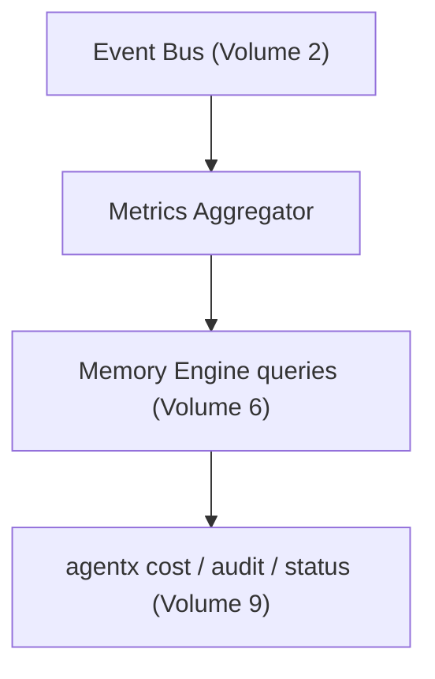

# Volume 13: Observability & SRE

**Status:** Approved — Architecture (Project Owner, 2026-07-12)
**Contract Test:** Template authored at `08-Examples/volume-13-observability/contract.test.ts` — pending Project Owner review before this Volume can advance to Approved — Implementation-Gated per ADR-0009.
**Schema:** `04-Schemas/volume-13.schema.json` added.
**Governs:** Logging, tracing, metrics for agent runs — cost, latency, failure rate
**Depends on:** Volume 1, 2 (Event Bus is the primary data source), 4, 6
**Depended on by:** Volume 10, 11

---

## 1. Objectives

1. Give the operator (and later, org admins via Volume 10) visibility into system health
   without reading raw logs: cost per task, latency per provider, failure rate per tool.
2. Provide the tracing backbone (`traceId`, already required by Volume 2 NFR-2) with an
   actual queryable implementation, not just a field that exists unused.
3. Define alerting thresholds appropriate for a solo-operator v0.1 deployment, extensible
   to org-level alerting once Volume 10 exists.

## 2. Scope

**In scope:** Metrics taxonomy, tracing implementation, log levels/structure, alerting
thresholds and channels.

**Out of scope:** A hosted dashboard product (deferred — CLI `agentx cost`/`agentx audit`
from Volume 9 are the v0.1 surface for this data; a richer UI is a Volume 10/11 concern).

## 3. Chapters

1. Metrics Taxonomy
2. Tracing
3. Structured Logging
4. Alerting

### Chapter 1 — Metrics Taxonomy

| Metric | Source | Aggregation |
|---|---|---|
| `task.duration_ms` | Volume 2 state transitions (Queued→Completed span) | p50/p95 per agent role |
| `provider.cost_usd` | Volume 4 `CompletionResponse.usage` | sum per day/task/graph |
| `provider.latency_ms` | Volume 4 | p50/p95 per provider |
| `tool.failure_rate` | Volume 7 `ToolResult.success` | failures / total calls, per category |
| `approval.pending_count` | Volume 5/7 gate events | current gauge |

All metrics derive from existing Event Bus topics (Volume 2, Ch. 2) — this Volume adds no
new instrumentation points, only aggregation/exposition on top of what already publishes.

### Chapter 2 — Tracing

Every `EventEnvelope.traceId` (Volume 2, Ch. 7) corresponds to one root goal submission
(Volume 9 `submit`). A trace is the full sequence of events sharing that `traceId`,
reconstructable directly from `AuditEvent` (Volume 6, Ch. 3) — no separate tracing
infrastructure (e.g., OpenTelemetry collector) is required for v0.1; `agentx audit
<traceId>` (extending Volume 9's command) is sufficient. An OTel-compatible exporter is a
natural future RFC once multi-service deployment (Volume 11) makes single-process log
correlation insufficient.

### Chapter 3 — Structured Logging

- All logs are structured JSON (not free-text) with mandatory fields: `timestamp`,
  `level`, `traceId`, `component`.
- Log levels: `debug`, `info`, `warn`, `error` — `debug` never runs in default config
  (opt-in via `agentx.config.yaml`, Volume 9 Ch. 5) to avoid accidentally logging verbose
  provider payloads.
- Credentials are never logged at any level (reinforces Volume 4 Ch. 3, Volume 9 NFR-1).

### Chapter 4 — Alerting

v0.1 default: no external alerting channel (email/Slack) — the CLI's `watch`/`status`
commands (Volume 9) are the notification surface for a solo operator actively working.
Threshold-based passive alerts (e.g., "cost exceeded $X today") are a config-driven CLI
warning on next command invocation, not a push notification — push alerting is deferred to
Volume 10/11 where a persistent server process makes it feasible.

## 4. Architecture



## 5. Requirements

### Functional Requirements
- FR-1: Every metric in Ch. 1 MUST be computable purely from existing `AuditEvent`/
  `CostRecord` data (Volume 6) — no parallel metrics store in v0.1.
- FR-2: `traceId` MUST be present on 100% of events published to the bus (already required
  by Volume 2 NFR-2; this Volume is where that requirement is validated via test).

### Non-Functional Requirements
- NFR-1 (No new infra for v0.1): This Volume must not require standing up a separate
  metrics/tracing service before v0.1 ships — that would work against Volume 1's own
  exit-criteria minimalism.

### Security & Isolation
- Ch. 3's no-credential-logging rule is the primary security requirement here, directly
  extending Volume 4 Ch. 3 and Volume 9 NFR-1 into the logging subsystem specifically.

## 6. Mermaid Diagrams

See Section 4 above.

## 7. Interfaces

```typescript
interface MetricsQuery {
  metric: "task.duration_ms" | "provider.cost_usd" | "provider.latency_ms" | "tool.failure_rate";
  groupBy?: "agentRole" | "provider" | "toolCategory";
  range: { from: Date; to: Date };
}
```

## 8. Examples

**Example: querying p95 task duration per agent role for the last 7 days**

```typescript
await metrics.query({ metric: "task.duration_ms", groupBy: "agentRole", range: last7Days });
```

## 9. Risks

| Risk | Likelihood | Impact | Mitigation |
|---|---|---|---|
| Deriving all metrics from `AuditEvent` at query time is slower than a dedicated metrics store as data grows | Medium (grows over time) | Low for v0.1 volume | Add materialized aggregation tables via RFC once query latency is actually measured as a problem |
| No push alerting means real issues go unnoticed between CLI sessions | Medium | Medium | Explicit v0.1 trade-off; Volume 10/11 push-alerting is the intended follow-up, not silently dropped |

## 10. Trade-offs

- **Derive metrics from existing audit data (chosen) vs. standing up Prometheus/Grafana
  now (rejected):** Avoids new infra before v0.1 ships (NFR-1); revisit once Volume 11
  multi-service topology exists.
- **Pull-based CLI visibility (chosen) vs. push alerting (deferred):** Matches actual
  solo-operator usage pattern; push alerting needs a persistent process this Volume
  doesn't assume exists yet.

## 11. Acceptance Criteria

- [ ] Project Owner confirms the metrics taxonomy (Ch. 1) covers what's actually useful
      to see day-to-day.
- [ ] Project Owner confirms deferring push alerting past v0.1.

## 12. Roadmap

Feeds Volume 10 (org-level dashboards) and Volume 11 (once multi-service, revisit
OTel-based tracing per Ch. 2). Proceeding to Volume 14 (Testing & QA Strategy) next.
