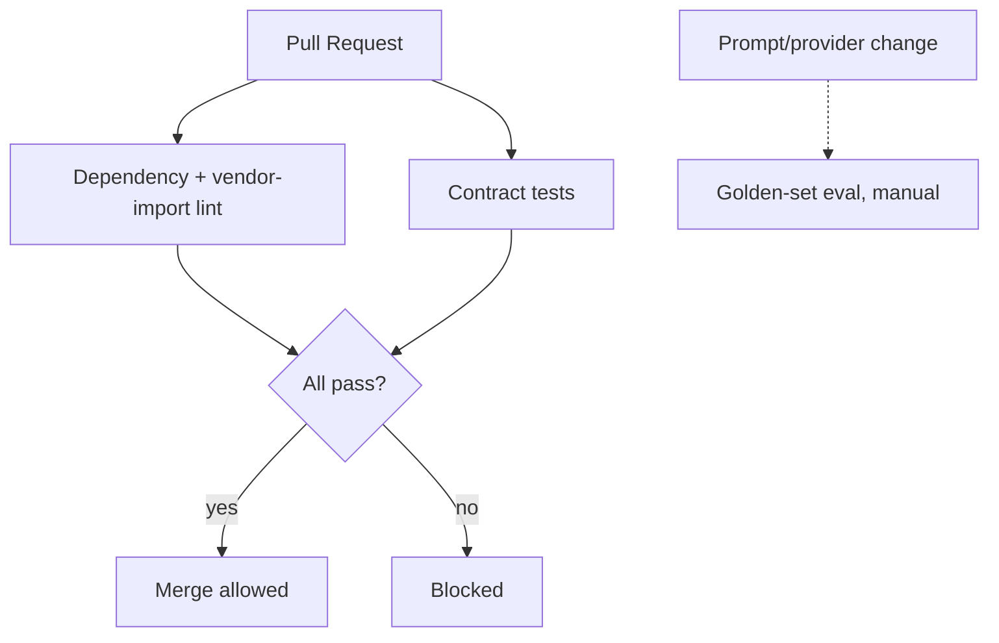

# Volume 14: Testing & QA Strategy

**Status:** Approved — Architecture (Project Owner, 2026-07-12)
**Contract Test:** Template authored at `08-Examples/volume-14-quality-gates/contract.test.ts` — pending Project Owner review before this Volume can advance to Approved — Implementation-Gated per ADR-0009.
**Schema:** `04-Schemas/volume-14.schema.json` added.
**Governs:** Contract-test conventions (Constitution Principle 6), agent output evaluation
methodology, CI gating
**Depends on:** Volume 1 (Constitution Principle 6 is the direct mandate for this Volume)
**Depended on by:** all Volumes (every Volume's Acceptance Criteria references this Volume's contract-test convention)

---

## 1. Objectives

1. Operationalize Constitution Principle 6 (Testable by Default): define exactly what a
   "contract test template" in `08-Examples/` must contain for a Volume to be Approved.
2. Define how to evaluate LLM-driven agent output quality — a fundamentally different
   problem from deterministic unit testing, since two correct outputs can differ in text.
3. Define CI gating rules so a regression in any package is caught before it silently
   breaks a downstream Volume's assumptions.

## 2. Scope

**In scope:** Contract-test template format, agent evaluation methodology (golden-set
scoring, not exact-match), CI pipeline gating rules, the self-hosted-portability check
flagged in Volume 11's risks.

**Out of scope:** Actual test implementation (this Volume defines the convention; each
package's tests are written when that package is implemented).

## 3. Chapters

1. Contract Test Template Format
2. Agent Output Evaluation Methodology
3. CI Gating Rules
4. Deployment Portability Check

### Chapter 1 — Contract Test Template Format

Every Volume that defines an `interface` (per Volume 1, Ch. 5 convention) must have a
corresponding file at `08-Examples/<volume-slug>/contract.test.ts` containing:

```typescript
// 08-Examples/<volume-slug>/contract.test.ts
describe("<InterfaceName> contract", () => {
  it("satisfies functional requirement FR-1", () => { /* ... */ });
  it("fails closed on the documented edge case", () => { /* ... */ });
  it("is idempotent / safe under duplicate invocation (if applicable)", () => { /* ... */ });
});
```

This is a **template**, not the implementation — it exists before code so that any
implementation (hand-written or AI-Studio-generated) can be validated against the same
fixed contract, satisfying Constitution Principle 6's actual purpose: letting an
implementation be regenerated without silently breaking its contract.

### Chapter 2 — Agent Output Evaluation Methodology

Deterministic contract tests (Ch. 1) validate *interfaces and control flow* (did the
Coding Agent respect its tool restrictions, did retries cap correctly). They cannot
validate *whether the code an agent wrote is actually good*. For that:

- **Golden-set evaluation:** a fixed set of representative goals (e.g., "add a health
  check endpoint," "fix a failing test") with human-reviewed acceptable outputs, re-run
  whenever an agent's prompt (Volume 3, Ch. 5) or default provider (Volume 4) changes.
- **Scoring is rubric-based, not exact-match:** did it compile/pass tests, did it stay
  within its tool restrictions, did Review Agent approve it — composite pass/fail, not a
  string diff against a "correct" answer.
- Golden-set runs are manual/periodic in v0.1 (triggered before a prompt or provider
  change ships), not part of every CI run — full automation is a candidate future RFC once
  the golden set is large enough to be worth the provider-cost of running automatically.

### Chapter 3 — CI Gating Rules

| Gate | Applies to | Blocks merge? |
|---|---|---|
| Contract tests (Ch. 1) | Every package with a defined interface | Yes |
| Lint: no cross-Volume dependency violations (Volume 1 Ch. 3 table) | All packages | Yes |
| Lint: no direct vendor SDK import outside `provider-sdk/providers/*` (Constitution Principle 3) | All packages | Yes |
| Golden-set evaluation (Ch. 2) | Agent prompt or provider changes only | Manual gate, not automatic |
| Deployment portability check (Ch. 4) | Infra/config changes | Yes |

### Chapter 4 — Deployment Portability Check

Directly resolves the risk flagged in Volume 11, Ch. 9 ("managed-service convenience
quietly becomes a hard dependency"): CI must periodically verify
`docker-compose up` (Volume 11, Ch. 8 example) brings up a fully working self-hosted
stack, not just that the managed-service path works. Recommended cadence: on every change
to `docker-compose.yml` or core service configuration, plus a scheduled weekly run.

## 4. Architecture



## 5. Requirements

### Functional Requirements
- FR-1: No Volume may be marked Approved (per Volume 1's own Acceptance Criteria pattern)
  without a corresponding contract-test template existing in `08-Examples/`.
- FR-2: CI MUST block merges on dependency-direction violations (Volume 1, Ch. 3 table) —
  this is the CI-enforceable form of Volume 1's FR-2.
- FR-3: Golden-set evaluation MUST be re-run before any change to an agent's system prompt
  template or the default provider ships.

### Non-Functional Requirements
- NFR-1 (Cost-bounded evaluation): Golden-set runs are manual/triggered, not per-commit,
  to keep provider cost bounded (ties to Volume 4/13's cost visibility).

### Security & Isolation
- CI gating (Ch. 3) is where Volume 7's fail-closed permission checks and Volume 10's RLS
  policies get their mandatory contract tests enforced — this Volume is the mechanism that
  makes those Volumes' Acceptance Criteria checkable rather than aspirational.

## 6. Mermaid Diagrams

See Section 4 above.

## 7. Interfaces

```typescript
interface GoldenSetCase {
  id: string;
  goal: string;
  rubric: Array<{ criterion: string; required: boolean }>;
}

interface GoldenSetResult {
  caseId: string;
  passed: boolean;
  failedCriteria: string[];
}
```

## 8. Examples

**Example: golden-set case for the Coding Agent**

```json
{
  "id": "gs-001",
  "goal": "Add a health-check endpoint",
  "rubric": [
    { "criterion": "Build passes", "required": true },
    { "criterion": "No tool calls outside fs.write/shell.build", "required": true },
    { "criterion": "Review Agent approves", "required": false }
  ]
}
```

## 9. Risks

| Risk | Likelihood | Impact | Mitigation |
|---|---|---|---|
| Contract-test-template requirement (FR-1) becomes a checkbox exercise, not real coverage | Medium | Medium | Architecture review (Constitution's Approved definition) should spot-check test substance, not just presence |
| Golden set goes stale (goals no longer representative as the platform grows) | Medium | Low–Medium | Revisit golden set whenever a new agent role is added via RFC (Volume 3) |

## 10. Trade-offs

- **Manual/triggered golden-set runs (chosen) vs. every-commit automated evaluation
  (rejected for v0.1):** Bounds provider cost; full automation is a natural future RFC
  once golden-set size and CI budget justify it.
- **Rubric-based scoring (chosen) vs. exact-match testing (rejected):** Exact-match is
  meaningless for LLM-generated code/text; rubric scoring is the only methodology
  compatible with non-deterministic agent output.

## 11. Acceptance Criteria

- [ ] Project Owner confirms the contract-test template format (Ch. 1) is the right level
      of ceremony (not too heavy for a solo-operator project).
- [ ] Project Owner confirms manual/triggered (not per-commit) golden-set evaluation.
- [ ] Project Owner confirms the CI gating table (Ch. 3) is complete.

## 12. Roadmap

This is the final Volume. With Volumes 1–14 drafted, the handbook's core specification is
now complete pending Project Owner review — see the consolidated summary at the end of
this delivery for what happens next.
