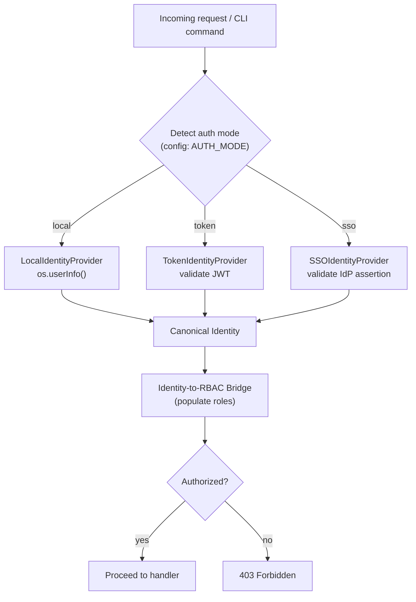
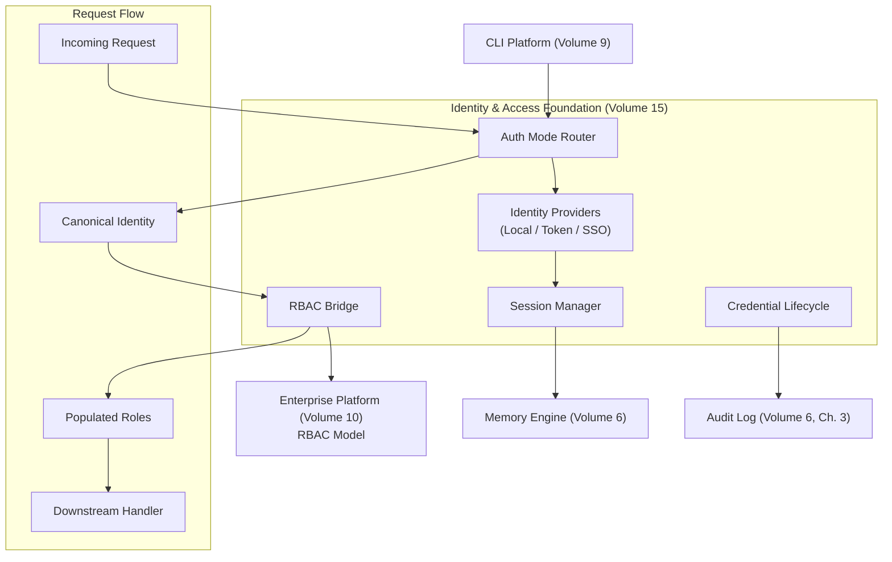

# Volume 15: Identity & Access Foundation

**Status:** Approved — Architecture (Project Owner, 2026-07-13)
**Contract Test:** Template authored at `08-Examples/volume-15-identity/contract.test.ts` — pending Project Owner review before this Volume can advance to Approved — Implementation-Gated per ADR-0009.
**Schema:** `04-Schemas/volume-15.schema.json` added.
**Governs:** Identity sources, authentication modes, session management, identity-to-RBAC bridge
**Depends on:** Volume 1 (Foundation)
**Depended on by:** Volume 10 (Enterprise Platform), Volume 9 (CLI Platform)

---

## 1. Objectives

1. Define the identity model that all authentication modes converge on, so downstream
   consumers (Volume 10's RBAC engine, Volume 9's CLI commands) never need to know *how*
   a user authenticated — only *who* they are.
2. Support a graduated authentication ramp: from zero-friction local mode (v0.1) through
   token-based (v0.5) to enterprise SSO (v1.0), without requiring architecture changes at
   each step — the `IdentityProvider` abstraction is the seam.
3. Define session management that integrates with Memory Engine (Volume 6) for persistence
   and respects the concurrent-session policy appropriate to each auth mode.
4. Specify the identity-to-RBAC bridge that connects an authenticated `Identity` to Volume
   10's role/permission model, including a deterministic permission resolution order.

## 2. Scope

**In scope:** Authentication modes (local, token, SSO), session entity and lifecycle, the
`Identity` and `IdentityProvider` interfaces, identity-to-RBAC bridge logic, credential
lifecycle (rotation, lockout, revocation).

**Out of scope:** The RBAC model itself (Volume 10, Ch. 2 defines roles and permissions),
the policy engine (Volume 10, Ch. 3), any UI for login or user management, and the actual
OIDC/SAML protocol implementation details (those are provider-specific adapter concerns,
not architectural specification).

## 3. Chapters

1. Authentication Modes
2. Session Management
3. Identity Model
4. Identity-to-RBAC Bridge
5. Credential Lifecycle

### Chapter 1 — Authentication Modes

The platform supports three authentication modes, selected via configuration. Each mode
produces the same `Identity` output — the difference is only in how that identity is
established and how much assurance it carries.

| Mode | Version | Configuration | Identity Source | MFA |
|---|---|---|---|---|
| `local` | v0.1 | `AUTH_MODE=local` | OS username (trusted operator) | N/A |
| `token` | v0.5 | `AUTH_MODE=token` | JWT issued after CLI login | Optional (TOTP) |
| `sso` | v1.0 | `AUTH_MODE=sso` | OIDC/SAML IdP assertion | IdP-enforced |

**Local mode (v0.1):** The operator is trusted by virtue of having filesystem/shell access
to the machine running agentx. Identity is derived from the OS username (`os.userInfo().username`)
with a fixed `authMode: "local"` tag. No login step is required. This matches the
solo-developer deployment context of v0.1 (Volume 1, Ch. 6) and avoids premature
authentication complexity. The local mode provider (`LocalIdentityProvider`) wraps the
OS username into a canonical `Identity` object so downstream code is already consuming the
right shape even though no real authentication occurred.

**Token-based mode (v0.5):** Introduces a `agentx login` CLI command that authenticates
against a local credential store (password or API key). On success, the system issues a
signed JWT access token (short-lived, default 15 minutes) and a refresh token
(longer-lived, default 24 hours). The `TokenIdentityProvider` validates incoming JWTs on
each request and re-issues access tokens via the refresh token. Tokens are signed with the
platform's signing key (see Volume 16 for key management).

**Enterprise SSO mode (v1.0):** Integrates with an external identity provider via OIDC or
SAML. The `SSOIdentityProvider` validates IdP assertions, extracts claims (email, groups,
roles), and maps them into the canonical `Identity`. MFA enforcement is delegated to the
IdP — agentx does not implement MFA itself, it trusts the IdP's assurance level. The
SSO adapter implements the standard OIDC authorization code flow; the SAML adapter consumes
SAML assertions posted to a callback endpoint.

**Configuration:** The active mode is set in `agentx.config.yaml` (Volume 9, Ch. 5):

```yaml
auth:
  mode: local  # "local" | "token" | "sso"
  # token-mode specific:
  token:
    accessTokenTtlMinutes: 15
    refreshTokenTtlHours: 24
  # sso-mode specific:
  sso:
    issuerUrl: "https://idp.example.com"
    clientId: "agentx"
    protocol: "oidc"  # "oidc" | "saml"
```

### Chapter 2 — Session Management

A **session** represents a single authenticated context — the period between login (or
identity establishment in local mode) and expiry/revocation. Sessions are first-class
entities persisted in Memory Engine (Volume 6) alongside Task and AuditEvent data.

**Session entity:**

```prisma
model Session {
  id           String   @id @default(cuid())
  identityId   String
  authMode     String   // "local" | "token" | "sso"
  createdAt    DateTime @default(now())
  expiresAt    DateTime
  lastActiveAt DateTime @updatedAt
  metadata     Json     // IP, user-agent, device fingerprint (non-PII)
  revokedAt    DateTime?
  tenantId     String?
}
```

**TTL and refresh:** Session `expiresAt` is set at creation time based on the auth mode's
configured TTL. The `lastActiveAt` field is updated on each request; in token mode, the
access token's short TTL means refresh tokens handle long-lived sessions transparently. In
local mode, the session lasts for the duration of the CLI process (no explicit expiry in
v0.1, though the config value still applies for consistency).

**Concurrent session policy:**

| Version | Policy |
|---|---|
| v0.1 (local mode) | Single implicit session per OS user. No enforcement needed — one process, one operator. |
| v0.5 (token mode) | Configurable: `maxConcurrentSessions` (default 3). Oldest session is revoked when exceeded. |
| v1.0 (SSO mode) | Per-org policy via Volume 10's `OrgPolicy`. Default: 5 concurrent sessions per identity. |

Session revocation (setting `revokedAt`) is checked on every request in token and SSO
modes. In local mode, revocation is implicit (process termination).

**Session storage:** Sessions use the Memory Engine (Volume 6) as their persistence backend,
sharing the same PostgreSQL instance. Session queries are high-frequency (checked on every
API/CLI request), so a Redis-based session cache (fronting Postgres) is recommended for
v0.5+ — this is an implementation optimization, not an architectural requirement. The
canonical source of truth is always Postgres; Redis is a read-through cache with TTL
aligned to session `expiresAt`.

### Chapter 3 — Identity Model

The `Identity` interface is the central abstraction. Every authenticated request carries an
`Identity`; every authorization check operates on an `Identity`. No module downstream of
this Volume ever sees a raw token, OS username, or IdP assertion — only `Identity`.

```typescript
type AuthMode = "local" | "token" | "sso";

interface Identity {
  id: string;               // internal canonical ID, e.g. "id_local_jdoe" or "id_sso_abc123"
  externalId: string;       // OS username, email from IdP, etc. — the human-meaningful identifier
  authMode: AuthMode;
  roles: string[];          // populated by the identity-to-RBAC bridge (Ch. 4)
  metadata: {
    tenantId?: string;      // set for SSO/token modes; "default" for local
    groups?: string[];      // IdP group claims (SSO mode only)
    mfaVerified: boolean;   // true if MFA was verified during this authentication
    authenticatedAt: Date;
    issuer?: string;        // IdP issuer URL (SSO mode only)
  };
}
```

**Identity Provider abstraction:** Each auth mode is implemented by an `IdentityProvider`
that produces an `Identity` from mode-specific inputs:

```typescript
interface IdentityProvider {
  readonly mode: AuthMode;

  /** Authenticate and produce an Identity. For local mode, this is synchronous (no credentials).
   *  For token mode, validates JWT. For SSO mode, validates IdP assertion. */
  authenticate(context: AuthContext): Promise<Identity>;

  /** Check if a previously issued Identity is still valid (e.g., token not revoked/expired). */
  validate(identity: Identity): Promise<boolean>;

  /** Revoke the Identity's session(s). */
  revoke(identityId: string, reason: string): Promise<void>;
}

type AuthContext =
  | { mode: "local"; osUsername: string }
  | { mode: "token"; accessToken: string; refreshToken?: string }
  | { mode: "sso"; idpAssertion: unknown; protocol: "oidc" | "saml" };
```

**Concrete implementations:**

| Provider | Package | Input | Notes |
|---|---|---|---|
| `LocalIdentityProvider` | `packages/auth/` | OS username | Wraps `os.userInfo()`, creates/retrieves `Identity` with `id: "id_local_{username}"` |
| `TokenIdentityProvider` | `packages/auth/` | JWT access token | Validates signature (Volume 16 signing key), checks expiry, maps `sub` claim to `Identity.id` |
| `SSOIdentityProvider` | `packages/auth/` | OIDC/SAML assertion | Validates IdP signature, extracts claims, maps to `Identity` |

**Identity resolution flow:**



The `Identity` is attached to the request context (NestJS middleware/guard) and flows
through to all downstream handlers, which read `identity.roles` to make authorization
decisions via Volume 10's RBAC checks.

### Chapter 4 — Identity-to-RBAC Bridge

The bridge is the mechanism that populates `Identity.roles` from the authenticated
identity's attributes and the organization's role configuration. It operates in two
stages:

**Stage 1 — System default roles:** Every identity receives a set of system-level roles
based on its `authMode`:

| Auth Mode | Default Roles |
|---|---|
| `local` (v0.1) | `["owner", "developer", "viewer"]` — full access, matches solo-operator context |
| `token` (v0.5) | `["developer"]` — base role; owner role assigned explicitly by an existing owner |
| `sso` (v1.0) | `["viewer"]` — base role; all other roles assigned explicitly by org admin |

This graduated default ensures that local mode (trusted operator, single machine) has
zero friction, while SSO mode (untrusted network, multi-user org) defaults to least
privilege.

**Stage 2 — Organization custom roles:** Once Volume 10's tenant model is active, an
organization's Owner can assign additional roles to identities. Custom role assignments
are stored in a mapping table and merged with system defaults. Custom assignments can
only *add* roles, not remove system defaults (system defaults are a floor, not overridden).

```typescript
interface RoleAssignment {
  identityId: string;
  tenantId: string;
  role: string;          // e.g. "owner", "developer", "viewer", or custom org role
  assignedBy: string;    // identityId of the assigner
  assignedAt: Date;
}

interface RBACBridge {
  /** Resolve the full set of roles for an identity within a tenant context. */
  resolveRoles(identity: Identity, tenantId: string): Promise<string[]>;

  /** Check if a specific permission is granted for an identity. */
  checkPermission(identity: Identity, permission: string, tenantId: string): Promise<boolean>;
}
```

**Permission resolution order:** When checking whether an identity has a specific
permission, the resolution follows a strict priority chain:

1. **Explicit deny** — if any assigned role explicitly denies the permission, access is
   denied immediately. This is the highest-priority rule and cannot be overridden.
2. **Role deny** — if any of the identity's roles (system or custom) define the
   permission as denied in their role definition, access is denied.
3. **Role allow** — if any of the identity's roles define the permission as allowed,
   access is granted.
4. **Default allow** — if no role explicitly addresses the permission, the system
   defaults to allow for `local` mode and deny for `token`/`sso` modes (matching the
   least-privilege principle for network-authenticated modes).

This four-tier order is non-negotiable: explicit deny always wins, and default allow only
applies in the trusted local context. This is the fail-closed posture required by
Constitution Principle 7.

### Chapter 5 — Credential Lifecycle

**Password/token rotation policy:**

| Version | Mechanism | Cadence |
|---|---|---|
| v0.1 (local) | N/A — no credentials in local mode | N/A |
| v0.5 (token) | Manual: `agentx auth rotate-token` CLI command | On demand |
| v0.5 (token, optional) | Configurable max token age; warning at 80% of TTL | Configurable, default 90 days |
| v1.0 (SSO) | Delegated to IdP; agentx respects IdP session lifetime | IdP policy |

Token rotation invalidates all existing refresh tokens for the identity and issues a new
access/refresh pair. The old refresh tokens are recorded in a revocation log (part of the
Session entity's `revokedAt` field and Volume 6's `AuditEvent`).

**Account lockout:** After a configurable number of consecutive failed authentication
attempts (default: 5), the identity is temporarily locked for a cooldown period (default:
15 minutes). Lockout state is tracked in a dedicated `AuthAttempt` record:

```typescript
interface AuthAttempt {
  identityId: string;
  succeeded: boolean;
  timestamp: Date;
  clientIp?: string;
}
```

Failed attempts are counted within a sliding window (default: 30 minutes). The lockout is
automatically released after the cooldown; manual unlock by an `owner`-role identity is
also supported via `agentx auth unlock <identityId>`.

**Session revocation:** Sessions can be revoked in three ways:
1. **Explicit revocation** — `agentx auth revoke-session <sessionId>` or `agentx auth
   revoke-all <identityId>` (revokes all active sessions for the identity).
2. **Concurrent session limit** — oldest sessions are revoked automatically when the limit
   is exceeded (Ch. 2).
3. **Admin revocation** — an `owner`-role identity can revoke any session within their
   tenant.

All revocations are logged to `AuditEvent` (Volume 6, Ch. 3) with the `revokerId`,
`revokedSessionId`, and `reason` fields.

## 4. Architecture



This Volume depends only on Volume 1 (Foundation) for terminology and conventions. It
exposes the `Identity` type and `IdentityProvider` interface to Volume 10 (which defines
what roles mean) and Volume 9 (which attaches identity to CLI command context). Memory
Engine (Volume 6) is used for session persistence but the dependency is on Volume 6's
`Persistence` interface, not an import of Volume 6's package — keeping the dependency
direction correct per Volume 1, Ch. 3.

## 5. Requirements

### Functional Requirements
- FR-1: All three authentication modes (local, token, SSO) MUST produce the same `Identity`
  interface — no downstream code may branch on `authMode` to access identity data.
- FR-2: Session revocation MUST be effective within 5 seconds for token and SSO modes
  (checked on every request against the session store or its cache).
- FR-3: The RBAC bridge MUST resolve roles deterministically — the same `Identity` and
  `tenantId` input MUST always produce the same role set, given the same role assignment
  state.
- FR-4: Account lockout MUST trigger after the configured number of consecutive failed
  attempts; the lockout state MUST be checked before credential validation to prevent
  brute-force attacks even against the validation endpoint.
- FR-5: All authentication events (login, logout, lockout, unlock, revocation) MUST be
  logged to `AuditEvent` (Volume 6, Ch. 3) — no silent auth state changes.

### Non-Functional Requirements
- NFR-1 (Performance): Session validation (check + role resolution) MUST add no more than
  10ms latency to an authenticated request in the common path (Redis cache hit, no DB
  round-trip).
- NFR-2 (Extensibility): Adding a new auth mode (e.g., WebAuthn) MUST require only
  implementing a new `IdentityProvider` — no changes to the `Identity` interface,
  session manager, or RBAC bridge.

### Security & Isolation
- Tokens and IdP assertions are handled exclusively within `packages/auth/` — no other
  package ever sees raw token bytes. The `Identity` object carries only the resolved
  identity, never the raw credential (per Constitution Principle 7).
- JWT signing keys are managed by Volume 16 (Secrets & Key Management) — this Volume never
  stores or reads signing keys directly, only references them via the `KeyProvider`
  interface.
- Local mode's trust-on-OS-username model is explicitly documented as a security boundary:
  it is acceptable only when the operator has full filesystem access to the machine. This
  mode MUST NOT be enabled on any network-accessible deployment — a startup guard rejects
  `AUTH_MODE=local` when `AGENTX_NETWORK_ACCESS=true` is set.
- Permission resolution order (Ch. 4, explicit deny first) is the enforcement mechanism
  for fail-closed authorization, directly satisfying Constitution Principle 7.

## 6. Mermaid Diagrams

See Section 4 (Architecture) and Chapter 3 (Identity Resolution Flow) above.

## 7. Interfaces

```typescript
// -- Core Types --

type AuthMode = "local" | "token" | "sso";

interface Identity {
  id: string;
  externalId: string;
  authMode: AuthMode;
  roles: string[];
  metadata: {
    tenantId?: string;
    groups?: string[];
    mfaVerified: boolean;
    authenticatedAt: Date;
    issuer?: string;
  };
}

// -- Identity Provider --

type AuthContext =
  | { mode: "local"; osUsername: string }
  | { mode: "token"; accessToken: string; refreshToken?: string }
  | { mode: "sso"; idpAssertion: unknown; protocol: "oidc" | "saml" };

interface IdentityProvider {
  readonly mode: AuthMode;
  authenticate(context: AuthContext): Promise<Identity>;
  validate(identity: Identity): Promise<boolean>;
  revoke(identityId: string, reason: string): Promise<void>;
}

// -- Session --

interface Session {
  id: string;
  identityId: string;
  authMode: AuthMode;
  createdAt: Date;
  expiresAt: Date;
  lastActiveAt: Date;
  metadata: Record<string, unknown>;
  revokedAt?: Date;
  tenantId?: string;
}

interface SessionManager {
  create(identity: Identity, ttlSeconds: number): Promise<Session>;
  validate(sessionId: string): Promise<Session | null>;
  revoke(sessionId: string, reason: string): Promise<void>;
  revokeAllForIdentity(identityId: string, reason: string): Promise<void>;
  listActive(identityId: string): Promise<Session[]>;
}

// -- Auth Configuration --

interface AuthConfig {
  mode: AuthMode;
  token?: {
    accessTokenTtlMinutes: number;
    refreshTokenTtlHours: number;
    signingKeyId: string;  // references Volume 16's KeyProvider
  };
  sso?: {
    issuerUrl: string;
    clientId: string;
    protocol: "oidc" | "saml";
  };
  lockout?: {
    maxFailedAttempts: number;  // default 5
    cooldownSeconds: number;    // default 900 (15 min)
    windowSeconds: number;      // default 1800 (30 min sliding window)
  };
  session?: {
    maxConcurrent: number;      // default varies by mode (Ch. 2)
  };
}

// -- RBAC Bridge --

interface RBACBridge {
  resolveRoles(identity: Identity, tenantId: string): Promise<string[]>;
  checkPermission(identity: Identity, permission: string, tenantId: string): Promise<boolean>;
}

// -- Credential Lifecycle --

interface AuthAttempt {
  identityId: string;
  succeeded: boolean;
  timestamp: Date;
  clientIp?: string;
}
```

## 8. Examples

**Example 1: Local mode — identity resolution for a CLI command**

```typescript
// Volume 9 (CLI Platform) calls this during request initialization
const provider = identityProviderRegistry.get(authConfig.mode); // "local"
const identity = await provider.authenticate({
  mode: "local",
  osUsername: os.userInfo().username,
});
// identity = {
//   id: "id_local_jdoe",
//   externalId: "jdoe",
//   authMode: "local",
//   roles: ["owner", "developer", "viewer"],  // system defaults for local
//   metadata: { tenantId: "default", mfaVerified: false, authenticatedAt: ... }
// }
const hasPermission = await rbacBridge.checkPermission(identity, "task.submit", "default");
// true — local mode defaults to full access
```

**Example 2: Token mode — login and session creation**

```bash
$ agentx login
Username: jdoe
Password: ********
Logged in. Access token expires in 15 minutes.
```

```typescript
// Behind the scenes:
const identity = await tokenProvider.authenticate({
  mode: "token",
  accessToken: extractedJwt,
});
const session = await sessionManager.create(identity, authConfig.token.accessTokenTtlMinutes * 60);
// Session persisted in Memory Engine (Volume 6)
```

**Example 3: RBAC bridge — permission check for SSO user**

```typescript
// SSO-authenticated user "alice@example.com" in tenant "acme"
const identity: Identity = {
  id: "id_sso_alice_42",
  externalId: "alice@example.com",
  authMode: "sso",
  roles: [],  // not yet resolved
  metadata: { tenantId: "acme", groups: ["engineering"], mfaVerified: true, authenticatedAt: ..., issuer: "https://idp.example.com" }
};

const roles = await rbacBridge.resolveRoles(identity, "acme");
// System default for SSO: ["viewer"]
// Org custom assignment (by admin): + ["developer"]
// roles = ["viewer", "developer"]

const canApprove = await rbacBridge.checkPermission(identity, "task.approve", "acme");
// Depends on whether "developer" role includes "task.approve" in Volume 10's role definition
```

## 9. Risks

| Risk | Likelihood | Impact | Mitigation |
|---|---|---|---|
| Local mode's OS-username trust is exploited on a shared machine | Low (v0.1 is single-operator) | High — unauthorized task execution | Startup guard: reject `AUTH_MODE=local` when `AGENTX_NETWORK_ACCESS=true`; document this as a deployment constraint |
| JWT signing key compromise (token mode) | Low | Critical — identity forgery | Keys managed by Volume 16 with rotation; short access-token TTL limits window; key compromise triggers full session revocation |
| SSO IdP outage blocks all authentication | Low–Medium | High — platform unusable | `SSOIdentityProvider` caches the last-valid assertion's claims for a grace period (configurable, default 1 hour); admin can temporarily switch to token mode via config |
| RBAC bridge performance degrades under high request rate | Low for v0.1 | Medium | Redis-cached role resolution (cache TTL aligned with session TTL); cache invalidated on role assignment change |
| Concurrent session limit causes unexpected revocation during legitimate multi-device use | Medium (v0.5+) | Low–Medium | Configurable limit (Ch. 2); CLI warning when approaching limit; audit log entry on automatic revocation |

## 10. Trade-offs

- **Local mode trusts OS username (chosen) vs. requiring credentials even in v0.1
  (rejected):** Requiring credentials on a solo-developer local machine is ceremony with
  no security benefit — the attacker already has filesystem access. The startup guard
  (rejecting local mode on network-accessible deployments) prevents misuse.
- **System default roles differ by auth mode (chosen) vs. uniform defaults (rejected):**
  Uniform defaults would force local mode to be locked down or SSO mode to be too open.
  Mode-specific defaults match the actual trust level of each authentication mechanism.
- **Four-tier permission resolution order (chosen) vs. simpler allow/deny model
  (rejected):** The explicit-deny-highest rule is the only way to implement emergency
  overrides (e.g., "deny all write access for this user immediately") without first
  removing them from all roles — essential for incident response.
- **Session revocation effective within 5 seconds (chosen) vs. immediate (rejected):**
  Immediate revocation would require invalidating a Redis cache on every revocation event,
  adding complexity. A 5-second window is an acceptable blast radius for a platform where
  the most sensitive actions (destructive tool calls) already require approval gates
  (Volume 5).

## 11. Acceptance Criteria

- [ ] Project Owner confirms the three authentication modes (local, token, SSO) and their
      version mapping (v0.1, v0.5, v1.0).
- [ ] Project Owner confirms the `Identity` interface is the correct canonical shape for
      downstream consumption.
- [ ] Project Owner confirms the permission resolution order (explicit deny > role deny >
      role allow > default allow) and the mode-dependent default-allow behavior.
- [ ] Project Owner confirms the concurrent session policy defaults per mode (Ch. 2).
- [ ] Project Owner confirms account lockout defaults (5 attempts, 15-minute cooldown).
- [ ] No outstanding Draft-blocking risk from Section 9 is left unaddressed.

## 12. Roadmap

- **v0.1 (current):** Local mode only. `LocalIdentityProvider` ships. Session entity is
  created in Memory Engine schema but concurrent-session enforcement is not yet active.
  Identity-to-RBAC bridge resolves system defaults only (no org custom roles until
  Volume 10).
- **v0.5:** Token-based mode. `TokenIdentityProvider` ships with JWT issuance and refresh.
  `agentx login` CLI command added (Volume 9). Session revocation and concurrent-session
  enforcement become active. Account lockout implemented.
- **v1.0:** Enterprise SSO mode. `SSOIdentityProvider` ships with OIDC and SAML adapters.
  Identity-to-RBAC bridge integrates with Volume 10's org-level role assignments. MFA
  verified flag populated from IdP claims.
- **v2.0 (candidate):** WebAuthn/passkey support (new `IdentityProvider` implementation,
  no interface changes). Adaptive session TTL based on risk signals (unusual IP, new
  device). Propose as a future RFC once v1.0 SSO is proven stable.

## Observability Requirements

### Metrics
- Authentication latency (p50, p95) — time to validate credentials per auth mode (local, token, SSO)
- Session creation rate — number of new sessions created per minute
- Active session count — number of currently valid sessions across all identity providers
- Authentication failure rate — percentage of failed login attempts per identity source
- Session invalidation events — count of sessions revoked (manual expiry, logout, security trigger)

### Logging
- Log authentication attempts with identity source, auth mode, userId (or attempted userId), and result
- Log session lifecycle events (created, refreshed, invalidated) with sessionId and userId
- Log identity-to-RBAC bridge evaluations with userId, resolved roles, and source identity provider
- Log SSO token exchange events with IdP name, token type, and expiry

### Alerting
- Alert if authentication failure rate exceeds 25% over a 5-minute window (possible brute-force or IdP outage)
- Alert if session creation rate drops to zero for more than 5 minutes during business hours (auth system down)