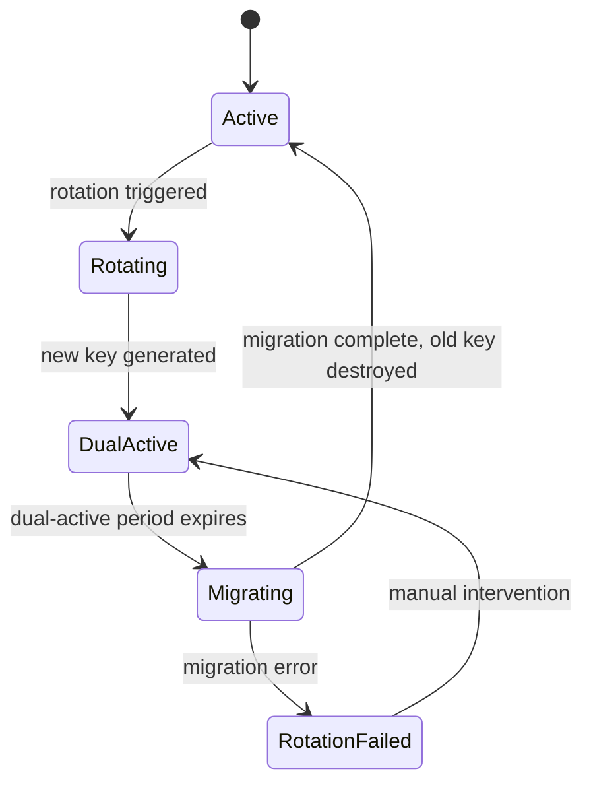
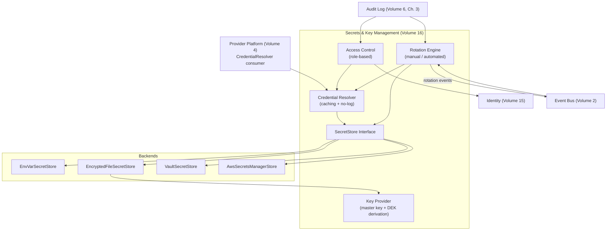

# Volume 16: Secrets & Key Management

**Status:** Approved — Architecture (Project Owner, 2026-07-13)
**Contract Test:** Template authored at `08-Examples/volume-16-secrets-and-key-management/contract.test.ts`, covering FR-1 through FR-6 (FR-6 as `.todo()`) — pending Project Owner review before this Volume can advance to Approved — Implementation-Gated per ADR-0009.
**Schema:** `04-Schemas/volume-16.schema.json` added.
**Governs:** Secret storage, rotation, retrieval, encryption key management
**Depends on:** Volume 1 (Foundation), Volume 2 (Core Runtime)
**Depended on by:** Volume 4 (Provider Platform), Volume 10 (Enterprise Platform), Volume 11 (Cloud Platform)

---

## 1. Objectives

1. Provide a unified `SecretStore` interface that abstracts secret storage backends,
   enabling a smooth ramp from environment variables (v0.1) to enterprise-grade secret
   managers (v1.0) without changing any consumer code — directly extending Volume 4,
   Ch. 3's `CredentialResolver` seam.
2. Formalize the `CredentialResolver` contract that Volume 4 introduced informally, adding
   caching, no-logging guarantees, and a versioned config interface.
3. Define secret classification categories with rotation cadences appropriate to each
   category's blast radius.
4. Specify a key management architecture supporting key derivation, separation by category,
   and zero-downtime rotation — ensuring that rotating a provider API key or encryption key
   never causes a running system to fail.
5. Enforce access control and auditability for all secret operations, tying into Volume
   6's audit log and Volume 15's identity model.

## 2. Scope

**In scope:** `SecretStore` interface and backend implementations, `CredentialResolver`
formalization, secret classification and rotation policy, key derivation and management,
access control for secret operations, audit trail for secret access.

**Out of scope:** The actual provider SDK integration (Volume 4), the OIDC/SAML IdP
secret handling (Volume 15 delegates to this Volume for storage but IdP protocol details
are Volume 15's concern), and any UI for secret management (a future console concern).

## 3. Chapters

1. Secret Storage Architecture
2. Credential Resolution Contract
3. Secret Categories & Classification
4. Rotation Policy
5. Access Control for Secrets
6. Key Management

### Chapter 1 — Secret Storage Architecture

The platform uses a multi-backend secret storage design. A `SecretStore` interface defines
the contract; concrete implementations provide backend-specific storage. The active backend
is selected via configuration, and no consumer code ever knows which backend is active.

**Backend progression:**

| Version | Backend | Encryption at Rest | Configuration |
|---|---|---|---|
| v0.1 | Environment variables | N/A (host process memory) | `SECRET_BACKEND=env` |
| v0.5 | Encrypted file on disk | AES-256-GCM | `SECRET_BACKEND=file` |
| v1.0 | HashiCorp Vault or AWS Secrets Manager | Native (Vault: transit; AWS: KMS) | `SECRET_BACKEND=vault` or `SECRET_BACKEND=aws` |

**Self-hosted fallback:** Per ADR-0007 and Constitution Principle 9 (No Vendor Lock-in),
every managed secret backend MUST have a working self-hosted fallback. The encrypted-file
backend (v0.5) is itself the self-hosted fallback for both Vault and AWS — if the managed
service is unavailable, operators can export secrets to the encrypted-file backend with
zero code changes.

```typescript
interface SecretStore {
  readonly backendId: string;

  /** Retrieve a secret by key. Throws if not found. */
  get(key: string): Promise<SecretEntry>;

  /** Store a secret. Overwrites if key exists (audit-logged). */
  set(key: string, value: string, metadata?: SecretMetadata): Promise<void>;

  /** Delete a secret. Throws if not found. */
  delete(key: string): Promise<void>;

  /** List all secret keys (values are not returned). */
  list(): Promise<string[]>;

  /** Check if a secret exists without accessing its value. */
  has(key: string): Promise<boolean>;
}

interface SecretEntry {
  key: string;
  value: string;            // the actual secret — never logged
  version: number;          // incremented on each set()
  createdAt: Date;
  updatedAt: Date;
  metadata?: SecretMetadata;
}

interface SecretMetadata {
  category: SecretCategory;       // see Ch. 3
  classification: Classification;  // see Ch. 3
  lastRotatedAt?: Date;
  rotatedBy?: string;              // identity ID from Volume 15
}
```

**Backend implementations:** `EnvVarSecretStore` reads from `process.env` on `get()`,
`set()`/`delete()` are no-ops (env vars are immutable at runtime). `EncryptedFileSecretStore`
stores in a single AES-256-GCM encrypted JSON file. `VaultSecretStore` uses Vault KV v2
+ transit engine. `AwsSecretsManagerStore` uses AWS SDK with KMS envelope encryption.

**Configuration:**

```yaml
secrets:
  backend: env  # "env" | "file" | "vault" | "aws"
  file:
    path: ".agentx/secrets.enc"
    masterKeyId: "master-key-v1"  # references Ch. 6's KeyProvider
  vault:
    address: "https://vault.example.com:8200"
    namespace: "agentx"
    authMethod: "approle"  # "approle" | "jwt"
    roleId: "${VAULT_ROLE_ID}"
    secretId: "${VAULT_SECRET_ID}"  # bootstrapping secret only, not stored here
  aws:
    region: "us-east-1"
    prefix: "agentx/"
```

### Chapter 2 — Credential Resolution Contract

This chapter formalizes the `CredentialResolver` that Volume 4, Ch. 3 introduced as a
minimal interface, adding caching, no-logging guarantees, and versioned config.

```typescript
interface CredentialResolverConfig {
  keyMapping: Record<string, string>;   // logical key → backend key renaming
  cacheTtlSeconds: number;             // default 300
  enforceNoLog: boolean;               // default true
}

interface CredentialResolver {
  resolve(logicalKey: string): Promise<string>;
  resolveMetadata(logicalKey: string): Promise<SecretMetadata>;
  invalidate(logicalKey: string): Promise<void>;
  invalidateAll(): Promise<void>;
}
```

`resolve()` is the ONLY way any module accesses a secret value. The returned value MUST
never be logged, serialized to an event payload, or included in debug output.

**Caching strategy:**

Credentials are cached in-memory with a 5-minute default TTL. The cache is
invalidated on explicit `invalidate()` call (triggered automatically by rotation) or
TTL expiry.

**No-logging guarantee:** Two-layer defense:
1. **Lint rule** (`no-credential-logging`): flags any `console.log`/`logger.info` that
   includes a variable assigned from `CredentialResolver.resolve()`. Catches common cases
   at development time.
2. **Runtime filter** (`RedactedString` proxy): wraps returned values so `JSON.stringify()`
   and `.toString()` return `"[REDACTED]"` outside the immediate call site. Catches runtime
   serialization and third-party library logging.

### Chapter 3 — Secret Categories & Classification

Secrets are classified into categories based on their purpose and into classification
levels based on their blast radius. Both dimensions inform rotation cadence and access
control.

**Categories:**

| Category | Description | Examples | Key Separation |
|---|---|---|---|
| `provider` | LLM provider API keys and tokens | `anthropic_api_key`, `google_api_key` | Provider category key (Ch. 6) |
| `database` | Database connection credentials | `postgres_password`, `redis_password` | Database category key |
| `encryption` | Encryption keys (master key, DEKs) | `master-key-v1`, `dek-session-v1` | Not stored in SecretStore (Ch. 6) |
| `plugin` | Third-party plugin secrets (future marketplace) | `plugin_github_token` | Plugin category key |
| `auth` | Authentication signing keys and tokens | `jwt_signing_key`, `sso_client_secret` | Auth category key |

**Classification levels:**

| Level | Rotation Cadence (default) | Access | Examples |
|---|---|---|---|
| `critical` | 30 days (automated in v1.0) | Owner only, audit-logged, break-glass available | Master encryption key, JWT signing key |
| `high` | 90 days (automated in v1.0) | Owner + Developer, audit-logged | Provider API keys, database passwords |
| `medium` | 180 days (manual in v0.1, automated in v1.0) | Owner + Developer, audit-logged | Plugin secrets, SSO client secrets |
| `low` | 365 days or on demand | Developer + Viewer (read-only metadata), audit-logged | Non-sensitive config tokens, internal service tokens |

The classification is assigned at secret-creation time (via `SecretMetadata`) and can be
changed by an Owner via the audit-logged `reclassify` operation. Downgrading classification
(from `critical` to `high`, for example) requires an explicit confirmation step and is
logged as a high-severity audit event.

**Key naming convention:** Secret keys follow the pattern
`{category}/{logical-name}#v{version}`, e.g., `provider/anthropic_api_key#v3`. The version
suffix is incremented on each rotation, enabling audit trail reconstruction without
examining the `SecretEntry.version` field alone.

### Chapter 4 — Rotation Policy

**Rotation modes by version:**

| Version | Mode | Trigger |
|---|---|---|
| v0.1 | Manual | `agentx secrets rotate <key>` CLI command |
| v0.5 | Manual with notification | Same command + warning when approaching cadence deadline |
| v1.0 | Automated (TTL-based) | Background job checks classification cadence; rotates and notifies |
| v1.0+ | Automated with approval | For `critical` secrets, rotation generates a pending-approval task |

**Manual rotation (v0.1):** `agentx secrets rotate <key>` prompts for a new value,
calls `SecretStore.set()` (incrementing version), and invalidates the cache. In-flight
requests complete on the old cached value; new requests resolve the new value.

**Automated rotation (v1.0):** A BullMQ job (Volume 2) checks all secrets against their
classification's rotation cadence daily. When a secret is within 7 days of its deadline, a
`secrets.rotation_warning` event is published. At deadline, the rotation job generates a new
value, stores it, invalidates the cache, and publishes `secrets.rotated`. For `critical`
secrets, rotation creates an `AwaitingApproval` task for Owner verification.

**Zero-downtime rotation strategy (dual-active key period):** For secrets that cannot be
rotated atomically (e.g., an encryption key where existing data is encrypted with the old
key), the platform supports a dual-active period:

1. New key is generated and stored alongside the old key (both versions are valid).
2. New writes use the new key; reads of old-encrypted data use the old key for decryption
   and re-encrypt with the new key on access (lazy migration).
3. After the dual-active period expires (default: 7 days), the old key is marked for
   decommission. Any remaining data still encrypted with the old key triggers a migration
   job.
4. Once migration is confirmed complete, the old key is destroyed (Ch. 6).



### Chapter 5 — Access Control for Secrets

**Who can access which secrets (role-based):**

Access to secret values (via `CredentialResolver.resolve()`) is governed by the identity's
role (Volume 15, Ch. 4) and the secret's classification (Ch. 3):

| Classification | Owner | Developer | Viewer |
|---|---|---|---|
| `critical` | Read, Write, Rotate | — | — |
| `high` | Read, Write, Rotate | Read | — |
| `medium` | Read, Write, Rotate | Read | Metadata only |
| `low` | Read, Write, Rotate | Read | Metadata only |

"Read" means access to the secret value. "Metadata only" means access to
`SecretMetadata` (category, classification, rotation date) but not the value. This is
enforced by the `CredentialResolver` itself — when a Viewer-role identity calls
`resolve()`, the resolver checks the secret's classification and throws a
`PermissionDeniedError` if the classification requires at least Developer role.

**Audit trail:** Every secret access is logged to `AuditEvent` (Volume 6, Ch. 3) with:

```typescript
interface SecretAccessEvent {
  secretKey: string;
  operation: "resolve" | "resolve_metadata" | "set" | "delete" | "rotate" | "reclassify";
  identityId: string;
  tenantId: string;
  timestamp: Date;
  success: boolean;
  failureReason?: string;  // only on success=false
}
```

The secret value itself is NEVER included in the audit event — only the key and metadata.
This is enforced by the same `RedactedString` proxy used in the no-logging guarantee (Ch. 2).

**Emergency access / break-glass procedure:** In an incident where the normal
authentication path (Volume 15) is unavailable but secret access is urgently needed
(e.g., rotating a compromised key when the IdP is down):

1. A pre-authorized break-glass key (stored offline, e.g., printed or in a hardware
   security module) can be used to authenticate directly against the `SecretStore` backend,
   bypassing Volume 15's identity flow.
2. Break-glass access is logged with a `breakGlass: true` flag in the audit event.
3. Break-glass access is limited to `critical` and `high` classification secrets only.
4. After a break-glass event, an automated notification is published to the Event Bus
   (topic: `secrets.break_glass_used`) and a task is created for an Owner to review the
   access within 24 hours.
5. Break-glass access is rate-limited (default: 3 uses per 24-hour period) to prevent
   abuse.

The break-glass procedure is a necessary safety valve, but its use is deliberately
expensive (offline key, audit-flagged, rate-limited, requires post-incident review) to
discourage routine use.

### Chapter 6 — Key Management

**Master key generation and storage:** The master key is the root of the key derivation
hierarchy. It is used to encrypt the encrypted-file backend (Ch. 1) and to derive
category-level data encryption keys (DEKs) via HKDF.

- **Generation:** The master key is a 256-bit random key generated by `crypto.randomBytes(32)`.
- **Storage (v0.1):** The master key is stored as an environment variable
  (`AGENTX_MASTER_KEY`) — acceptable only in the self-hosted, single-operator context.
  The environment variable MUST be set before the application starts; the application
  refuses to start without it when `SECRET_BACKEND=file`.
- **Storage (v0.5+):** The master key can be stored in a hardware security module (HSM)
  or a cloud KMS (AWS KMS, HashiCorp Vault transit). The application references the key
  by ID, not by value — the KMS/HSM handles the actual cryptographic operations.
- **The master key is NEVER stored in the `SecretStore`** — storing the key that protects
  the secrets inside the secrets store itself is circular. This is a hard rule.

**Key derivation — master key to data encryption keys (key wrapping):**

```
Master Key (256-bit)
  ├── HKDF(info="provider")  → Provider DEK
  ├── HKDF(info="database")  → Database DEK
  ├── HKDF(info="plugin")    → Plugin DEK
  └── HKDF(info="auth")      → Auth DEK
```

Each category (Ch. 3) has its own derived DEK. Key separation ensures that compromise of
one category's DEK does not expose other categories, and rotation of one DEK does not
affect others.

```typescript
interface KeyProvider {
  /** Get the master key reference (not the key itself). */
  getMasterKeyId(): string;

  /** Derive a DEK for a given category. */
  deriveKey(category: SecretCategory): Promise<DerivedKey>;

  /** Rotate the master key. Triggers re-encryption of all DEKs. */
  rotateMasterKey(): Promise<void>;

  /** Destroy a key version. Irreversible — data encrypted with this key
   *  MUST be re-encrypted first. */
  destroyKey(keyId: string): Promise<void>;
}

interface DerivedKey {
  keyId: string;           // e.g. "provider-dek-v1"
  algorithm: "aes-256-gcm";
  encryptedValue: string;  // encrypted under the master key (key wrapping)
  createdAt: Date;
}
```

**Key destruction procedure:** When a key version is no longer needed (post-rotation,
post-migration), it is destroyed irreversibly:

1. Verify no data remains encrypted with the key (query backend for entries referencing
   the key ID). If data remains, trigger a migration job first.
2. Call `KeyProvider.destroyKey(keyId)` — key material is securely zeroed from memory
   and removed from the backend.
3. Log a `key.destroyed` audit event with the key ID and destroying identity.

Key destruction is always audit-logged and irreversible.

## 4. Architecture



This Volume depends on Volume 1 (conventions) and Volume 2 (Event Bus for rotation
events). Consumed by Volume 4 (formalized `CredentialResolver`), Volume 10 (enterprise
secret policies), and Volume 11 (deployment-specific backend selection).

## 5. Requirements

### Functional Requirements
- FR-1: `SecretStore.set()` MUST atomically increment the secret version — a `get()`
  immediately after `set()` MUST return the new version.
- FR-2: `CredentialResolver.resolve()` MUST enforce the no-logging guarantee: the resolved
  value MUST NOT appear in any log output, event payload, or debug dump.
- FR-3: Secret rotation MUST invalidate the `CredentialResolver` cache for the rotated
  key before the new value is stored, ensuring no request sees a stale value after
  rotation completes.
- FR-4: All secret access operations MUST be logged to `AuditEvent` (Volume 6, Ch. 3)
  with the `SecretAccessEvent` shape, including the secret key, operation, identity, and
  success/failure status.
- FR-5: The master key MUST NOT be stored in the `SecretStore` — storing the key that
  protects secrets inside the secrets store is a circular dependency and is prohibited.
- FR-6: Key destruction MUST be irreversible — once `destroyKey()` completes, the key
  material MUST NOT be recoverable by any means.

### Non-Functional Requirements
- NFR-1 (Performance): `CredentialResolver.resolve()` with a cache hit MUST complete in
  under 1ms. Cache miss (backend round-trip) MUST complete in under 50ms for file/env
  backends and under 200ms for Vault/AWS backends.
- NFR-2 (Availability): Secret rotation MUST NOT cause any in-flight request to fail.
  The dual-active key period (Ch. 4) ensures both old and new values are valid during
  the transition.
- NFR-3 (Portability): Per ADR-0007, every managed backend (Vault, AWS) MUST have a
  working self-hosted fallback (encrypted-file backend). Switching backends MUST require
  only configuration changes, not code changes.

### Security & Isolation
- This Volume is the single point of control for all secret material in the platform.
  The `SecretStore` interface is the only code path to read or write secrets — no module
  may access `process.env`, file paths, or external APIs for secrets directly. This
  extends Volume 4, Ch. 3's credential isolation to all secret types, not just provider
  API keys.
- The `RedactedString` proxy (Ch. 2) is the runtime enforcement mechanism for Constitution
  Principle 7's requirement that credentials never appear in logs or event payloads.
- Break-glass access (Ch. 5) is the controlled exception to normal access control, with
  deliberate friction (offline key, rate limit, mandatory review) to prevent abuse.
- Key separation by category (Ch. 6) limits the blast radius of a single-key compromise
  to only the secrets in that category.

## 6. Mermaid Diagrams

See Section 4 (Architecture) and Chapter 4 (Rotation state diagram) above.

## 7. Interfaces

Core types (`SecretCategory`, `Classification`), `SecretStore`, `SecretEntry`, and
`SecretMetadata` are defined in Chapter 1. `CredentialResolverConfig` and
`CredentialResolver` are defined in Chapter 2. `KeyProvider` and `DerivedKey` are defined
in Chapter 6. `SecretAccessEvent` is defined in Chapter 5.

Additional interfaces not shown in Chapters:

```typescript
// -- Rotation Policy (referenced in Ch. 4) --

interface RotationPolicy {
  classification: Classification;
  maxAgeDays: number;
  warnBeforeDays: number;
  automated: boolean;        // false in v0.1, true in v1.0
  requireApproval: boolean;  // true for "critical" in v1.0+
}
```

## 8. Examples

**Example 1: v0.1 — environment variable backend**

```yaml
secrets:
  backend: env
```

```typescript
const resolver = new CachedCredentialResolver({
  store: new EnvVarSecretStore(),
  config: { cacheTtlSeconds: 300, enforceNoLog: true, keyMapping: {} },
});
const apiKey = await resolver.resolve("provider/anthropic_api_key");
// Reads from process.env.PROVIDER_ANTHROPIC_API_KEY
// Returns RedactedString — console.log(`${apiKey}`) throws or returns "[REDACTED]"
```

**Example 2: v0.5 — encrypted file backend with key derivation**

```yaml
secrets:
  backend: file
  file:
    path: ".agentx/secrets.enc"
    masterKeyId: "master-key-v1"
```

```typescript
await secretStore.set("provider/anthropic_api_key", "sk-ant-...", {
  category: "provider",
  classification: "high",
});
// File encrypted with master key; provider keys additionally encrypted with provider DEK
```

**Example 3: v1.0 — automated rotation with dual-active period**

```typescript
await rotationEngine.rotate("provider/anthropic_api_key", {
  classification: "high", maxAgeDays: 90, warnBeforeDays: 7,
  automated: true, requireApproval: false,
});
// SecretStore.set() → version incremented → cache invalidated → secrets.rotated event
// Old key valid for 7 days (dual-active), then decommissioned
```

**Example 4: Break-glass access**

```bash
$ agentx secrets break-glass provider/anthropic_api_key
Enter break-glass key: ********
WARNING: Break-glass access is audit-logged and rate-limited.
Access granted. This event will be reviewed within 24 hours.
```

## 9. Risks

| Risk | Likelihood | Impact | Mitigation |
|---|---|---|---|
| Master key stored as env var (v0.1) is leaked via process info or container inspect | Medium (v0.1 only) | Critical | Accepted for v0.1 self-hosted context; v0.5 migrates to HSM/KMS; document this as a deployment constraint in Volume 11 |
| `RedactedString` proxy is bypassed by raw string operations (e.g., `String.fromCharCode(...)`) | Low | High | Defense in depth: lint rule catches 99% of cases; proxy catches runtime serialization; neither is perfect but together they raise the bar significantly |
| Automated rotation (v1.0) generates an invalid new key (e.g., provider rejects it) | Medium | Medium | Rotation job validates new key before replacing old (test resolution against provider); if validation fails, old key is retained and an alert is published |
| Dual-active period expires with unmigrated data still encrypted with old key | Low | High | Pre-expiry check: migration job runs before old key decommission; if migration is incomplete, dual-active period is automatically extended with an alert |
| Break-glass key itself is lost or inaccessible | Low | High (cannot access secrets in emergency) | Break-glass key is generated once, stored offline (printed + hardware token); multiple copies recommended; recovery procedure documented in ops runbook (future RFC) |
| Encrypted-file backend single-file design becomes a bottleneck under high secret count | Low (v0.1–v0.5) | Low | Vault/AWS backends (v1.0) handle high scale; file backend is explicitly for self-hosted/low-scale use per ADR-0007 |

## 10. Trade-offs

- **Environment variables as v0.1 backend (chosen) vs. encrypted file from the start
  (rejected):** Env vars require zero setup — the operator already has them set for
  Volume 4's provider API keys. Encrypted file adds key management complexity (master
  key generation, storage) that is premature before multi-tenant concerns (Volume 10)
  justify it.
- **5-minute credential cache TTL (chosen) vs. no caching (rejected) vs. longer TTL
  (rejected):** No caching means a backend round-trip on every provider call —
  unacceptable latency. Longer TTL increases the window where a rotated credential is
  not yet effective. 5 minutes is the pragmatic middle ground; configurable for
  deployments with different freshness requirements.
- **`RedactedString` runtime proxy (chosen) vs. lint-only enforcement (rejected):** Lint
  catches cases at development time but cannot prevent runtime string operations or
  third-party library logging. The proxy is the runtime safety net; the performance cost
  (Proxy overhead on every string operation) is negligible for credential access (low
  frequency, not in hot loops).
- **Dual-active key period for rotation (chosen) vs. atomic rotation with forced
  migration (rejected):** Forced migration would require decrypting and re-encrypting all
  data atomically during rotation — a large, blocking operation that could itself fail.
  Dual-active is simpler and safer: both keys work during the transition, migration
  happens lazily or in the background.
- **Break-glass with offline key (chosen) vs. break-glass via elevated IAM role
  (rejected):** IAM-based break-glass assumes the cloud provider is accessible — the
  exact scenario where break-glass is needed (IdP down, cloud access impaired) may make
  IAM unavailable. An offline key works regardless of network or cloud availability.

## 11. Acceptance Criteria

- [ ] Project Owner confirms the four backend progression (env → file → vault → aws) and
      their version mapping.
- [ ] Project Owner confirms the secret classification levels and default rotation cadences
      (Ch. 3).
- [ ] Project Owner confirms the `CredentialResolver` formalization (Ch. 2) replaces
      Volume 4's informal `CredentialResolver`.
- [ ] Project Owner confirms the dual-active rotation strategy (Ch. 4).
- [ ] Project Owner confirms the break-glass procedure and its constraints (Ch. 5).
- [ ] Project Owner confirms key separation by category (Ch. 6) and the master-key-not-
      in-SecretStore rule (FR-5).
- [ ] No outstanding Draft-blocking risk from Section 9 is left unaddressed.

## 12. Roadmap

- **v0.1 (current):** `EnvVarSecretStore` ships. `CredentialResolver` is formalized with
  caching and no-logging enforcement. Manual rotation via CLI command. Master key as
  environment variable (accepted v0.1 constraint). This unblocks Volume 4's credential
  resolution with a proper abstraction in place.
- **v0.5:** `EncryptedFileSecretStore` ships. Key derivation (HKDF) and category-level
  DEKs implemented. Rotation warning notifications via Event Bus. Break-glass procedure
  implemented. Master key migrates from env var to file-backed or HMS-backed storage.
- **v1.0:** `VaultSecretStore` and `AwsSecretsManagerStore` ship. Automated rotation
  with dual-active period. Role-based access control for secret operations. Integration
  with Volume 15's identity model for per-identity audit trail. Break-glass rate limiting.
- **v1.0+ (candidate):** Plugin secret marketplace integration (new `plugin` category
  secrets managed by plugin authors with user approval). Secret versioning with rollback
  (store last N versions, not just current). Propose as future RFCs once the plugin
  ecosystem (Volume 8) has real usage data.

## Observability Requirements

### Metrics
- Secret retrieval latency (p50, p95) — time to decrypt and return a secret to a requesting package
- Secret rotation success rate — percentage of scheduled rotations completing without error
- Encryption key age — time since each encryption key was last rotated
- Secret access count per category — how often each secret category (provider, plugin, identity) is accessed
- Decryption failure rate — percentage of secret decryption operations that fail

### Logging
- Log secret access events with requester package, secret category, secret name (not value), and result
- Log secret rotation events with secret name, old version, new version, and rotation trigger
- Log encryption key lifecycle events (generated, activated, deprecated, destroyed) with keyId
- Log credential resolution chain events (which source provided the credential for each request)

### Alerting
- Alert if any encryption key exceeds its maximum age without rotation (compliance violation)
- Alert if secret decryption failure rate exceeds 5% over a 5-minute window (key corruption or misconfiguration)