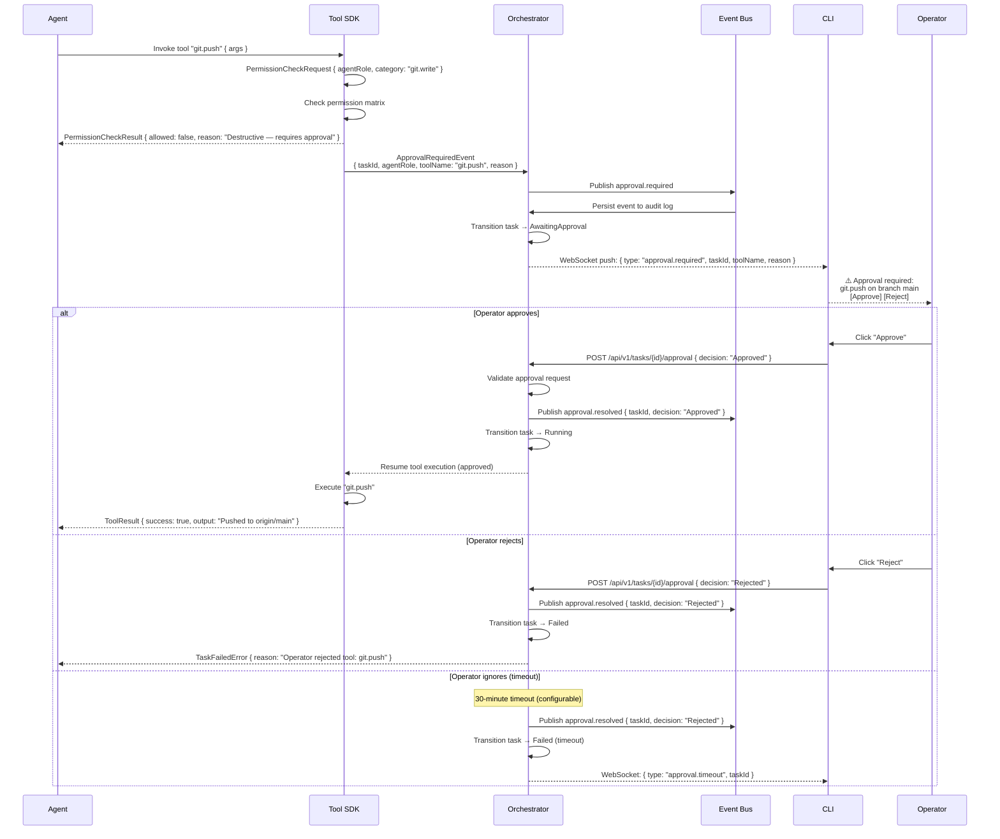

# Approval Gate Round-Trip — Sequence Diagram

> **Related:** Volume 02 (Ch. 3), Volume 07 (Ch. 3), SECURITY_STANDARDS §4.3  
> **Actors:** Operator, CLI, Orchestrator, Tool SDK, Agent

This diagram shows the full round-trip when a destructive tool requires operator approval before execution can proceed.

**Key flows illustrated:**
- Permission guard blocks destructive tool, returns denial with reason
- Task pauses in AwaitingApproval state
- Real-time notification to operator via WebSocket
- Operator approves, rejects, or times out
- All approval decisions are audit-logged via event bus
- Task resumes or fails based on operator decision