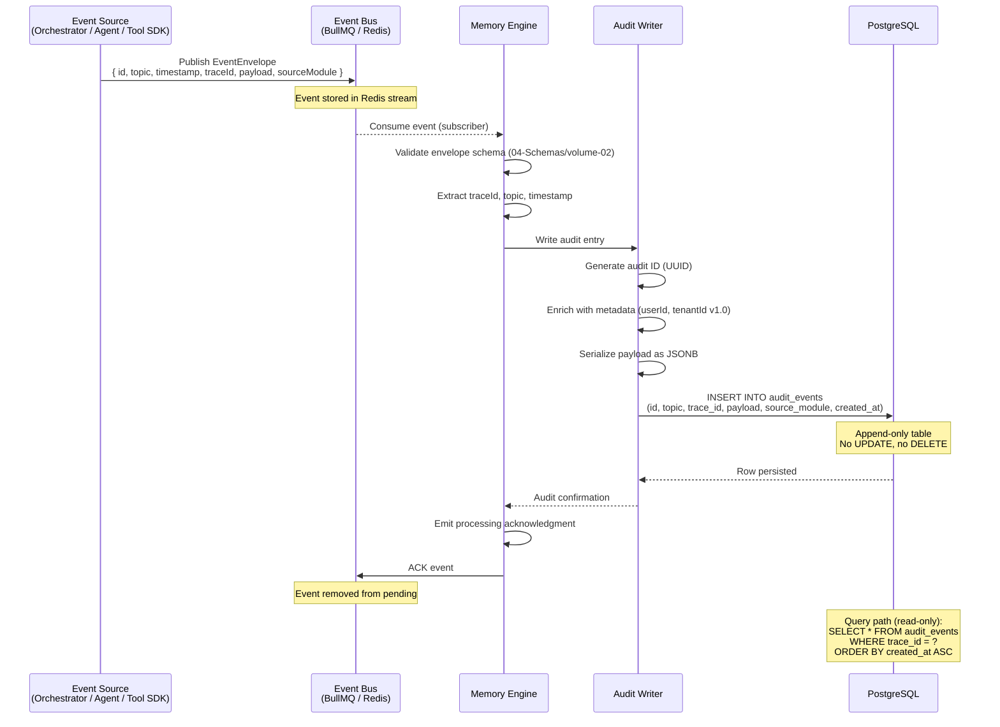

# Audit Log Write Path — Sequence Diagram

> **Related:** Volume 06 — Memory Engine (Ch. 3–4), ADR-0011  
> **Actors:** Event Source, Event Bus, Memory Engine, Audit Writer, PostgreSQL

This diagram shows how domain events flow through the system and are persisted as immutable audit entries.

**Key flows illustrated:**
- Event published to BullMQ-backed event bus
- Memory Engine consumes and validates against JSON Schema
- Audit Writer enriches and persists to PostgreSQL
- Append-only enforcement (no UPDATE/DELETE on audit_events table)
- At-least-once delivery with explicit ACK
- Read-only query path for audit trail retrieval