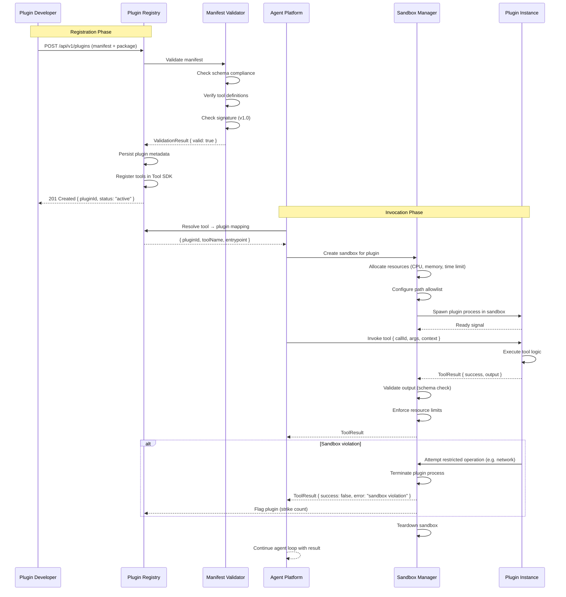

# Plugin Invocation — Sequence Diagram

> **Related:** Volume 08 — Plugin Platform (Ch. 2–4)  
> **Actors:** Plugin Registry, Manifest Validator, Sandbox Manager, Plugin Instance, Agent Platform

This diagram shows the plugin lifecycle from registration through manifest validation, invocation, sandboxing, and result return.

**Key flows illustrated:**
- Plugin registration with manifest validation
- Tool registration in the shared Tool SDK registry
- Per-invocation sandbox creation with resource limits
- Output validation before returning to agent
- Sandbox violation detection and plugin flagging
- Sandbox teardown after invocation completes