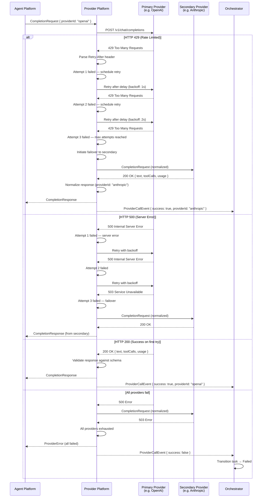

# Provider Failover — Sequence Diagram

> **Related:** Volume 04 — Provider Platform (Ch. 4–5), ADR-0005  
> **Actors:** Agent, Provider Platform, Primary Provider, Secondary Provider, Orchestrator

This diagram shows the provider call failure → retry → failover sequence when the primary LLM provider is unavailable or returns an error.

**Key flows illustrated:**
- Exponential backoff retry against primary (RetryPolicy: 3 attempts, 2x multiplier)
- Automatic failover to secondary provider after primary exhaustion
- Response normalization across providers
- ProviderCallEvent audit logging on every attempt
- Graceful degradation when all providers fail (task → Failed)