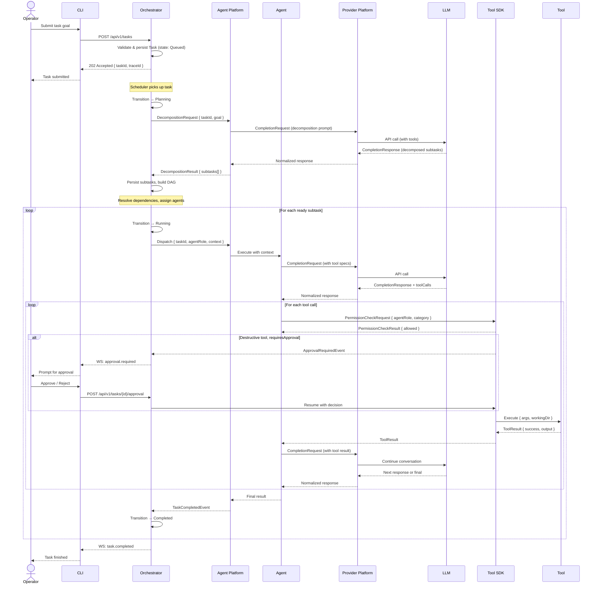

# Task Lifecycle — Full Sequence Diagram

> **Related:** Volume 02 — Core Runtime (Ch. 2–4)  
> **Actors:** Operator, CLI, Orchestrator, Agent Platform, Agent, Provider Platform, LLM, Tool SDK, Tool

This diagram shows the complete lifecycle of a task from submission through decomposition, agent dispatch, provider call, tool execution, approval gating, and result composition.

**Key flows illustrated:**
- Task submission and async acceptance
- LLM-driven task decomposition with DAG construction
- Agent dispatch with tool-use loop
- Permission guard check before tool execution
- Approval gate for destructive tools (operator pause/resume)
- Tool result fed back to LLM for continued reasoning
- Event-driven state transitions throughout