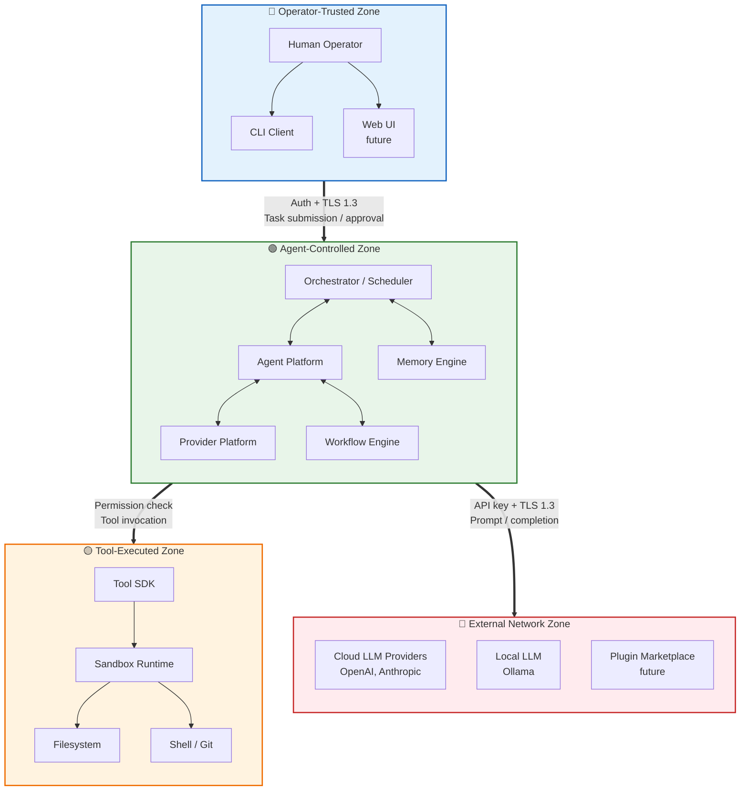

# Trust Boundary Diagram

> **Related:** THREAT_MODEL.md §2, RFC-0021, ADR-0004  
> **Zones:** Operator-Trusted, Agent-Controlled, Tool-Executed, External Network

This diagram illustrates the four trust boundaries of the agentx platform and the data flows between them.

**Trust boundaries explained:**

| Zone | Trust Level | Contains | Key Controls |
|------|------------|----------|--------------|
| Operator-Trusted | Highest | Human operator, CLI, Web UI | Authentication, RBAC, audit |
| Agent-Controlled | Medium | Orchestrator, Agent Platform, Memory Engine, Provider Platform | Schema validation, rate limits, task timeouts |
| Tool-Executed | Low | Tool SDK, Sandbox, Filesystem, Shell | Sandboxing, path allowlists, permission guards |
| External Network | Untrusted | Cloud LLMs, Local LLMs, Plugin Marketplace | TLS 1.3, certificate pinning, failover, prompt sanitization |

**Cross-boundary rules:**
- Data crossing from Agent→Tool requires permission check (Volume 07).
- Data crossing from Agent→External requires credential resolution and TLS.
- Data crossing from Operator→Agent requires authentication and task validation.
- Tool output crossing from Tool→Agent requires schema validation.