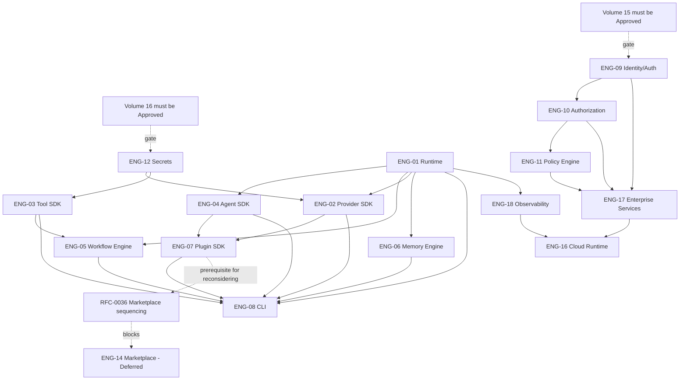

# Engineering Backlog & Specification Plan
**Phase:** AI Company Platform — Architecture → Engineering transition
**Role:** Chief Platform Engineer
**Baseline:** AI Company Architecture Handbook v1.0 (SSOT) + Architecture Improvement Plan v1.0
**Scope of this document:** Planning only. No Handbook chapter modified. No implementation code. No placeholder specifications — every domain below is mapped to real Handbook content or an explicit, reasoned gap; nothing is asserted without a citation to a Volume/RFC/ADR or a flagged absence.
**Rule applied throughout:** where a requested Engineering Domain conflicts with an already-Approved Volume boundary or an already-proposed deferral (Improvement Plan §2's Marketplace/Collaboration decision), this document raises the conflict as an RFC candidate rather than silently proceeding — per this phase's own Architecture Validation instruction.

---

## 0. Domain-to-Volume Mapping (do this first, before any spec work starts)

The 20 requested Engineering Domains do not map 1:1 to the 14 (soon 16) Handbook Volumes. Getting this mapping wrong is the single most likely source of duplicated or contradictory specs, so it is fixed here before anything else in this document is used.

| # | Requested Domain | Governing Volume(s) | Status | Note |
|---|---|---|---|---|
| 1 | Runtime | Volume 2 (Core Runtime) | Approved | — |
| 2 | Orchestrator | Volume 2, Ch. 4 (Orchestrator Decomposition Contract) | Approved | Not a separate Volume — the Handbook treats Orchestrator as a Core Runtime component, not a peer subsystem. Engineering spec for it is a **sub-spec of the Runtime domain**, not a 21st domain. |
| 3 | Agent SDK | Volume 3 (Agent Platform) | Approved, with a gap | Volume 3 specifies the fixed v0.1 roster (ADR-0002) and per-agent tool access, but **no third-party SDK contract exists yet** — RFC-0028 (Improvement Plan §6) must resolve whether "Agent SDK" is even in scope pre-v1.0, since the fixed-roster ADR is in tension with "SDK" implying external authorship. |
| 4 | Provider SDK | Volume 4 (Provider Platform) | Approved | — |
| 5 | Plugin SDK | Volume 8 (Plugin Platform) | Approved, with a gap | Manifest exists (RFC-0009); trust/sandboxing model does not (RFC-0027, not yet written). Full Plugin SDK spec is **blocked** on RFC-0027. |
| 6 | Workflow Engine | Volume 5 | Approved | — |
| 7 | Memory Engine | Volume 6 | Approved | — |
| 8 | Tool SDK | Volume 7 | Approved | — |
| 9 | CLI | Volume 9 | Approved | — |
| 10 | Identity | **Volume 15** (Identity & Access Foundation) | **Scoped, not authored or Approved** | Improvement Plan §2 only scoped this Volume's purpose/position/chapters. Per Constitution Principle 1, no engineering spec may be written against an un-Approved Volume. **This is a hard gate, not a soft one.** |
| 11 | Authentication | Volume 15, Ch. 1 (Authentication Modes) | Same gate as #10 | — |
| 12 | Authorization | Volume 10 (RBAC model, RFC-0012) + Volume 15 handoff (RFC-0026) | Volume 10 Approved; RFC-0026 not yet written | Authorization engineering spec can begin on Volume 10's model but **cannot be finalized** until RFC-0026 defines the Identity→RBAC contract |
| 13 | Policy Engine | Volume 10, Ch. 3 | Approved | — |
| 14 | Marketplace | **No Volume** | **Explicitly deferred** (Improvement Plan §2, candidate ADR-0016) | **Conflict.** This phase's instructions request a full engineering spec; the prior architectural decision was to defer Marketplace until Plugin Platform's trust model (Volume 8/RFC-0027) exists. Per this phase's own Architecture Validation rule, this is resolved as **RFC-0036: Reconsider Marketplace Sequencing** (§7 below) rather than silently producing a spec that outruns its own foundation. Marketplace is placed in this backlog as **Deferred**, not omitted. |
| 15 | Collaboration | **No Volume** | Deferred, Low priority (Improvement Plan §3) | No conflict — already correctly flagged as Low/deferred; no new RFC needed to say so twice. Included below as Deferred. |
| 16 | Configuration | Volume 9, Ch. 5 (CLI-local only) | Partial | Org-level configuration has no owner yet (Improvement Plan §3, "Medium priority RFC" — not yet written: **RFC-0037**, added below). |
| 17 | Secrets Management | **Volume 16** (Secrets & Key Management) | **Scoped, not authored or Approved** | Same hard gate as Identity (#10). |
| 18 | Cloud Runtime | Volume 11 (Cloud Platform) | Approved, explicitly post-v0.1 | Engineering spec work is legitimate to *plan* now (this document does that) but not to *execute* ahead of Volume 10 per Volume 11's own header ("Target: Post-v0.1, after Volume 10 exists"). |
| 19 | Enterprise Services | Volume 10 (Enterprise Platform) | Approved, explicitly post-v0.1 | — |
| 20 | Observability | Volume 13 | Approved | — |

**Net effect on sequencing:** 13 of 20 domains map cleanly to an Approved Volume and can proceed straight to engineering specification. 2 domains (Identity, Secrets) are blocked on Volume authorship itself. 2 domains (Agent SDK's external-authoring aspect, Plugin SDK's trust model) are blocked on a specific unwritten RFC. 1 domain (Marketplace) requires a sequencing RFC before spec work starts at all. 1 domain (Collaboration) stays deferred. 1 domain (Configuration) needs a scoping RFC for its org-level half before that half can be specified (its CLI-local half is already specifiable now).

---

## 1. Engineering Specification Template (applies to every domain below)

To avoid placeholder text in the specs themselves once they're written, every domain's future specification will use this fixed shape — stated once here rather than repeated 20 times below:

`Purpose · Scope · Responsibilities · Public Interfaces · Internal Components · Lifecycle · State Machine · Events · Commands · Data Contracts · Error Contracts · Security Requirements · Performance Targets · Scalability Targets · Observability Requirements · Testing Strategy · Acceptance Criteria`

Each field must cite the Handbook Volume/Chapter it derives from, or cite the RFC that will establish it if the Volume doesn't yet cover it at that depth. A field with no citation and no open RFC is not permitted to ship — that itself is the anti-placeholder rule for this phase.

---

## 2. Engineering Backlog

Priority key: **Critical** = blocks the next codegen session in the existing run order (`06-Prompts/codegen/README.md`); **High** = blocks a Critical item's completion or a near-term codegen session; **Medium** = needed before v1.0 per the Improvement Plan's version milestones; **Low** = correctly deferred, tracked so it isn't lost.

| ID | Specification | Priority | Depends on | Complexity | Required schemas | Required diagrams |
|---|---|---|---|---|---|---|
| ENG-01 | Runtime Engineering Spec (incl. Orchestrator sub-spec) | **Critical** | Volume 2 (satisfied); `04-Schemas/volume-02.schema.json` (Improvement Plan §1, not yet populated) | Large | Task, EventEnvelope, Scheduler, EventBus JSON Schemas | Task lifecycle sequence diagram (Improvement Plan §5, not yet drawn); interaction-matrix diagram |
| ENG-02 | Provider SDK Engineering Spec | **Critical** | Volume 4 (satisfied); RFC-0022/0023 (secrets bridge, not yet written) for the Credential Resolution chapter specifically | Large | `Provider`, `NormalizedToolSpec`, `NormalizedToolCall` schemas | Provider failover sequence diagram |
| ENG-03 | Tool SDK Engineering Spec | **Critical** | Volume 7 (satisfied); **RFC-0021 (threat model) — hard blocker**, not yet written | Large | Tool contract schema, permission-check schema | Trust boundary diagram; threat model diagram |
| ENG-04 | Agent Platform / Agent SDK Engineering Spec | **High** | Volume 3 (satisfied for fixed roster); RFC-0028 (Agent SDK scope decision) for the external-authoring half | Medium | AgentDefinition, AgentResult schemas | Agent lifecycle diagram |
| ENG-05 | Workflow Engine Engineering Spec | **High** | Volume 5 (satisfied); ENG-01, ENG-03 (workflow gates depend on Runtime + Tool SDK contracts existing first) | Large | TaskGraph, ApprovalGate schemas | Workflow execution + approval-gate round-trip sequence diagram |
| ENG-06 | Memory Engine Engineering Spec | **High** | Volume 6 (satisfied); RFC-0024 (audit log immutability, not yet written) for the audit/compliance-adjacent parts | Medium | Prisma schema export, AuditEvent/CostRecord schemas | Audit-log write-path data flow diagram |
| ENG-07 | Plugin SDK Engineering Spec | Medium | Volume 8 (satisfied for manifest); **RFC-0027 (trust/sandboxing model) — hard blocker** for anything beyond registration | Large | Plugin manifest schema (versioned) | Plugin invocation lifecycle sequence diagram |
| ENG-08 | CLI Engineering Spec | Medium | Volume 9 (satisfied); ENG-01 through ENG-07 (CLI is the composition surface — cannot finalize ahead of what it composes) | Medium | CLI config schema | Approval-gate UX flow (already state-diagram-covered in Volume 9; no new diagram required) |
| ENG-09 | Identity & Authentication Engineering Spec | Medium | **Volume 15 must reach Approved status first — hard gate** | Large | Identity, Session/Token schemas | Authentication mode decision flow |
| ENG-10 | Authorization Engineering Spec | Medium | Volume 10 (satisfied for RBAC shape); RFC-0026 (Identity→RBAC handoff) — hard blocker for the identity-binding half | Medium | Role/Permission schema | RBAC evaluation sequence diagram |
| ENG-11 | Policy Engine Engineering Spec | Medium | Volume 10 Ch. 3 (satisfied); ENG-10 (policy evaluation needs a resolved identity/role first) | Medium | Policy rule schema | Advisory→enforced policy state diagram |
| ENG-12 | Secrets Management Engineering Spec | **High** (elevated — blocks ENG-02's credential chapter and ENG-03's threat model scope) | **Volume 16 must reach Approved status first — hard gate**; RFC-0022 | Large | Secret storage/retrieval schema | Secret access audit trail diagram |
| ENG-13 | Configuration Engineering Spec (CLI-local half) | Low | Volume 9 Ch. 5 (satisfied) | Small | CLI config schema (shared with ENG-08) | None required |
| ENG-13b | Configuration Engineering Spec (org-level half) | Low | **RFC-0037 (org-level config ownership) — not yet written** | Medium | Org config schema | None required beyond ENG-13b's own scoping |
| ENG-14 | Marketplace Engineering Spec | **Deferred** | **RFC-0036 (sequencing decision) — must resolve before any spec work, per this phase's Architecture Validation rule** | Unestimated pending RFC-0036 | — | — |
| ENG-15 | Collaboration Engineering Spec | **Deferred** | No Volume; correctly Low/deferred per Improvement Plan §3 | Unestimated | — | — |
| ENG-16 | Cloud Runtime Engineering Spec | Low (correctly gated) | Volume 11 (satisfied); Volume 10 must be implemented first per Volume 11's own header | Large | Deployment topology schema | Deployment + network diagrams |
| ENG-17 | Enterprise Services Engineering Spec | Low (correctly gated) | Volume 10 (satisfied); ENG-09, ENG-10 (Enterprise Services composes Identity + Authorization) | Large | Tenant schema (extends Volume 6) | None beyond ENG-09/10/16's diagrams |
| ENG-18 | Observability Engineering Spec | Medium | Volume 13 (satisfied); RFC-0033 (instrumentation-required-for-Approval gate, not yet written) | Medium | Metrics taxonomy schema, trace schema | Tracing data flow diagram |

**Not separately listed:** Testing Strategy is not its own ENG item — per Volume 14's own design, every ENG-xx spec above inherits Volume 14's contract-test template requirement as part of its Acceptance Criteria field (§1), rather than getting a duplicate Volume-14-specific spec. This mirrors the same reasoning that kept Orchestrator inside ENG-01 rather than becoming its own item.

---

## 3. Dependency Graph

**Reading this graph:** ENG-01 (Runtime) and ENG-03 (Tool SDK) are the two true roots — every other spec transitively depends on one or both. ENG-12 (Secrets) sits earlier than it might look at first glance: it gates both Provider SDK's credential chapter and Tool SDK's threat-model scope, which is why it's marked **High** despite Identity being architecturally "earlier" in the Volume numbering. This is a case where the numeric Volume order (15 before 16) and the engineering dependency order (16 before much of 2/4/7's spec can finalize) diverge — worth stating explicitly so no one assumes Volume number order is spec order.

---

## 4. Engineering Milestones

| Milestone | Contents | Exit condition |
|---|---|---|
| **M1 — Core Contracts** | ENG-01, ENG-03, ENG-12 (Secrets, elevated per dependency graph) | Volume 16 Approved; RFC-0021 (threat model) and RFC-0022/0023 (secrets) Accepted; `04-Schemas` populated for Volumes 2, 7 |
| **M2 — Extensibility Contracts** | ENG-02, ENG-04, ENG-06 | RFC-0028 (Agent SDK scope) Accepted; `04-Schemas` populated for Volumes 3, 4, 6 |
| **M3 — Orchestration Contracts** | ENG-05, ENG-07 | RFC-0027 (Plugin trust model) Accepted; workflow + approval-gate sequence diagrams exist |
| **M4 — Product Surface** | ENG-08, ENG-18 | All of M1–M3 complete (CLI composes everything below it); RFC-0033 (observability gate) Accepted |
| **M5 — Identity & Access** | ENG-09, ENG-10, ENG-11 | Volume 15 Approved; RFC-0026 (Identity→RBAC handoff) Accepted |
| **M6 — Enterprise & Cloud** | ENG-16, ENG-17, ENG-13b | Volume 10/11 implementation begins (post-v0.1 per their own headers — this milestone is intentionally the last one, matching the Handbook's existing gating) |
| **Parked** | ENG-14 (Marketplace), ENG-15 (Collaboration) | RFC-0036 resolves Marketplace sequencing; Collaboration re-evaluated only if usage data shows single-operator CLI is insufficient (same trigger logic as Volume 1's own Recommended Additions used for Volumes 13/14) |

This milestone order matches the existing codegen run order in `06-Prompts/codegen/README.md` (Core Runtime → Agent/Provider → Tool SDK → Workflow → Memory → Plugin/CLI → gated Enterprise/Cloud/OS) with one adjustment: **Secrets (ENG-12) is pulled into M1** rather than waiting for its "natural" position, because the dependency graph in §3 shows it's a prerequisite for M1's own Tool SDK and Provider SDK specs, not a parallel-track item.

---

## 5. Machine Contracts Plan

Per this phase's instruction that `04-Schemas/` become the canonical source for machine-readable contracts, the following contract types are required **per ENG item**, not globally — a spec is not engineering-complete without all applicable rows populated:

| Contract type | Applies to | Convention |
|---|---|---|
| JSON Schema | Every ENG item's Data Contracts field | `04-Schemas/volume-NN.schema.json`, one file per Volume (existing convention, Volume 1 Recommended Addition #5 — unchanged, just finally executed) |
| YAML Schema | Configuration-bearing specs only: ENG-08 (CLI config), ENG-13/13b (Configuration), ENG-16 (deployment topology) | New convention — `04-Schemas/volume-NN.config.schema.yaml`, since these are operator-authored files, not just internal types |
| Event Schema | Every ENG item that publishes to the Event Bus (ENG-01, 02, 03, 04, 05, 06, 07, 18 at minimum) | Extends the existing `EventEnvelope` type (Volume 2 Ch. 7) — one schema per event name, not one per Volume, since a single Volume can emit several distinct event types |
| API Contract | ENG-08 (CLI command surface), ENG-16 (any future HTTP surface), ENG-17 (Enterprise Console surface) | Deferred until Volume 11 unfreezes for the HTTP-surface items; CLI's command surface can be contracted now (it already exists in prose in Volume 9 Ch. 1) |
| Versioning Strategy | Every ENG item | Inherits Volume 1 Ch. 6 (SemVer at package level) — **gap:** no deprecation window exists yet; this is RFC-0029 (Improvement Plan §6), still not written, and blocks any ENG item's Versioning Strategy field from being called complete rather than provisional |
| Compatibility Rules | Cross-cutting — Provider SDK (ENG-02) and Plugin SDK (ENG-07) specifically, since Constitution Principles 3 and 4 make replaceability a hard requirement for exactly these two | ENG-02 and ENG-07 must each include a "minimum contract a replacement provider/plugin must satisfy" section — this is the direct engineering-level expression of Provider Agnostic / Plugin First, and its absence would be a Constitution violation, not just a spec gap |

---

## 6. Runtime Contracts Plan

Each of the ten runtime interactions requested maps to a specific diagram + spec obligation already identified above — listed together here because they cut across multiple ENG items and are easy to lose track of individually:

| Runtime interaction | Owning ENG item(s) | Current state |
|---|---|---|
| Agent lifecycle | ENG-04 | Prose-specified (Volume 3); no state diagram yet — required before ENG-04 is complete |
| Provider lifecycle | ENG-02 | Prose-specified (Volume 4 Ch. 1, 5); no lifecycle diagram yet |
| Plugin lifecycle | ENG-07 | Blocked on RFC-0027 — cannot be diagrammed meaningfully before the trust model exists |
| Workflow execution | ENG-05 | Partially diagrammed (Volume 5 has a flowchart); sequence diagram still missing (Improvement Plan §5) |
| Event propagation | ENG-01 | Contract exists (Volume 2 Ch. 2, ADR-0001's at-least-once decision); no propagation-path diagram across module boundaries yet |
| Task scheduling | ENG-01 | State-diagrammed (Volume 2 Ch. 1); concurrency/back-pressure behavior under load is **not specified anywhere** — flagged in the Assessment Report §10 as a scalability risk, repeated here because it directly blocks ENG-01's Performance Targets and Scalability Targets fields from being non-placeholder |
| Context management | ENG-06 | Prose-specified (Volume 6 Ch. 2, RFC-0008); needs a data contract for `TaskContext` in `04-Schemas` |
| Failure recovery | ENG-01, ENG-05 | Volume 2 Ch. 5 ("Failure Handling & Retries") exists; no rollback strategy is specified for a *partially executed* task graph — this is a real gap, not yet captured by any existing RFC. **New backlog item: RFC-0038, Task Graph Rollback Strategy**, added to §7. |
| Retry policies | ENG-01, ENG-02 | Volume 2 Ch. 5 covers task-level retry; Provider-call-level retry (distinct — a single tool call inside a task retrying against a rate-limited provider) is under-specified. Folds into ENG-02's Error Contracts field, not a new RFC. |
| Rollback strategy | ENG-01, ENG-05, ENG-06 | Same gap as Failure recovery above — RFC-0038 covers both, since a rollback strategy and a partial-failure recovery strategy are the same design problem viewed from two angles. |

---

## 7. New RFCs Identified During This Phase

Two genuinely new gaps surfaced while producing this backlog that were not present in the Improvement Plan's RFC list (§6 of that document). Both are additive to that list, not replacements:

| # | Purpose | Priority | Dependencies | Affected Volumes | Complexity |
|---|---|---|---|---|---|
| RFC-0036 | Marketplace sequencing decision (build now vs. wait for Plugin trust model) | **High** — blocks ENG-14 from starting at all, and this phase's instructions explicitly requested a Marketplace spec, so the conflict needs fast resolution, not slow-tracking | RFC-0027 (Plugin trust model) should logically precede or accompany this decision | 8, 14 (new, if approved) | Small — this is a sequencing decision, not a design decision |
| RFC-0037 | Org-level configuration ownership (Volume 9 vs. Volume 10 vs. new owner) | Medium | None | 9, 10 | Small |
| RFC-0038 | Task graph rollback strategy for partial failure | **High** — blocks ENG-01 and ENG-05's Error Contracts and Acceptance Criteria fields | Volume 2 Ch. 5, Volume 5 | 2, 5, 6 | Medium |

---

## 8. Architecture Validation Summary

Checked against the four criteria this phase specifies, for the backlog as a whole rather than item-by-item (repeating this per ENG item would be exactly the kind of padding this phase's anti-placeholder instruction rules out):

- **Consistent with the Handbook / no ADR or RFC violated:** Yes, with one flagged exception (Marketplace, §0 and §7 — routed to a new RFC rather than silently specified).
- **Supports provider replacement:** Preserved — ENG-02's Compatibility Rules obligation (§5) is the direct mechanism; nothing in this backlog weakens ADR-0003's two-adapter requirement.
- **Supports plugin replacement:** Preserved, but currently **theoretical** until RFC-0027 exists — ENG-07 cannot demonstrate this property in practice without a trust model to replace *safely* within.
- **Supports horizontal scaling / enterprise deployment:** **Not yet demonstrable** — the task-scheduling concurrency gap (§6) means ENG-01's Scalability Targets field cannot be honestly completed yet. This is the single largest open risk this backlog surfaces that wasn't already named in the Assessment Report or Improvement Plan; recommend it be treated as equal priority to RFC-0038, not deferred to Volume 11.

---

## 9. Closing

No Handbook chapter modified. No implementation code generated. No placeholder specifications produced — every ENG item above either cites the Volume section it derives from or names the specific RFC/ADR/Volume-approval that blocks it, and every such block is listed, not hidden.

Recommended next action, pending your approval: begin **M1 (ENG-01, ENG-03, ENG-12)**, which requires — in order — Volume 16 reaching Approved status, RFC-0021 and RFC-0022/0023 reaching Accepted, and `04-Schemas` population for Volumes 2 and 7. This is the same critical path already identified in the Improvement Plan, now expressed as an executable milestone rather than a priority list.
