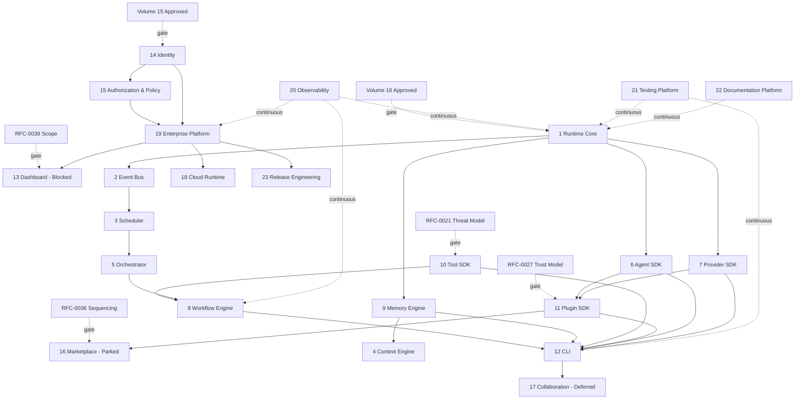

# Engineering Execution Program (EEP)
**Fase:** AI Company Platform — dari Arsitektur ke Eksekusi Rekayasa
**Peran:** Chief Engineering Officer (CEO Engineering)
**Baseline:** Architecture Handbook v1.0 (SSOT, frozen) + Architecture Improvement Plan v1.0 + Engineering Backlog & Specification Plan v1.0
**Lingkup dokumen ini:** Perencanaan eksekusi saja. Tidak ada bab handbook yang diubah. Tidak ada kode implementasi. Tidak ada dokumen placeholder — setiap workstream di bawah dipetakan ke Volume/RFC/ADR yang sudah ada, atau ditandai eksplisit sebagai celah baru dengan RFC yang diusulkan.
**Aturan yang tetap berlaku:** ketika ada ketidakpastian atau workstream yang diminta tidak punya Volume pemilik, dokumen ini mengusulkan RFC baru, bukan berasumsi diam-diam — konsisten dengan aturan Architecture Validation di fase-fase sebelumnya.

---

## 0. Kontinuitas dengan Dokumen Sebelumnya

EEP ini **tidak mendesain ulang** apa pun yang sudah diputuskan. Ia menyusun ulang unit kerja (ENG-01 s.d. ENG-18 dari Engineering Backlog) menjadi 24 workstream yang diminta di fase ini, karena permintaan sekarang memecah beberapa item backlog menjadi lebih granular (mis. Runtime Core, Event Bus, Scheduler, Context Engine dulunya digabung dalam ENG-01) dan menambahkan workstream yang belum pernah punya rumah di Handbook (Dashboard, Testing Platform, Documentation Platform, Release Engineering, Developer Experience).

Prinsip pemetaan: **satu workstream = satu pemilik Volume**, kecuali dinyatakan lain. Jika sebuah workstream yang diminta tidak punya Volume pemilik sama sekali, itu dicatat sebagai celah baru dengan RFC pengusul (bukan diam-diam diberi spesifikasi).

---

## 1. Workstream Matrix — Bagian A (Purpose, Scope, Dependencies, Required Specs & Schemas)

| # | Workstream | Purpose | Scope | Dependencies | Required Specs (ENG dari Backlog) | Required Schemas |
|---|---|---|---|---|---|---|
| 1 | Runtime Core | Kernel orkestrasi: siklus hidup Task | Volume 2 Ch. 1, 3 (State machine, Scheduler inti — bukan Event Bus/Orchestrator, dipisah di bawah) | Volume 16 (Secrets) harus Approved dulu untuk kredensial internal runtime | ENG-01 (subset) | Task, Scheduler schema |
| 2 | Event Bus | Distribusi event antar-modul, at-least-once delivery | Volume 2 Ch. 2, ADR-0001 | Runtime Core | ENG-01 (subset) | EventEnvelope schema |
| 3 | Scheduler | Concurrency, pause/resume, penjadwalan Task | Volume 2 Ch. 3 | Runtime Core, Event Bus | ENG-01 (subset) | Scheduler schema (bersama #1) |
| 4 | Context Engine | Konstruksi & retrieval `TaskContext` agar agent tidak mengirim ulang seluruh riwayat | **Bukan Volume 2** — pemilik sebenarnya adalah Volume 6 (Memory Engine) Ch. 2 / RFC-0008. Permintaan fase ini menyiratkan Context Engine sebagai bagian Runtime; ini **konflik penamaan**, diselesaikan sebagai catatan klarifikasi di §9, bukan RFC baru, karena tidak mengubah keputusan arsitektur — hanya penempatan workstream. | Memory Engine (Volume 6) | ENG-06 (subset) | TaskContext schema |
| 5 | Orchestrator | Dekomposisi goal menjadi Task | Volume 2 Ch. 4 (sub-komponen Runtime, bukan Volume terpisah — konsisten dengan Engineering Backlog §0) | Runtime Core, Event Bus, Scheduler | ENG-01 (subset) | — (bagian dari Task schema) |
| 6 | Agent SDK | Kontrak agent, roster v0.1 tetap | Volume 3 | Runtime Core, Orchestrator; RFC-0028 untuk bagian "SDK pihak ketiga" | ENG-04 | AgentDefinition, AgentResult |
| 7 | Provider SDK | Abstraksi vendor LLM, normalisasi tool-calling | Volume 4 | Runtime Core; RFC-0022/0023 (Secrets) untuk bab Credential Resolution | ENG-02 | Provider, NormalizedToolSpec/Call |
| 8 | Workflow Engine | Task graph, approval gate | Volume 5 | Runtime Core, Tool SDK | ENG-05 | TaskGraph, ApprovalGate |
| 9 | Memory Engine | Persistensi, audit log, cost log | Volume 6 | Runtime Core | ENG-06 | Prisma schema, AuditEvent, CostRecord |
| 10 | Tool SDK | Kontrak tool, permission, sandboxing | Volume 7 | Runtime Core; **RFC-0021 (threat model) — blocker keras** | ENG-03 | Tool contract, permission-check schema |
| 11 | Plugin SDK | Titik ekstensi pihak ketiga | Volume 8 | Agent SDK, Provider SDK; **RFC-0027 (trust model) — blocker keras** | ENG-07 | Plugin manifest schema |
| 12 | CLI | Permukaan produk utama v0.1 | Volume 9 | Semua di atas (CLI mengomposisi semuanya) | ENG-08 | CLI config schema |
| 13 | Dashboard | Antarmuka web (enterprise console) | **Tidak ada Volume pemilik.** Disebut sekilas di Volume 1 Ch. 4 (`apps/enterprise-console`, "future, web UI") dan Volume 10, tapi tidak pernah punya Volume/bab sendiri. **Celah nyata** — lihat RFC-0039 di §7. | CLI (mewarisi command semantics, per Volume 9 header), Identity (untuk login web) | Belum ada — menunggu RFC-0039 | Belum bisa ditentukan sebelum RFC-0039 |
| 14 | Identity & Authentication | Sumber identitas untuk seluruh platform | **Volume 15 — baru di-scope, belum Approved. Hard gate.** | — | ENG-09 | Identity, Session/Token schema |
| 15 | Authorization & Policy Engine | RBAC + policy advisory→enforced | Volume 10 Ch. 2, 3 | Identity & Authentication (RFC-0026 untuk handoff) | ENG-10, ENG-11 | Role/Permission, Policy rule schema |
| 16 | Marketplace | Distribusi plugin pihak ketiga | **Tidak ada Volume — sengaja ditunda** (Improvement Plan §2). **Parked**, menunggu RFC-0036. | Plugin SDK (trust model harus ada dulu) | ENG-14 (Deferred) | — |
| 17 | Collaboration Platform | Multi-user pada satu task graph | **Tidak ada Volume — Low priority, ditunda** (Improvement Plan §3) | CLI, Enterprise Platform | ENG-15 (Deferred) | — |
| 18 | Cloud Runtime | Topologi deployment, scaling | Volume 11 — **eksplisit post-v0.1, gated setelah Volume 10** | Enterprise Platform | ENG-16 | Deployment topology schema |
| 19 | Enterprise Platform | Multi-tenant, RBAC lanjutan, compliance export | Volume 10 — post-v0.1 | Identity & Authentication, Authorization & Policy Engine | ENG-17 | Tenant schema (extends Volume 6) |
| 20 | Observability & SRE | Metrics, tracing, logging | Volume 13 | Runtime Core (Event Bus sebagai sumber data utama) | ENG-18 | Metrics taxonomy, trace schema |
| 21 | Testing Platform | Contract test, evaluasi output agent, CI gating | Volume 14 — **satu-satunya workstream yang Volume-nya sudah lengkap tanpa blocker** | Semua workstream lain (konsumsi kontrak mereka) | — (Volume 14 sudah operasional sebagai standar, bukan item ENG terpisah, per Engineering Backlog §2 catatan penutup) | Contract test template format (sudah ada, `08-Examples/`) |
| 22 | Documentation Platform | Tooling untuk menjaga handbook tetap konsisten (linting, no-empty-heading check, dependency-table validation) | **Tidak ada Volume — hanya konvensi di Volume 1 Ch. 5.** Celah yang sama yang sudah diberi nama "Governance Services" (Improvement Plan §3, Low priority) tapi belum punya nomor RFC resmi. Diformalkan di §7. | Foundation (Volume 1) | Belum ada — menunggu RFC-0040 | Belum bisa ditentukan sebelum RFC-0040 |
| 23 | Release Engineering | Pipeline rilis, penegakan SemVer, kebijakan deprecation | Volume 1 Ch. 6 (versioning, parsial) | Semua workstream yang dirilis sebagai package | **RFC-0029 (kebijakan deprecation) sudah diidentifikasi tapi belum ditulis** — celah pipeline eksekusinya sendiri diformalkan sebagai RFC-0041 di §7 | Release manifest / CHANGELOG format |
| 24 | Developer Experience (DX) | Kualitas pengalaman kontributor (docs onboarding, error message quality, local dev setup) | **Tidak disebut sama sekali di Handbook manapun.** Ini domain paling baru dari seluruh 24 — layak dipertanyakan apakah ini workstream mandiri atau praktik lintas-workstream (mis. bagian dari CLI + Documentation Platform). Diformalkan sebagai pertanyaan terbuka di RFC-0042, §7. | Semua workstream (DX adalah kualitas lintas-produk) | Belum ada — menunggu RFC-0042 | — |

---

## 2. Workstream Matrix — Bagian B (Required RFCs, ADRs, Diagrams, Validation Strategy, Deliverables, Completion Criteria)

| # | Workstream | Required RFCs (baru/ada) | Required ADRs | Required Diagrams | Validation Strategy | Deliverables | Completion Criteria |
|---|---|---|---|---|---|---|---|
| 1 | Runtime Core | — (RFC-0002, RFC-0003 sudah Accepted) | ADR-0001 (sudah Final) | Sequence diagram siklus Task (belum ada — Improvement Plan §5) | Contract test Volume 14; `04-Schemas/volume-02.schema.json` | Runtime Core Engineering Spec (ENG-01 subset) | State machine lolos contract test; schema tervalidasi CI |
| 2 | Event Bus | RFC-0002 (Accepted) | ADR-0001 (Final) | Diagram alur propagasi event lintas-modul (belum ada) | Idempotency test (dedupe pada `event.id`, per ADR-0001) | Event Bus Engineering Spec | Duplicate-delivery test lulus untuk semua consumer |
| 3 | Scheduler | RFC-0038 (rollback, baru) | — | State diagram pause/resume (sudah ada, Volume 2) | Load test — **belum bisa dilakukan jujur** sampai target konkurensi ditetapkan (celah dari Assessment Report §10) | Scheduler Engineering Spec | Target skalabilitas tertulis eksplisit dan diuji, bukan diasumsikan |
| 4 | Context Engine | RFC-0008 (Accepted) | — | Data flow diagram TaskContext (belum ada) | Contract test untuk retrieval strategy | Context Engine Engineering Spec (bagian dari ENG-06) | TaskContext teruji tidak mengirim riwayat penuh di setiap panggilan (NFR Volume 6) |
| 5 | Orchestrator | RFC-0004 (Accepted) | — | Sequence diagram dekomposisi goal→task (belum ada) | Contract test validasi output dekomposisi | Orchestrator Engineering Spec (bagian ENG-01) | Output dekomposisi lolos RFC-0004's validation rule |
| 6 | Agent SDK | RFC-0005 (Accepted), **RFC-0028 (baru)** | ADR-0002 (Final) | Diagram siklus hidup agent (belum ada) | Contract test per role agent | Agent SDK Engineering Spec | Roster v0.1 lulus test; keputusan RFC-0028 (SDK pihak ketiga: ya/tidak) tercatat |
| 7 | Provider SDK | RFC-0001 (Accepted), RFC-0022/0023 (baru) | ADR-0003 (Final) | Sequence diagram provider failover (belum ada) | **Dua adapter kerja nyata** wajib (ADR-0003) sebelum lulus | Provider SDK Engineering Spec | Dua provider berbeda lulus contract test yang identik |
| 8 | Workflow Engine | RFC-0007 (Accepted), RFC-0038 (baru) | — | Sequence diagram approval-gate round-trip (belum ada) | Contract test dua lapis approval gating | Workflow Engine Engineering Spec | Task graph parsial-gagal punya jalur rollback teruji |
| 9 | Memory Engine | RFC-0008 (Accepted), **RFC-0024 (baru, immutability)** | **ADR-0014 (baru, diusulkan)** | Data flow diagram audit-log write path (belum ada) | Contract test skema Prisma | Memory Engine Engineering Spec | Audit log terbukti append-only sebelum dianggap selesai |
| 10 | Tool SDK | RFC-0006 (Accepted), **RFC-0021 (baru, threat model)** | ADR-0004, ADR-0005 (Final) | Trust boundary + threat model diagram (belum ada) | Fail-closed permission test (ADR-0004) | Tool SDK Engineering Spec | Threat model diverifikasi terhadap perilaku nyata, bukan cuma dispesifikasikan |
| 11 | Plugin SDK | RFC-0009 (Accepted), **RFC-0027 (baru, trust model)** | — | Sequence diagram invocation plugin (belum ada) | Sandbox isolation test (menunggu RFC-0027) | Plugin SDK Engineering Spec | Plugin pihak ketiga bisa diganti tanpa memodifikasi core (Plugin First, Prinsip 4) |
| 12 | CLI | RFC-0010 (Accepted) | — | — (state diagram approval-gate UX sudah ada di Volume 9) | End-to-end test task lifecycle penuh (submit→plan→execute→approve→result) | CLI Engineering Spec | Memenuhi exit criteria v0.1 #3 (Volume 1 Ch. 6) |
| 13 | Dashboard | **RFC-0039 (baru)** | ADR baru menyusul setelah RFC-0039 | Belum bisa ditentukan | Belum bisa ditentukan | Belum bisa ditentukan — **workstream ini diblokir total sampai RFC-0039 selesai** | RFC-0039 Accepted dan Volume pemilik (baru atau bagian Volume 10) ditetapkan |
| 14 | Identity & Authentication | **RFC-0025 (baru)** | **ADR-0012 (baru, diusulkan — secrets bridge interim)** | Diagram alur mode autentikasi | Belum bisa ditentukan sebelum Volume 15 Approved | Volume 15 harus mencapai status Approved dulu | Volume 15 Approved oleh Project Owner |
| 15 | Authorization & Policy Engine | RFC-0012 (Accepted), **RFC-0026 (baru)** | — | Sequence diagram evaluasi RBAC | Policy engine test (advisory vs enforced) | Authorization Engineering Spec | RFC-0026 Accepted; identitas berhasil di-bind ke role |
| 16 | Marketplace | **RFC-0036 (baru, sequencing)** | **ADR-0016 (baru, diusulkan)** | — | — | Hanya keputusan sequencing, bukan spek teknis | RFC-0036 Accepted (menentukan mulai kapan spek teknis boleh ditulis) |
| 17 | Collaboration Platform | — (tidak ada RFC aktif, sengaja) | — | — | — | — | Ditinjau ulang hanya jika data penggunaan menunjukkan CLI single-operator tidak cukup |
| 18 | Cloud Runtime | RFC-0013, RFC-0014 (Accepted) | ADR-0007 (Final) | Deployment + network diagram (belum ada) | Self-hosted fallback test (ADR-0007) untuk setiap managed service | Cloud Runtime Engineering Spec | Setiap managed service punya fallback self-hosted terbukti jalan |
| 19 | Enterprise Platform | RFC-0011, RFC-0012 (Accepted) | ADR-0006 (Final) | — | RLS isolation test (ADR-0006) | Enterprise Platform Engineering Spec | Isolasi tenant terbukti lewat test, bukan hanya desain |
| 20 | Observability & SRE | RFC-0017 (Accepted), **RFC-0033 (baru)** | ADR-0008 (Final) | Data flow diagram tracing (belum ada) | Cek instrumentasi wajib sebelum Volume dianggap Approved (meniru pola ADR-0009) | Observability Engineering Spec | RFC-0033 Accepted; setiap workstream lain punya metrik wajib |
| 21 | Testing Platform | RFC-0018, RFC-0019 (Accepted) | ADR-0009 (Final) | — | Sudah menjadi validation strategy untuk workstream lain | Sudah beroperasi — tidak ada spec baru yang dibutuhkan | Sudah terpenuhi; hanya perlu dipertahankan |
| 22 | Documentation Platform | **RFC-0040 (baru)** | — | — | Linter/CI check untuk "no empty heading" dan tabel dependency (Assessment Report §9, direkomendasikan sejak Volume 1) | Menunggu RFC-0040 | RFC-0040 Accepted |
| 23 | Release Engineering | RFC-0029 (sudah diidentifikasi, belum ditulis), **RFC-0041 (baru)** | — | — | Release checklist gating (lihat §8) | Menunggu RFC-0029 dan RFC-0041 | Kedua RFC Accepted |
| 24 | Developer Experience (DX) | **RFC-0042 (baru)** | — | — | Belum bisa ditentukan | Menunggu RFC-0042 | RFC-0042 menentukan apakah DX jadi workstream mandiri |

---

## 3. Fase Rekayasa (Roadmap yang Disempurnakan)

Roadmap contoh di instruksi (Fase 0–10, linear) diperbaiki di sini dengan satu perubahan struktural: **empat workstream bersifat lintas-fase (continuous), bukan terkurung di satu fase** — Testing Platform, Observability & SRE, Documentation Platform, dan Developer Experience. Memaksakan mereka ke satu fase saja (mis. "Fase 10 — Production Readiness") akan membuat setiap fase sebelumnya berjalan tanpa pengujian, tanpa observability, dan tanpa dokumentasi yang terjaga — persis pola kegagalan yang sudah diperingatkan Assessment Report §9 ("dokumentasi yang tertinggal implementasi menjadi fiksi").

| Fase | Workstream sekuensial | Syarat keluar (exit condition) |
|---|---|---|
| **Fase 0 — Foundation Validation** | Volume 15 & 16 mencapai Approved; RFC-0021, RFC-0022/0023, RFC-0027 Accepted; `04-Schemas` terisi untuk Volume 2, 4, 7 | Semua hard gate di §1/§2 hilang untuk Runtime Core, Provider SDK, Tool SDK, Secrets |
| **Fase 1 — Runtime Core** | Runtime Core, Event Bus, Scheduler, Orchestrator | Contract test Volume 2 lulus; sequence diagram siklus Task tersedia |
| **Fase 2 — SDK Layer** | Agent SDK, Provider SDK, Tool SDK | Dua adapter Provider lulus test identik (ADR-0003); threat model Tool SDK terverifikasi |
| **Fase 3 — Workflow Layer** | Workflow Engine, Memory Engine, Context Engine | Approval gate dua-lapis teruji; audit log terbukti append-only (RFC-0024) |
| **Fase 4 — Extensibility** | Plugin SDK | RFC-0027 Accepted dan sandbox isolation teruji — **tidak boleh mulai lebih awal** |
| **Fase 5 — Product Surface** | CLI, Testing Platform (sudah berjalan sejak Fase 0), Documentation Platform | Exit criteria v0.1 #3 terpenuhi (task lifecycle penuh via CLI) |
| **Fase 6 — Identity & Access** | Identity & Authentication, Authorization & Policy Engine | Volume 15 Approved; RFC-0026 Accepted |
| **Fase 7 — Enterprise & Dashboard** | Enterprise Platform, Dashboard (jika RFC-0039 sudah menyetujui keberadaannya) | Isolasi tenant teruji; RFC-0039 sudah menentukan nasib Dashboard |
| **Fase 8 — Cloud & Release** | Cloud Runtime, Release Engineering | Fallback self-hosted teruji untuk semua managed service; pipeline rilis dan kebijakan deprecation aktif |
| **Fase 9 — Marketplace** | *Parked* — hanya berjalan jika RFC-0036 memutuskan untuk lanjut | RFC-0036 Accepted dengan hasil "lanjut" |
| **Fase 10 — Production Readiness** | Readiness Checklist (§10) dijalankan penuh; Collaboration Platform ditinjau ulang (bukan dibangun) berdasarkan data penggunaan nyata | Semua item checklist §10 lulus |
| **Continuous (Fase 0–10)** | Testing Platform, Observability & SRE, Documentation Platform, Developer Experience (setelah RFC-0042 menentukan bentuknya) | Tidak ada — berjalan terus, diukur lewat metrik Volume 13, bukan "selesai" satu kali |

---

## 4. Dependency Graph Lintas-Workstream



**Bottleneck tunggal terbesar:** Volume 16 (Secrets) menggerbangi Runtime Core, yang pada gilirannya menggerbangi hampir semua workstream lain. Ini mengonfirmasi temuan Engineering Backlog §3 — Secrets bukan hanya "High priority" tapi secara struktural adalah **akar dependency graph bersama Runtime Core**, meski nomor Volume-nya (16) menyiratkan urutan yang jauh lebih akhir.

---

## 5. Milestone Plan

| Milestone | Isi | Ukuran keberhasilan |
|---|---|---|
| M0 | Fase 0 selesai | Semua hard gate hilang |
| M1 | Fase 1–2 selesai | Runtime + SDK Layer lulus contract test; dua provider adapter jalan |
| M2 | Fase 3–4 selesai | Workflow + Plugin SDK lulus test; rollback strategy (RFC-0038) teruji |
| M3 | Fase 5 selesai | **v0.1 tercapai** — exit criteria Volume 1 Ch. 6 terpenuhi penuh |
| M4 | Fase 6 selesai | Identity & Authorization berfungsi end-to-end |
| M5 | Fase 7–8 selesai | Enterprise + Cloud beroperasi; Dashboard punya nasib jelas (dibangun atau resmi dibatalkan) |
| M6 | Fase 10 selesai | **v1.0 / Production Readiness** — checklist §10 lulus penuh |
| M-Marketplace | Kondisional | Hanya jika RFC-0036 memutuskan lanjut |

---

## 6. Paralelisasi

**Boleh paralel (tidak saling memblokir):**
- Agent SDK dan Provider SDK (keduanya hanya bergantung pada Runtime Core, tidak pada satu sama lain — sudah dikonfirmasi di `06-Prompts/codegen/README.md`, dipertahankan di sini)
- Testing Platform, Observability & SRE, Documentation Platform — berjalan sepanjang waktu, tidak menunggu fase manapun
- Cloud Runtime dan Release Engineering (Fase 8) — keduanya bergantung pada Enterprise Platform tapi tidak pada satu sama lain

**Harus menunggu (hard sequential):**
- Tool SDK menunggu RFC-0021 (threat model) — tidak bisa diparalelkan, karena spek Tool SDK sendiri yang menghasilkan input untuk RFC-0021
- Plugin SDK menunggu Agent SDK **dan** Provider SDK **dan** RFC-0027 — tiga syarat sekaligus, titik konvergensi tersempit di seluruh graph
- Dashboard dan Marketplace sepenuhnya menunggu RFC masing-masing (RFC-0039, RFC-0036) sebelum tim manapun boleh dialokasikan — mengalokasikan tim ke sini lebih awal adalah pemborosan yang paling mudah dihindari di seluruh program ini

---

## 7. RFC Baru yang Teridentifikasi di Fase Ini

Melanjutkan penomoran dari Engineering Backlog (berhenti di RFC-0038):

| # | Tujuan | Prioritas | Blocker untuk |
|---|---|---|---|
| RFC-0039 | Menentukan apakah Dashboard jadi Volume baru atau sub-bagian Volume 10, dan lingkupnya | **High** — diminta eksplisit di fase ini, workstream #13 total terblokir tanpanya | Dashboard |
| RFC-0040 | Documentation Platform — tooling linting/validasi handbook (memformalkan "Governance Services" dari Improvement Plan §3) | Medium | Documentation Platform |
| RFC-0041 | Mekanisme eksekusi pipeline rilis (melengkapi RFC-0029 yang mengatur kebijakan, bukan pipeline-nya) | Medium | Release Engineering |
| RFC-0042 | Apakah Developer Experience adalah workstream mandiri atau praktik lintas-workstream | Low — tidak memblokir apa pun secara langsung, tapi tanpa keputusan ini alokasi tim untuk DX tidak punya dasar | Developer Experience |

---

## 8. Gerbang Kualitas Wajib (Quality Gates)

Sembilan gerbang yang diminta, masing-masing dengan kriteria masuk/keluar yang eksplisit — tidak ada yang boleh dilewati untuk workstream manapun sebelum merge:

| Gerbang | Kriteria masuk | Kriteria keluar | Mekanisme yang sudah ada |
|---|---|---|---|
| Architecture Review | Perubahan memetakan ke satu/lebih Volume | Tidak melanggar Constitution atau ADR Final manapun | CODEOWNERS untuk package core (Constitution Prinsip 4) |
| Specification Review | ENG spec (§1 Engineering Backlog) tersedia | Semua field template §1 Backlog terisi, tidak ada yang mengutip "TBD" | Definition of Approved (Constitution) |
| Schema Validation | Interface didefinisikan di Volume | Schema JSON/YAML ada di `04-Schemas` dan lolos validasi CI | Konvensi `04-Schemas/README.md` |
| Contract Validation | Implementasi ada | Contract test template (Volume 14, `08-Examples/`) lulus | ADR-0009 |
| Security Review | Tool/interface baru dengan permukaan serang | Threat model relevan (RFC-0021 untuk Tool SDK, atau turunannya) diperiksa ulang | Constitution Prinsip 7 (Security & Isolation wajib per-Volume) |
| Performance Review | Komponen menyentuh path kritis (Runtime, Event Bus, Scheduler) | Target performa eksplisit tertulis dan diuji — **saat ini belum ada satu pun target angka konkret di corpus**, jadi gerbang ini secara jujur **tidak bisa dilewati** sampai target skalabilitas (§9 Assessment Report) ditulis | Belum ada — celah aktif |
| Testing Review | Kode/spec baru | Coverage sesuai Volume 14 Ch. 3 (CI gating rules) | Volume 14 |
| Documentation Review | Perubahan apa pun ke Volume/RFC/ADR | Checklist CONTRIBUTING.md terpenuhi ("Volumes updated") | `00-Governance/CONTRIBUTING.md` |
| Release Review | Package siap rilis | SemVer dipatuhi, CHANGELOG diperbarui (menunggu RFC-0029/0041 untuk kebijakan deprecation) | Volume 1 Ch. 6 (parsial) |

---

## 9. Catatan Klarifikasi (bukan RFC, hanya penempatan)

Satu hal perlu diluruskan agar tidak jadi kebingungan tim eksekusi: **Context Engine** yang diminta sebagai workstream tersendiri di fase ini sebenarnya adalah kapabilitas yang sudah dimiliki **Volume 6 (Memory Engine)**, bukan Volume 2 (Runtime). Ini bukan kontradiksi arsitektur — hanya perbedaan pengelompokan antara "yang dikonsumsi Runtime saat eksekusi" (kesan yang diberikan istilah "Context Engine") vs. "yang benar-benar memilikinya" (Memory Engine, per RFC-0008). Direkomendasikan workstream #4 di seluruh dokumen ini dan dokumen turunannya secara eksplisit disebut **"Context Engine (dimiliki Volume 6)"**, bukan didaftar seolah-olah Volume baru.

---

## 10. Risk Register

| # | Risiko | Kemungkinan | Dampak | Mitigasi |
|---|---|---|---|---|
| R1 | Volume 16 (Secrets) menjadi bottleneck tunggal terbesar (§4) dan menunda hampir semua workstream jika penulisannya molor | Tinggi | Tinggi | Prioritaskan Fase 0 secara ketat; jangan alokasikan tim ke workstream lain sebelum Volume 16 Approved |
| R2 | Target performa/skalabilitas tidak pernah ditulis (celah dari Assessment Report §10), membuat Performance Review Gate (§8) tidak bisa dilewati secara jujur selamanya | Sedang | Tinggi | Jadikan penulisan target skalabilitas bagian dari Fase 1, bukan ditunda ke Fase 10 |
| R3 | Tim dialokasikan ke Dashboard atau Marketplace sebelum RFC-0039/0036 selesai | Sedang (risiko manajemen proyek, bukan teknis) | Sedang — pemborosan kerja | Larangan eksplisit di §6; RFC-0039/0036 diberi prioritas High meski scope-nya kecil |
| R4 | Tim implementasi AI (Google AI Studio, sesi tanpa memori) kehilangan konteks antar-workstream yang saling bergantung erat (mis. Plugin SDK butuh tiga syarat sekaligus) | Sedang | Sedang | Setiap prompt codegen (`06-Prompts/codegen/`) untuk workstream dengan multi-dependency harus mengutip status Accepted semua RFC prasyaratnya, bukan hanya Volume-nya |
| R5 | RFC/ADR baru (0021–0042) ditulis dangkal seperti RFC/ADR lama (rata-rata 15–20 baris, minim Alternatives) — sudah diidentifikasi di Assessment Report §8/§9 tapi belum ada penegakan | Tinggi jika tidak ditindaklanjuti | Sedang | ADR-0013 (minimum content bar) harus diprioritaskan lebih awal dari nomornya menyiratkan — tanpa ini, seluruh RFC baru di dokumen ini berisiko sama dangkalnya |
| R6 | Observability & SRE baru aktif penuh di Fase 10 dalam roadmap contoh asli — jika diikuti apa adanya, delapan fase sebelumnya berjalan tanpa visibilitas | Tinggi jika roadmap asli diikuti tanpa perbaikan | Tinggi | Sudah dimitigasi secara struktural di §3 dengan menjadikannya continuous workstream — dicatat di sini sebagai alasan perubahan itu dibuat |

---

## 11. Critical Path Analysis

Jalur terpanjang yang menentukan kapan v1.0 bisa tercapai (mengasumsikan tidak ada paralelisasi sempurna karena keterbatasan tim nyata):

```
Volume 16 Approved
  → RFC-0021 (Threat Model) Accepted
  → Runtime Core + Event Bus + Scheduler lulus contract test
  → Tool SDK lulus test (butuh threat model terverifikasi)
  → Workflow Engine lulus test (butuh Tool SDK)
  → CLI memenuhi exit criteria v0.1
  → [v0.1 tercapai — M3]
  → Volume 15 Approved (bisa paralel sejak Fase 0, tapi RBAC butuh ini)
  → RFC-0026 (Identity→RBAC handoff) Accepted
  → Authorization & Policy Engine berfungsi
  → Enterprise Platform terintegrasi
  → Cloud Runtime + Release Engineering
  → Readiness Checklist (§10) lulus
  → [v1.0 / Production Readiness — M6]
```

**Implikasi:** jalur kritis **tidak melewati** Dashboard, Marketplace, atau Collaboration Platform sama sekali — ketiganya benar-benar off-critical-path selama RFC penentu nasib mereka belum selesai. Ini mengonfirmasi keputusan §6 untuk tidak mengalokasikan tim ke sana lebih dulu.

---

## 12. Release Governance

- **Versioning:** SemVer di level package (Volume 1 Ch. 6, tidak diubah). Milestone platform (v0.1 → v1.0 → seterusnya, mengikuti Long-Term Evolution Roadmap di Improvement Plan §11) tetap menjadi label koarser di level platform.
- **Kebijakan deprecation:** **belum aktif** — bergantung penuh pada RFC-0029 (diidentifikasi di Improvement Plan, belum ditulis) dan mekanisme eksekusinya, RFC-0041 (baru, §7). Tidak ada rilis breaking change yang boleh diumumkan "resmi" sebelum kedua RFC ini Accepted.
- **Rilis breaking change pra-v1.0:** tetap diperbolehkan (Volume 1 Ch. 6) dengan syarat dicatat via ADR dan CHANGELOG — tidak berubah dari ketentuan yang sudah ada.
- **Otoritas rilis:** mengikuti Definition of Approved yang sama dari Constitution — Project Owner tetap otoritas akhir; tidak ada otoritas rilis terpisah diusulkan di sini, konsisten dengan prinsip "jangan mendesain ulang" fase ini.

---

## 13. Readiness Checklist (Production)

Checklist ini adalah syarat keluar Fase 10 (M6) — semua item harus lulus, tidak ada yang opsional:

- [ ] Volume 15 & 16 Approved dan diimplementasikan penuh (bukan hanya disetujui di atas kertas)
- [ ] RFC-0021 (Threat Model) diverifikasi terhadap perilaku Tool SDK nyata, bukan hanya spesifikasi
- [ ] RFC-0027 (Plugin trust model) diverifikasi lewat setidaknya satu plugin pihak ketiga nyata
- [ ] RFC-0024 / ADR-0014 (audit log immutability) terbukti lewat test, bukan asumsi
- [ ] RFC-0030 (disaster recovery, dari Improvement Plan) — setidaknya satu drill restore nyata sudah dijalankan
- [ ] Target skalabilitas (celah R2) tertulis eksplisit dan diuji beban
- [ ] ADR-0008 ("No Push Alerting in v0.1") ditinjau ulang secara eksplisit untuk konteks produksi — keputusan v0.1 tidak otomatis berlaku untuk v1.0, dan ini butuh ADR baru (bukan asumsi bahwa keputusan lama tetap berlaku)
- [ ] Semua sembilan Quality Gate (§8) punya bukti lulus terdokumentasi, termasuk Performance Review yang saat ini masih terblokir (R2)
- [ ] Dashboard dan Marketplace punya status final tertulis (dibangun sesuai RFC-0039/0036, atau resmi dibatalkan) — tidak boleh "menggantung" saat v1.0 diumumkan

---

## 14. Penutup

Tidak ada bab handbook yang diubah. Tidak ada kode implementasi dihasilkan. Tidak ada dokumen placeholder — setiap workstream di atas mengutip Volume/RFC/ADR yang sudah ada, atau secara eksplisit menyebut RFC baru yang harus menyelesaikannya lebih dulu (RFC-0039 s.d. RFC-0042).

Tindakan berikutnya yang direkomendasikan, menunggu persetujuan Anda: mulai **Fase 0** — dorong Volume 16 ke status Approved, selesaikan RFC-0021/0022/0023/0027, dan isi `04-Schemas` untuk Volume 2, 4, 7. Ini adalah akar dari seluruh dependency graph di §4 dan critical path di §11 — semua fase lain, termasuk M3 (v0.1), tidak bisa dimulai secara jujur sebelum ini selesai.
